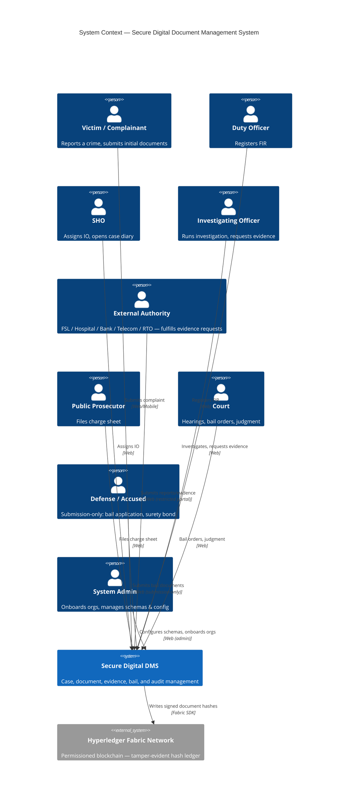
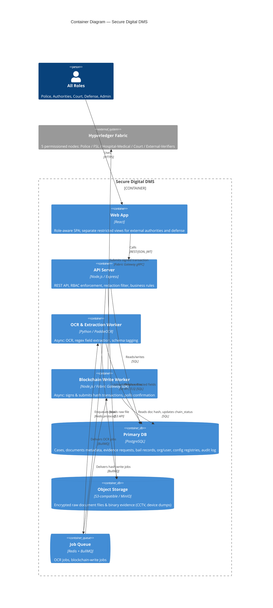
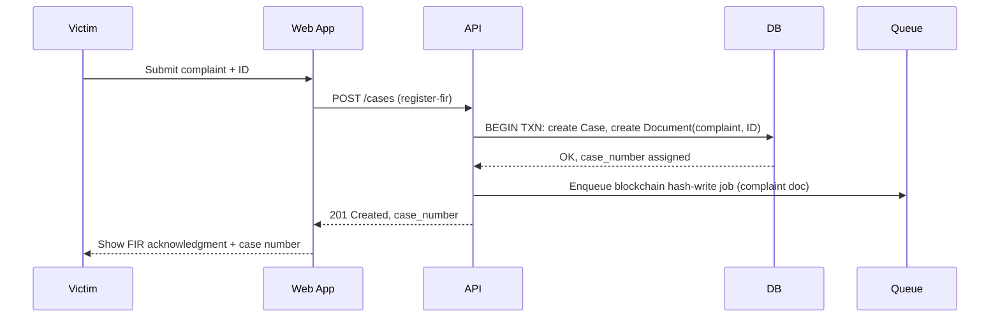
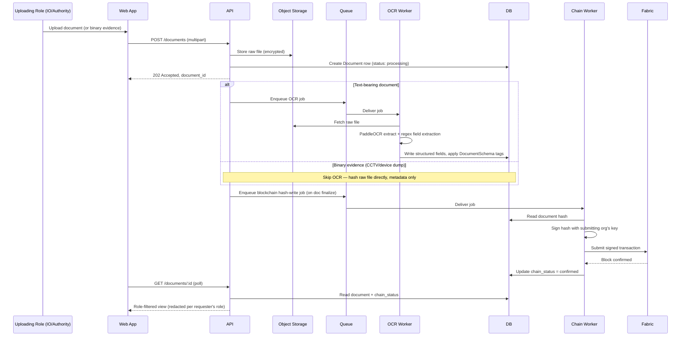
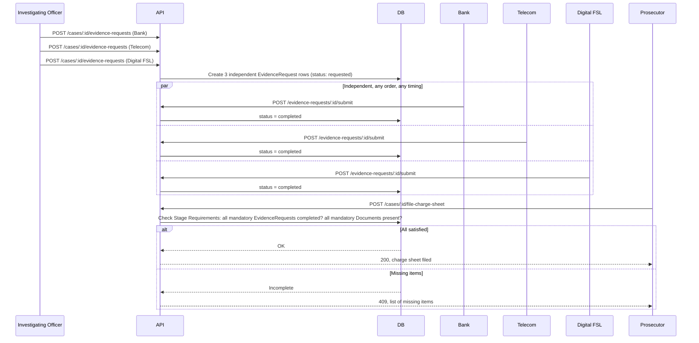
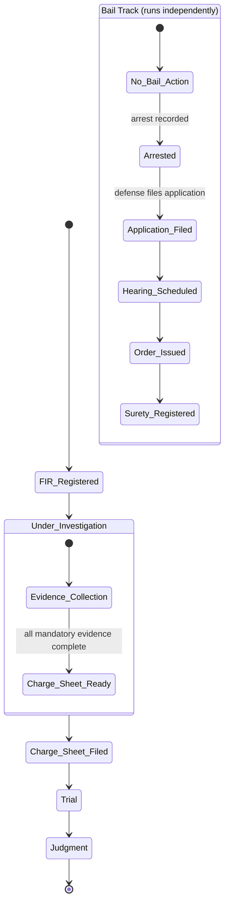

# System Design — Secure Digital Document Management System (SIH26190)

## Scope
A multi-organization case management system for law enforcement, forensic, medical, and judicial bodies to jointly manage the lifecycle of a criminal case — from FIR registration through investigation, parallel evidence collection, an independently-running bail track, charge sheet filing, and court disposition. Every document is stored with a field-level sensitivity schema (role-based redaction, not model-based), and every state-changing action is hash-chained to a permissioned blockchain ledger for tamper-evidence, on top of standard encryption, RBAC, and audit logging.

This design incorporates the 15-case crime taxonomy and bail-lifecycle data already collected, generalizes it into configuration tables rather than per-crime-type code, and resolves the 14 technical gaps previously identified and decided on. Broader legal-scope items considered out of MVP scope (POCSO/juvenile pathways, appeals, multi-jurisdiction transfer, compensation tracking, etc.) are intentionally excluded here — noted once in Open Questions as a conscious exclusion, not re-litigated.

## Scale tier
**MVP, single team, ~1 week build window, targeting demonstrable correctness with a clear path to production scale — not production scale itself.** A 5-person team with mixed experience (React, CNN/ML background pivoting to backend logic, Java + conceptual Python, general full-stack, one strong pipeline-experienced generalist) building toward a judged prototype demo, not live traffic. Every infrastructure choice below is sized to that reality; anything heavier is explicitly deferred with a stated trigger, not built because it looks impressive.

---

## Architecture

### C4 Context Diagram



**ASCII fallback:**
```
[Victim] ─┐
[Duty Officer] ─┤
[SHO] ─┤
[IO] ────────────┤
[External Authority] ─┼──▶ [Secure Digital DMS] ──▶ [Hyperledger Fabric — hash ledger]
[Prosecutor] ─┤
[Court] ─┤
[Defense/Accused] ─┤
[Admin] ─┘
```

---

### C4 Container Diagram



**ASCII fallback:**
```
[All Roles] ─▶ [Web App: React] ─▶ [API: Node/Express] ──▶ [DB: PostgreSQL]
                                          │                       ▲
                                          ├──▶ [Object Storage: S3/MinIO]
                                          └──▶ [Queue: Redis/BullMQ]
                                                   │
                                    ┌──────────────┴──────────────┐
                                    ▼                              ▼
                     [OCR Worker: Python/PaddleOCR]   [Chain Worker: Node/Fabric SDK]
                                    │                              │
                                    ▼                              ▼
                              (writes to DB)          [Hyperledger Fabric — 5 org nodes]
```

**Tech-choice rationale (one line each):**
- **PostgreSQL over NoSQL** — case/document/evidence-request/bail data is deeply relational (foreign keys, joins for stage-requirement checks); relational integrity matters more here than schema flexibility.
- **Node/Express for the API** — keeps the team in one language across frontend and API (your React-strong teammate can contribute directly), and Fabric's most mature, officially-supported SDK is Node.js.
- **Python for the OCR worker, isolated as its own container** — PaddleOCR is Python-native; rather than forcing the whole API into Python, this keeps the polyglot surface to exactly one well-justified service.
- **Redis/BullMQ over Kafka** — you have two job types (OCR, blockchain-write), each with one producer and one consumer type. Kafka's event-streaming/multi-consumer strengths are unused overhead here; BullMQ is the right-sized choice.
- **MinIO/S3-compatible object storage over storing files in Postgres** — documents and binary evidence (CCTV, device dumps) don't belong in relational rows; object storage with DB-held references is the standard, correct split.

---

## Key Flows

### Flow 1 — FIR Registration & Case Creation (synchronous)



**ASCII fallback:**
```
1. Victim submits complaint + ID → Web App
2. Web App → API: POST /cases (register-fir)
3. API → DB: transaction — create Case, create Document(complaint, ID)
4. API → Queue: enqueue blockchain hash-write job
5. API → Web App: 201 Created, case_number
6. Web App → Victim: FIR acknowledgment shown
```

---

### Flow 2 — Document Upload → Redaction → Blockchain Hash-Write (mixed sync/async — this is the core technical differentiator)



**ASCII fallback:**
```
1. Upload → Web App → API: POST /documents
2. API → Object Storage: store encrypted raw file
3. API → DB: create Document (status: processing)
4. API → Web App: 202 Accepted
5a. [text doc] API → Queue → OCR Worker: PaddleOCR + regex extraction → DB
5b. [binary evidence] skip OCR, hash raw file only
6. API → Queue → Chain Worker: sign hash with org key → submit to Fabric
7. Fabric confirms → Chain Worker updates DB chain_status
8. Web App polls GET /documents/:id → API applies role-based redaction filter → returns view
```

---

### Flow 3 — Parallel Evidence Requests (AND-join) → Charge Sheet Filing



**ASCII fallback:**
```
1. IO creates 3 independent evidence requests (Bank, Telecom, Digital FSL) — no ordering required
2. Each authority submits independently, any time, any order
3. Prosecutor attempts POST /cases/:id/file-charge-sheet
4. API checks Stage Requirements config: all MANDATORY requests completed + all MANDATORY docs present?
   → Yes: charge sheet filed, case transitions stage
   → No: 409 with explicit list of what's missing
```

---

### Supplementary — Case State: Investigation Track vs. Bail Track (concurrent, not sequential)



This is the direct resolution to gap #5 (bail integration): `investigation_status` and `bail_status` are two independent columns on the same `case_id`, each with their own transition rules. Neither blocks the other — a case can reach "Charge Sheet Ready" while bail is still at "Hearing Scheduled," and vice versa.

---

## Interface Contracts

### Endpoint Table

| Verb | Route | Auth (who) | Purpose | Notes |
|---|---|---|---|---|
| POST | /auth/login | Public | Issue session/JWT | — |
| GET | /orgs/:orgId/users | Org Admin | List an org's users | — |
| POST | /orgs | System Admin | Onboard external authority org | MVP: admin pre-registration, not self-service |
| POST | /cases | Duty Officer | Register FIR, create case | Action-shaped, not raw POST — validates crime-type config |
| GET | /cases | Any authenticated role | List cases, filtered by role/org visibility | Paginated, filterable by crime_type/status |
| GET | /cases/:id | Role-filtered | Fetch case summary + linked resources | — |
| POST | /cases/:id/assign-io | SHO | Assign investigating officer | Creates CaseAssignment row |
| POST | /cases/:id/reassign-io | SHO / Admin | Reassign IO mid-case | Logged as its own audit event |
| POST | /cases/:id/evidence-requests | IO | Create request to external org | One row per request — supports parallel N requests |
| GET | /cases/:id/evidence-requests | IO / relevant Authority | List requests + status | — |
| POST | /evidence-requests/:id/submit | The specific requested Authority | Fulfill request, attach document | Triggers document upload pipeline |
| POST | /documents | Role permitted for that case/doc-type | Upload document or binary evidence | Multipart; routes to OCR or binary pipeline by file type |
| GET | /documents/:id | Role-filtered | Fetch document | Returns redacted or full view per DocumentSchema + role |
| GET | /documents/:id/versions | Role-filtered | Version history | Append-only — originals never overwritten |
| GET | /documents/:id/chain-status | Role-filtered | Poll blockchain confirmation | Short-poll target for Flow 2 |
| POST | /documents/:id/redact-tag | Recording officer | Tag sensitive spans before finalizing a free-text statement | Human-in-the-loop, not model-based |
| POST | /cases/:id/file-charge-sheet | Prosecutor | Attempt charge sheet filing | Validated against Stage Requirements — 409 if incomplete |
| POST | /cases/:id/bail/arrest | IO / Police | Record arrest | Starts independent bail track |
| POST | /cases/:id/bail/application | Defense (submission-only) | File bail application | — |
| POST | /cases/:id/bail/hearing-notice | Court | Schedule hearing | — |
| POST | /cases/:id/bail/order | Court | Issue bail order | Same role as hearing-notice; differentiated by audit-log action, not a separate "Judge" role |
| POST | /cases/:id/bail/surety | Accused (submission-only) | Register surety bond | — |
| GET | /cases/:id/audit-log | Role-filtered | Full or summarized audit trail incl. chain_status | Full for Admin/Court, summarized elsewhere |
| GET | /admin/document-schemas | System Admin | Manage field-sensitivity schema registry | Built fully for FIR, MLC, Witness Statement at MVP; extensible |
| GET | /admin/stage-requirements | System Admin | Manage mandatory-document/evidence config per crime type | Drives Flow 3's validation check |

*(25 rows — normal range for an MVP of this shape per the design methodology; every route above maps to a resource + verb derived mechanically from the case/document/evidence/bail resource model, not invented ad hoc.)*

---

### Arrow Specifications (every connection in the container diagram)

| From → To | Trigger | Sync/Async | Payload | Auth | Failure behavior | Retry/Idempotency | Volume (demo scale) |
|---|---|---|---|---|---|---|---|
| Web App → API | User action | Sync | REST/JSON per endpoint table | JWT (role + org claim) | Error surfaced to user | N/A (user-initiated) | Low (10s/min at demo) |
| API → DB | Every request | Sync | SQL | Service credential | 500 to caller, logged | N/A within a request; idempotency keys on state-transition actions | Low |
| API → Object Storage | Document upload/fetch | Sync | File bytes, S3 API | Service credential, scoped per-org path | Error surfaced; upload retried by client | Client-side retry on network failure | Low |
| API → Queue | Doc uploaded / doc finalized | Async (fire-and-forget enqueue) | Job payload: doc_id, case_id, org_id, idempotency_key | Internal service credential | Job requeued on worker crash (BullMQ default) | Idempotency key prevents duplicate OCR/hash-write on redelivery | Low |
| Queue → OCR Worker | Job available | Async | doc_id | Internal | Job retried with backoff; after N failures, dead-letter + manual review flag | Idempotency key = doc_id + version | Low |
| Queue → Chain Worker | Job available | Async | doc_id, computed hash | Internal | Retried with backoff (Fabric transaction submission is a known flaky point — see risk list) | Idempotency key prevents double hash-write for same doc version | Low |
| Chain Worker → Fabric | Job processing | Async (from the API's perspective) | Signed transaction (doc hash + metadata) | Org's signing key via Fabric MSP identity | On endorsement failure, retry with backoff; on repeated failure, flag doc as chain_status=failed for manual review | Fabric's own transaction ID + our idempotency key together prevent duplicate ledger entries | Low |
| Web App → API (polling) | Status check after upload | Sync, short-poll | GET request | JWT | Simple retry by client on next poll interval | N/A | Low |

**Third-party arrow — direction of trust:** the only genuinely external system is Hyperledger Fabric, and *we* call *it* (Chain Worker holds each org's signing credential, submits outbound). There is no inbound webhook from Fabric in this design — confirmation is read back via polling the ledger, kept deliberately simple for MVP rather than standing up event listening infrastructure.

---

### Async Pattern Decisions (one line per flow)

- **FIR registration**: synchronous — user needs the case number immediately to continue.
- **Document raw upload acknowledgment**: synchronous (202 Accepted) — but the *processing* (OCR, hash-write) is async; no one should wait on OCR to finish before the UI responds.
- **OCR/field extraction**: queue + worker — slow, not needed inline; status surfaced via short-poll on `GET /documents/:id`.
- **Blockchain hash-write**: queue + worker, always async — chain confirmation is not needed synchronously; UI shows a "recorded → chain-pending → chain-confirmed" badge via the same short-poll pattern.
- **Evidence request fulfillment**: synchronous submit action, which itself triggers the async upload pipeline above.
- **Charge sheet filing**: synchronous — it's a fast DB-side validation + state transition, no reason to make it async.
- **Bail stage actions**: synchronous — same reasoning, fast state transitions.

No WebSockets anywhere in this design — nothing here needs live bidirectional push at MVP scale; short-polling a status endpoint is the simplest thing that works, per the framework's own default bias.

---

## State Ownership Map

| State | Owner (writes) | Readers | Copies/caches | Invalidation |
|---|---|---|---|---|
| Case core data (status, crime_type, court_level) | API → `cases` table | All roles (filtered) | None | Direct read, always current |
| Investigation status | API → `cases.investigation_status` | All roles (filtered) | None | — |
| Bail status | API → `cases.bail_status` | All roles (filtered) | None | Independent of investigation_status — see state diagram |
| Document raw bytes | Object Storage | OCR Worker, API (serving to authorized roles) | None — single copy | — |
| Document structured fields | OCR Worker → `documents` table | API (redaction filter reads this) | None | Re-extracted only if document is re-uploaded as new version |
| Document hash + chain_status | Chain Worker writes `chain_status`; **Fabric ledger is the actual source of truth for the hash's validity** | API (displays status) | DB holds a *mirror* of confirmation state | Reconciliation job compares DB chain_status against ledger periodically (LATER — manual reconciliation acceptable at MVP scale) |
| EvidenceRequest status | API, written by IO (create) and Authority (submit) | IO, Prosecutor (for Stage Requirements check) | None | — |
| BailRecord per stage | API, written by respective role per stage | Court, IO, Defense (own case only) | None | — |
| CaseAssignment (current IO) | API, written by SHO only | All roles needing to know current IO | None | Updated in place on reassignment; history preserved via audit log, not this table |
| DocumentSchema registry | Admin, via `/admin/document-schemas` | Redaction filter (every document read) | None | Changing a schema does not retroactively re-tag already-processed documents — noted as an open question below |
| Stage Requirements config | Admin, via `/admin/stage-requirements` | Charge-sheet validation logic | None | — |
| Audit log | API, append-only write on every state-changing action | Role-filtered readers | None — blockchain holds only the *hash* of each entry, not a full copy | Immutable by design; no invalidation path exists or should exist |

**Rule enforced here per the methodology**: the blockchain is never treated as a second full copy of anything — it holds hashes only. Postgres is the single owner of all actual content; Fabric is the tamper-evidence layer riding on top, not a parallel data store. This keeps you honest about the earlier design principle (documents off-chain, hashes on-chain) all the way through the state model, not just as a stated intention.

---

## Environments

| Env | DB | Fabric network | Object storage | Third parties real/mocked | Secrets source | Deliberate differences |
|---|---|---|---|---|---|---|
| local/dev | Dockerized Postgres | Local Fabric test network (fabric-samples-style, 5 peer containers) | MinIO container | N/A — fully self-hosted, no external SaaS dependency | `.env`, gitignored | Seed data (synthetic cases) loaded on startup |
| demo (judging day) | Same dockerized Postgres, seeded with your synthetic 15-case dataset | Same local Fabric network, now treated as "the" network for the demo | Same MinIO | Still fully self-hosted | `.env` on demo machine | No seed-reset route exposed once demo data is finalized |
| production (stated, not built) | Managed Postgres | Real multi-org Fabric consortium across actual agency infrastructure | Managed S3-compatible storage, data-localized per government requirements | Real org onboarding process (not admin pre-registration) | Platform secret store / HSM for signing keys | Named as the LATER target throughout this doc — not built now |

**Worth stating plainly in your pitch**: unlike almost every other project you've scoped this cycle, this system has genuinely **zero external SaaS dependencies** in its architecture — no third-party API calls at all in the core pipeline (no LLM API, no external maps/payment/identity provider). Everything runs self-hosted. That's a real, defensible confidentiality claim, not just a stated intention.

---

## Domain Overlays Applied

None of the four domain overlays in the reference set (B2B SaaS, Fintech, Trading/quant, AI-agent) is a precise match for a multi-agency government legal-records system — worth being honest about that rather than forcing a fit.

**Partially adapted: B2B SaaS multi-tenant overlay**, because Police/FSL/Hospital/Bank/Telecom/RTO/Court function analogously to separate tenant organizations, each with their own users and a role model.

| Adapted item | Application here | Rationale |
|---|---|---|
| Tenant context propagation | Every request carries `org_id` + `role` as JWT claims, checked via one consistent middleware — not reinvented per endpoint | Prevents the classic cross-tenant leak failure mode this overlay warns about; directly relevant since an FSL user must never see a Bank's evidence requests, etc. |
| Org/user model | Users belong to exactly one Organization; role model (Duty Officer, SHO, IO, Authority-staff, Prosecutor, Court, Defense, Admin) designed as first-class tables now | Bolting multi-org support on later would be a real migration cost — designed in from day one per the overlay's own warning |

**Explicitly not applicable:**
- **Fintech overlay** — there is no money-movement ledger in this system's core scope (unlike, for example, your MPLADS or SC loan-scheme projects). The "ledger-shaped storage" instinct is satisfied instead by the *audit log's* append-only design, which serves an analogous integrity purpose without being a financial ledger.
- **Trading/quant overlay** — no signal generation, no execution, not applicable.
- **AI-agent overlay** — deliberately not applicable, and worth stating explicitly: **per your instruction, no SLM or LLM sits in the core pipeline.** Redaction is handled by the structured DocumentSchema + human-tagging approach (Flow 2 / gap #8-9 resolution), not a model. There is no LLM gateway, no prompt-assembly component, no token-budget concern anywhere in this design — a deliberate simplification versus your other projects, not an oversight.

---

## Concepts Checklist

### NOW

| Category | Choice | Rationale |
|---|---|---|
| Containerization (Docker) | Yes, every service | Needed regardless of team size once Fabric enters the picture — Fabric's own setup assumes containerized peers |
| Docker Compose | Yes | More than one local dependency (Postgres, Redis, MinIO, Fabric peers) |
| Primary DB | PostgreSQL | Deeply relational data (case↔document↔evidence-request↔bail relationships, stage-requirement joins) |
| Indexes | On `case_number`, `crime_type`, `status`, `org_id` | Real queries exist from day one (case search, role-filtered listing) |
| Object storage | MinIO (S3-compatible) | Any document/binary-evidence upload needs this — non-negotiable |
| Queue | Redis + BullMQ | Two real async workloads (OCR, blockchain-write) that must not block the request thread |
| Firewall / default-deny | Yes, even for demo | No exceptions, per your own standard across every prior project |
| HTTPS/TLS | Yes, no exceptions | Same |
| CI/CD pipeline | Lightweight (GitHub Actions: run tests on push) | 5-person team committing in parallel over a 1-week window benefits immediately from catching breakage early |
| Git branching strategy | Trunk-based, short-lived feature branches | Decided now so it isn't improvised mid-build under time pressure |
| Code review | Lightweight peer check before merge | Team of 5, real value even at hackathon pace |
| Rate limiting | Basic, at API middleware | External orgs are calling in — even a demo should show this is considered |
| Error logging | Structured logs to stdout/console | Sufficient for demo; real sink is a LATER concern |
| Retry/circuit-breaker on Chain Worker specifically | Yes, exponential backoff on Fabric transaction submission | This is a **known real failure point** you will likely hit live during your demo — see risk list |
| Encryption at rest | Yes, on Object Storage and DB | Non-negotiable given victim PII content |
| Availability target (informal) | "Must stay up through the judging window; brief downtime outside it acceptable" | Cheap to state, focuses effort correctly |
| Observability (basic) | Structured logs + simple request/error counters | Enough for a demo; full APM is unjustified overhead |
| Scheduled jobs | None required at MVP | (see LATER — evidence-request reminders deferred) |
| Third-party dependency inventory | One table (below) | Doubles as your "we don't depend on external SaaS" pitch point |
| Cost estimate | Near-zero — everything self-hosted/open-source; only real cost is compute during the build/demo window | Worth stating plainly, it's a strength |
| Testing priority | Auth/RBAC tests first, then redaction-filter tests, then charge-sheet Stage Requirements validation logic | These three are exactly what judges will probe hardest |
| RTO/RPO (informal) | "Acceptable to lose in-progress demo state; not acceptable to lose a blockchain-confirmed record" | This asymmetry is itself a good line for your pitch — confirmed records have a fundamentally different resilience story than working state |
| Accessibility baseline | Semantic HTML, alt text | Costs nothing to start right; consistent with your accessibility instincts on other projects |
| Architecture diagrams | This document | Done |

### LATER (path kept open, not built)

| Category | Why deferred | Trigger to build it |
|---|---|---|
| Evidence-request reminder/escalation jobs | Explicitly descoped earlier as a legal-process nuance beyond pure MVP technical scope | Real deployment beyond demo, or if judges specifically probe for it and you want a stretch answer ready |
| Caching layer (Redis for reads, not just queue) | No expensive/repeated read pattern exists yet at demo scale | If dashboard/search load grows meaningfully |
| Chain-status reconciliation job (automated) | Manual reconciliation is acceptable at MVP scale; DB mirror vs. ledger drift risk is low with single-digit demo transaction volume | Before any real multi-org production pilot |
| API versioning scheme | No external consumer beyond your own frontend exists yet | First external consumer (e.g., if e-Courts or CCTNS integration ever becomes real) |
| Self-service org onboarding | Admin pre-registration is sufficient and safer for a demo | Real deployment needing many orgs to onboard without your direct involvement |
| Distributed tracing / full APM | Structured logs are enough at this scale and team size | More than 2-3 services genuinely need cross-service trace correlation |
| Load testing | No real traffic expected | Before any pilot deployment with actual usage |
| Formal DR runbook | Backup strategy (Postgres point-in-time recovery, if using a managed instance later) is enough for now | Real deployment stage |

### WATCHLIST (explicit non-decision)

| Category | Why skipped | Revisit trigger |
|---|---|---|
| Kubernetes | Team of 5, no ops capacity, 1-week window — this would actively slow you down | Never, at this project's current scope; revisit only if this became a genuinely funded multi-year deployment |
| Kafka | Two simple job types with single producer/consumer each — BullMQ is correctly sized | Only if genuine multi-consumer event streaming becomes necessary, which nothing in this design currently requires |
| WebSockets | No real-time bidirectional need identified anywhere in the 15-case workflow data | If a live "war room" collaborative case view became a real requirement |
| CDN | No public read-heavy content — this is an internal, authenticated system | Never expected to apply to this system's nature |
| Load balancer | Single instance sufficient for demo | Multi-instance deploy, which is a production-stage concern |
| Sharding/partitioning | Nowhere near the data volume that would justify this | 10x+ current design assumptions, genuinely production scale |
| Full WCAG accessibility audit | Baseline only is right-sized for MVP | Production deployment stage |

---

## Third-Party Dependency Inventory

| Dependency | Used for | Credential location | Blast radius if down | Fallback |
|---|---|---|---|---|
| Hyperledger Fabric (self-hosted) | Tamper-evident hash ledger | Org-specific MSP identity, stored per-service | Documents still store/serve normally; only chain-confirmation badge shows "pending" | Retry with backoff; documents remain usable via off-chain DB in the interim |
| PostgreSQL (self-hosted) | All structured data | DB service credential | Full outage — this is the single real point of failure in the design | Standard DB backup/restore; no external mitigation needed at MVP scale |
| MinIO (self-hosted) | File/evidence storage | Service credential | Document uploads/reads fail | Same tier as DB — self-hosted, backed up |
| Redis/BullMQ (self-hosted) | Job queue | Internal | OCR and hash-write jobs pause, resume once restored | Jobs persist in Redis, not lost, just delayed |

Notably: **no external SaaS product appears in this table at all** — worth restating once more because it's genuinely unusual compared to your other SIH projects and is a strong, simple line for judges.

---

## Open Questions

1. **Fabric SDK language confirmation** — Hyperledger Fabric's officially well-supported SDKs are Node.js, Java, and Go; a Python SDK exists but is community-maintained and less current. Given your team has both React/Node-comfortable members and a Java-comfortable member, I've defaulted the Chain Worker to Node.js in this design — confirm this fits your team's actual comfort level, or whether the Java-strong teammate would rather own this piece in Java instead.
2. **DocumentSchema retroactivity** — if an admin edits a document type's sensitivity schema after documents of that type already exist, do already-stored documents get re-tagged automatically, or only new uploads? Not resolved in this design — needs a decision before the redaction filter logic is finalized.
3. **Which 3 document types get a fully-built DocumentSchema for the MVP demo?** I've assumed FIR, MLC, and Witness Statement as the representative set (per your earlier direction) — confirm, or swap in different ones if a specific crime-type demo (e.g., Cyber Fraud) is your chosen showcase path.
4. **Conscious exclusions carried forward from the earlier full gap audit** — POCSO/juvenile pathway, appeals, multi-jurisdiction FIR transfer, victim compensation tracking, evidence disposal/retention rules remain out of scope by your own prior decision. Flagged once here so it's on record as a conscious choice, not silently dropped — no further action needed unless you want to revisit.

---

## Issues Encountered While Producing This Design

Being direct about where I had to make a judgment call or where I think there's real risk, rather than smoothing it over:

1. **Fabric's SDK language mismatch is a genuine, previously-unflagged risk.** Every earlier conversation about this project mentioned "Hyperledger Fabric" without checking which language actually integrates with it well. Python — despite being your OCR worker's natural language — is not Fabric's strongest-supported client SDK. I resolved this by isolating Fabric interaction into its own Node.js worker rather than trying to force it into the Python OCR service, but this is worth your team confirming explicitly, since it affects who owns that piece of work.
2. **The polyglot stack (Node API + Python OCR worker + Node Chain worker) is the right technical choice but a real 1-week timeline risk.** Three moving pieces in two languages, plus a Fabric network, plus a queue, plus object storage — that's a lot of infrastructure to stand up cleanly even in a week. My strong recommendation: get the Fabric network and the OCR worker running **first**, in isolation, before wiring up the full request flow — these are your two highest-setup-risk components, and discovering a Fabric configuration problem on day 5 instead of day 1 would be costly.
3. **I made an assumption on API framework (Node/Express) that trades off against your team's stated Java strength.** An equally valid alternative is a Java/Spring Boot API, which would let your Java-strongest teammate own the core API rather than just the Fabric piece. I defaulted to Node for frontend-language cohesion with React, but this is a real, reasonable alternative your team should explicitly choose between, not something I should silently decide for you.
4. **The Stage Requirements config table (gap #3's resolution) assumes you'll hand-populate it correctly for however many crime types you demo.** I haven't built the actual data for this table — that's a concrete to-do, not just a design concept, and it's easy to underestimate how much decision-making goes into "which documents are actually mandatory vs. optional" per crime type, especially since your source data didn't explicitly mark this distinction anywhere.
5. **I did not design a specific UI flow for the redaction-tagging step (`POST /documents/:id/redact-tag`)** beyond naming the endpoint — the actual interaction (how an officer selects text spans in a witness statement UI and marks them sensitive) is a real frontend design problem your React-strong teammate will need to solve concretely, not something this system-design pass resolves.
6. **Reconciliation between DB `chain_status` and the actual Fabric ledger state is deferred to LATER**, which is the right scope call for MVP — but means if your chain worker crashes mid-write during a live demo, you could show a document stuck at "chain-pending" with no automatic recovery. Worth a manual "retry chain write" admin action existing even at MVP, as a demo-safety net — this wasn't in your original 14 gaps but surfaced naturally while designing the worker's failure path.

---

## Build Prompt Seed

> Building a multi-organization criminal case management system (Node.js/Express API, React frontend, PostgreSQL, Redis+BullMQ queue, MinIO object storage, Python/PaddleOCR worker for document text extraction, Node.js worker for Hyperledger Fabric integration). Core resources: Organization, User, Case, Document (versioned, never overwritten), EvidenceRequest (supports N parallel requests per case with an AND-join gate before charge-sheet filing), BailRecord (tracks independently of investigation status on the same case), DocumentSchema (field-level sensitivity registry driving role-based redaction at read time — no ML/LLM involved), StageRequirements (config-driven mandatory-document rules per crime type), and an append-only AuditLog whose entries are hash-signed and mirrored to a 5-node permissioned Fabric network (Police/FSL/Hospital-Medical/Court/External-Verifiers). First milestone: stand up the Fabric test network and confirm a Node.js worker can submit and confirm a signed hash transaction end-to-end, in isolation, before building the rest of the request pipeline around it.

---

## Review Gate

This is a full first pass, not a final decision — per the four open questions above and the six issues flagged, there are real judgment calls in here I made on your behalf (API language choice, Fabric worker language, which 3 document schemas to build first) that are cheap to change now and expensive to change once code exists. Please review, push back on anything, and confirm before your team starts building against this.
