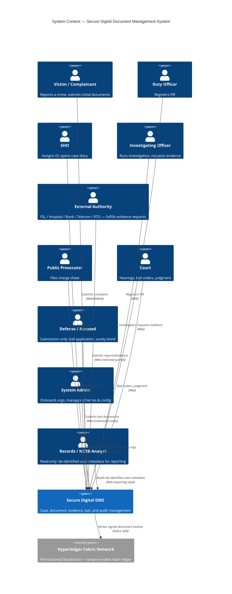
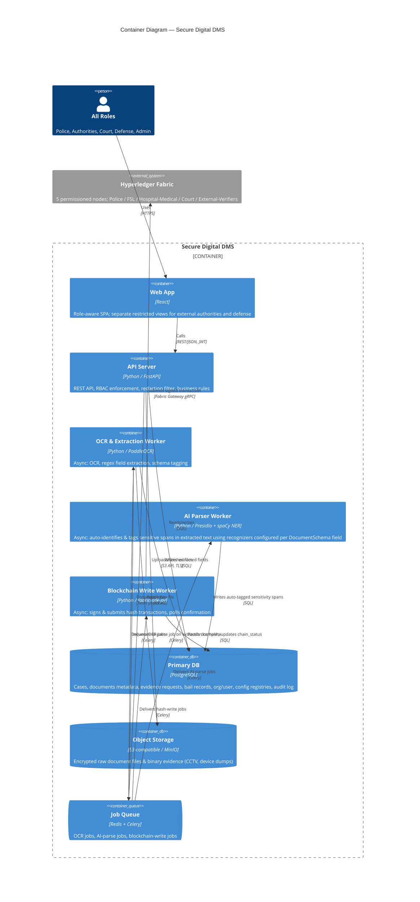
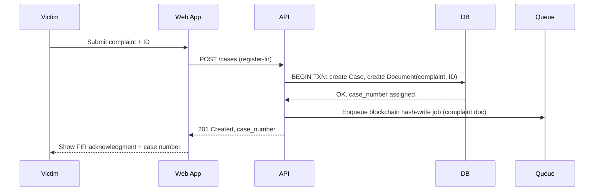
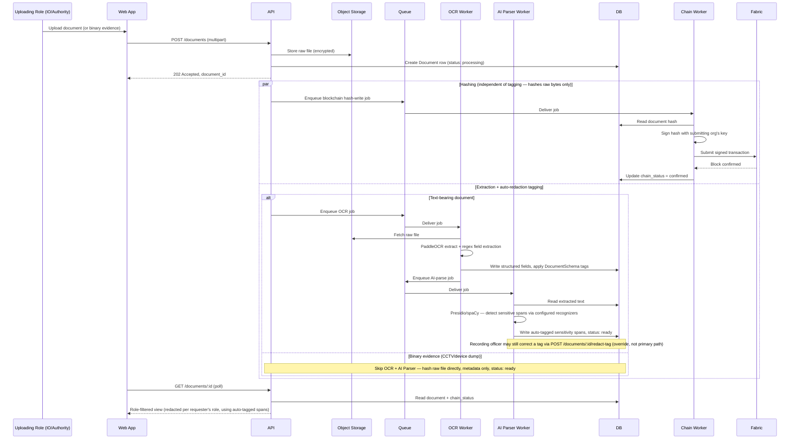
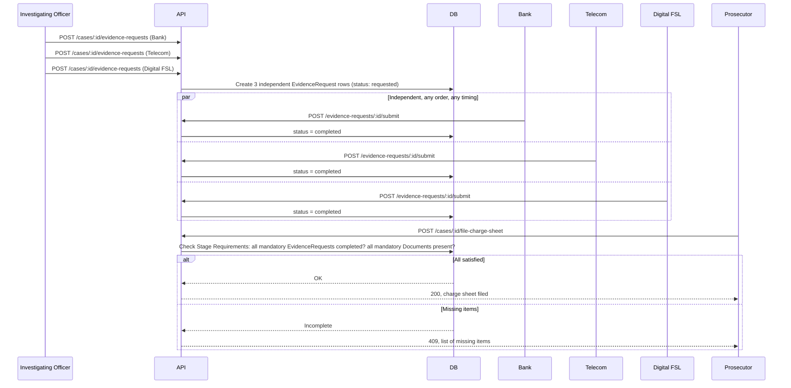
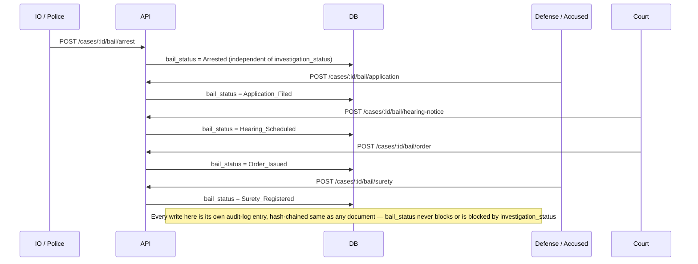
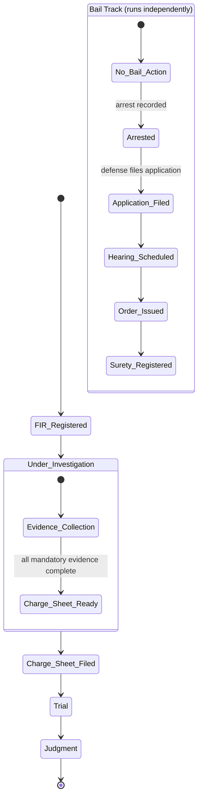

# System Design — Secure Digital Document Management System (SIH26190) — v2

## Changelog addendum (same review session, after receiving `SIH26190_Role_Document_Taxonomy.docx`)

This reference document supplied the concrete data Open Question 3 was blocked on: **57 canonical document types** across the 15 crime workflows, a much richer **Role & Authority taxonomy** (specialized units, external authorities, courts, plus a role not previously in this design — **Records/NCRB Analyst**, de-identified metadata only), and an **Access Model Summary**. It also came with its own sizing recommendation, which changes a decision made earlier in this session:

- **DocumentSchema coverage reversed from "all 57 fully custom" to tiered.** The source document itself calls building 57 full custom schemas "unnecessary work... already flagged as a risk of scope creep." Adopted its tiered recommendation instead: **Tier 1** — FIR, MLC, Witness Statement (already decided, universal + highest sensitivity). **Tier 2** — **Domestic Violence** as the demo showcase case (chosen over Cyber Fraud or Rape — see rationale below), adding Marriage Proof, Injury Report, Protection Order, plus the full Bail Lifecycle set (Arrest Memo, Bail Application, Bail Hearing Notice, Bail Order, Surety Bond, Bail Conditions Register). **Tier 3** — every other document type inherits one generic default sensitivity profile (name/address/identity-adjacent fields sensitive by default) until individually authored later. This still means "every one of the 57 types has a schema" — just not all at the same depth — and fits the 1-week window (~2-3 days for one person) instead of a multi-week effort.
- **Demo showcase case: Domestic Violence, not Cyber Fraud or Rape.** The design's core technical differentiator is the investigation-track/bail-track running *concurrently* (see the state diagram). Domestic Violence has a confirmed bail pathway ("Yes") with a full bail lifecycle — the demo can show both tracks live. Rape's bail pathway is "typically non-bailable, not yet confirmed," which would leave the bail-track half of the demo empty; Cyber Fraud also has bail pathway "Yes" but doesn't lean into the redaction/sensitivity story as hard as a women-safety case does, which the source doc itself calls the stronger pitch given the project's NCRB/Women Safety Division ownership.
- **Role model expanded.** v1/early-v2 used a generic role list (Duty Officer, SHO, IO, Authority-staff, Prosecutor, Court, Defense, Admin). The taxonomy reference names 15+ additional specialized roles actually appearing across the 15 workflows — see the new Role & Authority Taxonomy section below, now the canonical role list for RBAC.
- **New Access Model Summary** folded in as the at-a-glance version of the State Ownership Map's access rules, including a role this design hadn't accounted for: **Records/NCRB Analyst**, who sees de-identified case metadata only.

## Changelog from v1 (decided in review session, 2026-08-29)

1. **Entire backend is Python**, not Node/Express + isolated Python OCR worker. API Server → **FastAPI**. This also forces a follow-on change not explicitly asked about but flagged here: **Job Queue moves from BullMQ to Celery** — BullMQ's Node client is mature but its Python client is a community port with the same "less current, less official" risk profile the doc already flagged for Fabric's Python SDK; Celery is Python's own well-supported, mature queue framework and removes a second instance of the same risk. *(Flagged for your confirmation in Review Gate — not silently decided.)*
2. **Chain Worker is Python** (`fabric-sdk-py`), for stack consistency — chosen with the known risk (community-maintained, less current SDK) explicitly accepted, not overlooked.
3. **New container: AI Parser Worker** (self-hosted, Presidio + spaCy NER) — sits between the OCR Worker and document finalization, fully automatically identifying and tagging sensitive spans. This reverses v1's "no model-based redaction" default — see updated Domain Overlays section for the honest reframe (it's classical NLP/NER, not an LLM — the "no LLM in core pipeline" claim actually survives).
4. **DocumentSchema retroactivity**: resolved — new uploads only, no auto re-tagging of existing documents.
5. **DocumentSchema coverage**: resolved — schemas will be built for **all** document types across the 15-case taxonomy (not just 3), kept in the same ~1-week window by treating this as config-table breadth, not per-type custom UI work. *(Needs the actual document-type list — see Open Questions.)*
6. **New endpoint**: `POST /documents/:id/retry-chain-write` — manual admin recovery action for a chain-worker crash mid-demo.
7. **Manual `redact-tag` endpoint retained** as a human override/correction path alongside the now-automatic AI Parser, not removed.

Everything below is the full design with these decisions folded in; sections unaffected by the changes are carried over from v1 unchanged.

---

## Scope
A multi-organization case management system for law enforcement, forensic, medical, and judicial bodies to jointly manage the lifecycle of a criminal case — from FIR registration through investigation, parallel evidence collection, an independently-running bail track, charge sheet filing, and court disposition. Every document is stored with a field-level sensitivity schema, now **auto-identified by a self-hosted AI Parser and applied as role-based redaction at read time**, with a human override path retained. Every state-changing action is hash-chained to a permissioned blockchain ledger for tamper-evidence, on top of standard encryption, RBAC, and audit logging.

This design incorporates the 15-case crime taxonomy and bail-lifecycle data already collected, generalizes it into configuration tables rather than per-crime-type code, and resolves the 14 technical gaps previously identified and decided on. Broader legal-scope items considered out of MVP scope (POCSO/juvenile pathways, appeals, multi-jurisdiction transfer, compensation tracking, etc.) are intentionally excluded here — noted once in Open Questions as a conscious exclusion, not re-litigated.

## Scale tier
**MVP-that-becomes-a-capstone: single team, ~1 week to a demoable state, targeting demonstrable correctness with a clear path to production scale — not production scale itself.** A 5-person team with mixed experience (React, CNN/ML background pivoting to backend logic, Java + conceptual Python, general full-stack, one strong pipeline-experienced generalist) building toward a judged prototype demo, not live traffic. The scope was widened mid-review (full document-type schema coverage, an AI redaction layer) without widening the timeline — every choice below is made to absorb that breadth without blowing the 1-week window, and anything heavier is explicitly deferred with a stated trigger.

---

## Architecture

### C4 Context Diagram



**ASCII fallback:**
```
[Victim] ─┐
[Duty Officer] ─┤
[SHO] ─┤
[IO] ────────────┤
[External Authority] ─┼──▶ [Secure Digital DMS] ──▶ [Hyperledger Fabric — hash ledger]
[Prosecutor] ─┤
[Court] ─┤
[Defense/Accused] ─┤
[Admin] ─┤
[Records/NCRB Analyst] ─┘ (read-only, de-identified)
```

---

### C4 Container Diagram



**ASCII fallback:**
```
[All Roles] ─▶ [Web App: React] ─▶ [API: Python/FastAPI] ──▶ [DB: PostgreSQL]
                                          │                       ▲
                                          ├──▶ [Object Storage: S3/MinIO]
                                          └──▶ [Queue: Redis/Celery]
                                                   │
                              ┌────────────────────┼───────────────────────┐
                              ▼                    ▼                       ▼
             [OCR Worker: Python/PaddleOCR] → [AI Parser: Presidio+spaCy]  [Chain Worker: Python/fabric-sdk-py]
                              │                    │                       │
                              ▼                    ▼                       ▼
                        (writes to DB)      (writes tags to DB)   [Hyperledger Fabric — 5 org nodes]
```

**Tech-choice rationale (one line each):**
- **PostgreSQL over NoSQL** — case/document/evidence-request/bail data is deeply relational (foreign keys, joins for stage-requirement checks); relational integrity matters more here than schema flexibility.
- **Python/FastAPI for the API** — the team is standardizing the whole backend on Python; FastAPI's async support fits the poll-heavy, queue-heavy request patterns in this design and gives request/response validation for free.
- **Python for the OCR worker** — PaddleOCR is Python-native; no longer the odd-one-out now that the whole backend is Python.
- **Python (fabric-sdk-py) for the Chain Worker, deliberately** — Fabric's most mature SDKs are Node/Java/Go; the Python SDK is community-maintained and less current. Chosen anyway for stack consistency, with the risk explicitly accepted, not overlooked — see Issues section.
- **Presidio + spaCy NER for the AI Parser, self-hosted** — purpose-built open-source PII/sensitive-span detection (pattern recognizers + a pretrained NER model), not a generative LLM. Needs a one-time human configuration step (map entity types → DocumentSchema fields) instead of training data collection, which is the only realistic path to "fully automatic, self-hosted, no existing trained model" inside a 1-week window.
- **Redis/Celery over BullMQ** — with the whole backend now Python, Celery is the natural, officially-supported choice (BullMQ's own Python client carries the same "less mature" risk the Fabric Python SDK does — no reason to take that risk twice). Still exactly right-sized: three job types (OCR, AI-parse, blockchain-write), each single-producer/single-consumer.
- **MinIO/S3-compatible object storage over storing files in Postgres** — documents and binary evidence (CCTV, device dumps) don't belong in relational rows; object storage with DB-held references is the standard, correct split.

---

## Key Flows

### Flow 1 — FIR Registration & Case Creation (synchronous)



**ASCII fallback:**
```
1. Victim submits complaint + ID → Web App
2. Web App → API: POST /cases (register-fir)
3. API → DB: transaction — create Case, create Document(complaint, ID)
4. API → Queue: enqueue blockchain hash-write job
5. API → Web App: 201 Created, case_number
6. Web App → Victim: FIR acknowledgment shown
```

---

### Flow 2 — Document Upload → OCR → AI-Parsed Redaction → Blockchain Hash-Write (mixed sync/async — this is the core technical differentiator)



**ASCII fallback:**
```
1. Upload → Web App → API: POST /documents
2. API → Object Storage: store encrypted raw file
3. API → DB: create Document (status: processing)
4. API → Web App: 202 Accepted
5. Two independent async tracks kick off in parallel:
   a. [hashing] API → Queue → Chain Worker: sign hash with org key → submit to Fabric → confirm → update chain_status
   b. [extraction+tagging, text docs only] API → Queue → OCR Worker: PaddleOCR + regex extraction → DB
                                            → OCR Worker → Queue → AI Parser Worker: Presidio/spaCy auto-tags sensitive spans → DB, status: ready
      [binary evidence] skip both OCR and AI Parser, hash raw file only, status: ready
6. Web App polls GET /documents/:id → API applies role-based redaction filter (using auto-tags) → returns view
   (an officer can still correct a wrong auto-tag via POST /documents/:id/redact-tag)
```

---

### Flow 3 — Parallel Evidence Requests (AND-join) → Charge Sheet Filing



**ASCII fallback:**
```
1. IO creates 3 independent evidence requests (Bank, Telecom, Digital FSL) — no ordering required
2. Each authority submits independently, any time, any order
3. Prosecutor attempts POST /cases/:id/file-charge-sheet
4. API checks Stage Requirements config: all MANDATORY requests completed + all MANDATORY docs present?
   → Yes: charge sheet filed, case transitions stage
   → No: 409 with explicit list of what's missing
```

---

### Flow 4 — Bail Track (runs independently of the Investigation Track; demo showcase uses this end-to-end)



**ASCII fallback:**
```
1. IO/Police → API: POST /cases/:id/bail/arrest            → bail_status = Arrested
2. Defense/Accused → API: POST /cases/:id/bail/application  → bail_status = Application_Filed
3. Court → API: POST /cases/:id/bail/hearing-notice          → bail_status = Hearing_Scheduled
4. Court → API: POST /cases/:id/bail/order                   → bail_status = Order_Issued
5. Defense/Accused → API: POST /cases/:id/bail/surety        → bail_status = Surety_Registered
Runs entirely on its own timeline — the investigation track (Flow 3) can be at any stage while this happens.
```

---

### Supplementary — Case State: Investigation Track vs. Bail Track (concurrent, not sequential)



This is the direct resolution to gap #5 (bail integration): `investigation_status` and `bail_status` are two independent columns on the same `case_id`, each with their own transition rules. Neither blocks the other — a case can reach "Charge Sheet Ready" while bail is still at "Hearing Scheduled," and vice versa.

---

## Interface Contracts

### Endpoint Table

| Verb | Route | Auth (who) | Purpose | Notes |
|---|---|---|---|---|
| POST | /auth/login | Public | Issue session/JWT | — |
| GET | /orgs/:orgId/users | Org Admin | List an org's users | — |
| POST | /orgs | System Admin | Onboard external authority org | MVP: admin pre-registration, not self-service |
| POST | /cases | Duty Officer | Register FIR, create case | Action-shaped, not raw POST — validates crime-type config |
| GET | /cases | Any authenticated role | List cases, filtered by role/org visibility | Paginated, filterable by crime_type/status |
| GET | /cases/:id | Role-filtered | Fetch case summary + linked resources | — |
| POST | /cases/:id/assign-io | SHO | Assign investigating officer | Creates CaseAssignment row |
| POST | /cases/:id/reassign-io | SHO / Admin | Reassign IO mid-case | Logged as its own audit event |
| POST | /cases/:id/case-diary | IO | **New** — append a running case-diary entry | Simple append-only log (author, text, timestamp) — not a Document upload, a running notebook per case |
| GET | /cases/:id/case-diary | Role-filtered | **New** — list case-diary entries for a case | Same visibility rule as the rest of the case file |
| POST | /cases/:id/evidence-requests | IO | Create request to external org | One row per request — supports parallel N requests |
| GET | /cases/:id/evidence-requests | IO / relevant Authority | List requests + status | — |
| POST | /evidence-requests/:id/submit | The specific requested Authority | Fulfill request, attach document | Triggers document upload pipeline |
| POST | /documents | Role permitted for that case/doc-type | Upload document or binary evidence | Multipart; routes to OCR→AI-Parser pipeline or binary pipeline by file type |
| GET | /documents/:id | Role-filtered | Fetch document | Returns redacted or full view per auto-tagged sensitivity spans + role |
| GET | /documents/:id/versions | Role-filtered | Version history | Append-only — originals never overwritten |
| GET | /documents/:id/chain-status | Role-filtered | Poll blockchain confirmation | Short-poll target for Flow 2 |
| GET | /documents?status=needs_review | Admin / Recording officer | **New** — list documents where the AI Parser fell back to fully-redacted after repeated failure | Closes the gap where the fail-safe had no queue to land in — a plain filtered query on the existing `documents` table, not new infrastructure |
| POST | /documents/:id/retry-chain-write | Admin | Manually re-trigger a stuck chain-write | **New**, and **idempotency rule**: reuses the *original* idempotency key from the failed attempt, never a fresh one — if Fabric actually confirmed the transaction before the crash, this guarantees the retry can't create a duplicate ledger entry |
| POST | /documents/:id/redact-tag | Recording officer | Correct/override an AI Parser sensitivity tag | **Changed from v1**: now a correction path over the AI Parser's auto-tags, not the primary tagging mechanism |
| POST | /cases/:id/file-charge-sheet | Prosecutor | Attempt charge sheet filing | Validated against Stage Requirements — 409 if incomplete |
| POST | /cases/:id/bail/arrest | IO / Police | Record arrest | Starts independent bail track |
| POST | /cases/:id/bail/application | Defense (submission-only) | File bail application | — |
| POST | /cases/:id/bail/hearing-notice | Court | Schedule hearing | — |
| POST | /cases/:id/bail/order | Court | Issue bail order | Same role as hearing-notice; differentiated by audit-log action, not a separate "Judge" role |
| POST | /cases/:id/bail/surety | Accused (submission-only) | Register surety bond | — |
| POST | /cases/:id/trial/hearing-notice | Court | **New** — schedule a trial hearing | Mirrors bail's hearing-notice; moves `investigation_status` to `Trial` |
| POST | /cases/:id/judgment | Court | **New** — record final judgment | Mirrors bail's order pattern; moves `investigation_status` to `Judgment` — closes the state diagram's `Trial → Judgment` transition, which previously had no endpoint at all |
| GET | /cases/:id/audit-log | Role-filtered | Full or summarized audit trail incl. chain_status | Full for Admin/Court, summarized elsewhere |
| GET | /cases/:id/audit-log/ai-parser | **System Admin only** | **New** — full detail of every AI Parser auto-tag decision and every human correction on this case's documents | Deliberately narrower than the general audit log — see new "AI Parser Audit Trail & Security" section below |
| GET | /admin/document-schemas | System Admin | Manage field-sensitivity schema registry | **Changed again**: tiered — full field definitions for the ~13 Tier 1+2 types (FIR, MLC, Witness Statement + Domestic Violence showcase set), one generic default profile inherited by the remaining ~40+ of the 57 canonical types |
| POST | /admin/document-schemas/:type/recognizers | System Admin | **New** — map entity types (name, phone, medical condition, ID number, ...) to a DocumentSchema's sensitivity fields | One-time-per-type config step that drives the AI Parser; the "human training step" reframed as configuration, not model training. Scope: ~13 explicit configs + 1 generic fallback config, not 57 |
| GET | /admin/stage-requirements | System Admin | Manage mandatory-document/evidence config per crime type | Drives Flow 3's validation check |
| GET | /reports/case-metadata | Records / NCRB Analyst | **New** — de-identified case metadata only | Separate access tier from the normal role-filtered document view, not an overload of `/cases` or `/documents/:id`. **Mechanism, now specified**: backed by a dedicated Postgres view (e.g. `case_metadata_deidentified`) exposing only non-sensitive columns (crime_type, status, dates, court_level) — no separate redaction logic to build or keep in sync, just a narrower `SELECT` this role is restricted to |

*(36 rows — grew by 11 from v1 across two review passes: retry-chain-write, the recognizer-mapping config endpoint, the Records/NCRB Analyst reporting endpoint, case-diary (create + list), the needs-review queue, trial/judgment endpoints closing the state diagram's previously-unbuilt transition, and the restricted AI-parser audit endpoint are all genuinely new resources; redact-tag's and document-schemas' semantics changed but their routes didn't.)*

---

### Arrow Specifications (every connection in the container diagram)

| From → To | Trigger | Sync/Async | Payload | Auth | Failure behavior | Retry/Idempotency | Volume (demo scale) |
|---|---|---|---|---|---|---|---|
| Web App → API | User action | Sync | REST/JSON per endpoint table | JWT (role + org claim) | Error surfaced to user | N/A (user-initiated) | Low (10s/min at demo) |
| API → DB | Every request | Sync | SQL | Service credential | 500 to caller, logged | N/A within a request; idempotency keys on state-transition actions | Low |
| API → Object Storage | Document upload/fetch | Sync | File bytes, S3 API | Service credential, scoped per-org path | Error surfaced; upload retried by client | Client-side retry on network failure | Low |
| API → Queue | Doc uploaded / doc finalized | Async (fire-and-forget enqueue) | Job payload: doc_id, case_id, org_id, idempotency_key | Internal service credential | Job requeued on worker crash (Celery default, acks-late) | Idempotency key prevents duplicate OCR/AI-parse/hash-write on redelivery | Low |
| Queue → OCR Worker | Job available | Async | doc_id | Internal | Job retried with backoff; after N failures, dead-letter + manual review flag | Idempotency key = doc_id + version | Low |
| OCR Worker → Queue | Extraction complete | Async (fire-and-forget enqueue) | doc_id, extracted text ref | Internal | Requeued on worker crash | Idempotency key = doc_id + version | Low |
| Queue → AI Parser Worker | Job available | Async | doc_id, extracted text ref | Internal | Retried with backoff; after N failures, document falls back to "unreviewed — full redaction" default (fail-safe: hide everything, not expose everything) and flags for manual review | Idempotency key = doc_id + version | Low |
| Queue → Chain Worker | Job available | Async | doc_id, computed hash | Internal | Retried with backoff (Fabric transaction submission is a known flaky point — see risk list) | Idempotency key prevents double hash-write for same doc version | Low |
| Chain Worker → Fabric | Job processing | Async (from the API's perspective) | Signed transaction (doc hash + metadata) | Org's signing key via Fabric MSP identity | On endorsement failure, retry with backoff; on repeated failure, flag doc as chain_status=failed for manual review via new retry-chain-write endpoint | Fabric's own transaction ID + our idempotency key together prevent duplicate ledger entries | Low |
| Web App → API (polling) | Status check after upload | Sync, short-poll | GET request | JWT | Simple retry by client on next poll interval | N/A | Low |

**Third-party arrow — direction of trust:** the only genuinely external system is Hyperledger Fabric, and *we* call *it* (Chain Worker holds each org's signing credential, submits outbound). There is no inbound webhook from Fabric in this design — confirmation is read back via polling the ledger, kept deliberately simple for MVP rather than standing up event listening infrastructure. The AI Parser Worker is **not** third-party — it's a self-hosted library call, not a network call to anyone.

**New fail-safe worth calling out**: if the AI Parser job fails repeatedly, the document defaults to **fully redacted** pending manual review, not fully exposed. In a legal-evidence system, failing closed (over-hiding) is the safe direction; failing open (under-hiding) is the one that causes real harm.

---

### Async Pattern Decisions (one line per flow)

- **FIR registration**: synchronous — user needs the case number immediately to continue.
- **Document raw upload acknowledgment**: synchronous (202 Accepted) — but the *processing* (OCR, AI-parse tagging, hash-write) is async; no one should wait on any of it before the UI responds.
- **OCR/field extraction**: queue + worker — slow, not needed inline; status surfaced via short-poll on `GET /documents/:id`.
- **AI Parser sensitivity tagging**: queue + worker, chained after OCR completes — runs fully automatically once extraction finishes; document status stays "processing" until tagging completes, since the redaction filter needs tags before any role should read the document.
- **Blockchain hash-write**: queue + worker, always async, and runs **in parallel** with OCR/AI-parse rather than after — it hashes the raw file bytes in Object Storage, which never change regardless of tagging outcome, so there's no reason to serialize it behind tagging. UI shows a "recorded → chain-pending → chain-confirmed" badge via the same short-poll pattern.
- **Evidence request fulfillment**: synchronous submit action, which itself triggers the async upload pipeline above.
- **Charge sheet filing**: synchronous — it's a fast DB-side validation + state transition, no reason to make it async.
- **Bail stage actions**: synchronous — same reasoning, fast state transitions.

No WebSockets anywhere in this design — nothing here needs live bidirectional push at MVP scale; short-polling a status endpoint is the simplest thing that works, per the framework's own default bias.

---

## State Ownership Map

| State | Owner (writes) | Readers | Copies/caches | Invalidation |
|---|---|---|---|---|
| Case core data (status, crime_type, court_level) | API → `cases` table | All roles (filtered) | None | Direct read, always current |
| Investigation status | API → `cases.investigation_status` | All roles (filtered) | None | Full lifecycle now has endpoints end-to-end: FIR → Evidence Collection → Charge Sheet Ready → Charge Sheet Filed → Trial → Judgment. The last two transitions had no endpoint until this pass — `/cases/:id/trial/hearing-notice` and `/cases/:id/judgment` close that gap |
| Case Diary entries | IO, via `POST /cases/:id/case-diary` | Role-filtered readers of the case | None | Append-only running log, separate from Document uploads — new in this pass, was named in the Context diagram (SHO "opens case diary") but had no backing endpoint before |
| Bail status | API → `cases.bail_status` | All roles (filtered) | None | Independent of investigation_status — see state diagram |
| Document raw bytes | Object Storage | OCR Worker, API (serving to authorized roles) | None — single copy | — |
| Document structured fields | OCR Worker → `documents` table | AI Parser Worker, API (redaction filter reads this) | None | Re-extracted only if document is re-uploaded as new version |
| Document sensitivity tags | **AI Parser Worker writes automatically**; recording officer can overwrite an individual tag via `redact-tag` | API (redaction filter reads this on every document read) | None | Not retroactive on schema change — new uploads only (resolved, was open in v1) |
| Document hash + chain_status | Chain Worker writes `chain_status`; **Fabric ledger is the actual source of truth for the hash's validity** | API (displays status) | DB holds a *mirror* of confirmation state | Reconciliation job compares DB chain_status against ledger periodically (LATER — manual reconciliation acceptable at MVP scale); admin can force a retry via the new endpoint |
| EvidenceRequest status | API, written by IO (create) and Authority (submit) | IO, Prosecutor (for Stage Requirements check) | None | — |
| BailRecord per stage | API, written by respective role per stage | Court, IO, Defense (own case only) | None | — |
| CaseAssignment (current IO) | API, written by SHO only | All roles needing to know current IO | None | Updated in place on reassignment; history preserved via audit log, not this table |
| DocumentSchema registry (incl. recognizer mappings) | Admin, via `/admin/document-schemas` and new `/admin/document-schemas/:type/recognizers` | AI Parser Worker (reads recognizer config), redaction filter (reads schema on every document read) | None | Changing a schema or recognizer mapping does not retroactively re-tag already-processed documents — resolved decision, was open in v1 |
| Stage Requirements config | Admin, via `/admin/stage-requirements` | Charge-sheet validation logic | None | — |
| Audit log (incl. AI Parser decisions + corrections) | API, append-only write on every state-changing action, including AI Parser auto-tags and human corrections | Role-filtered readers (aggregate view); **full AI-parser entity-level detail is System Admin only** via `/audit-log/ai-parser` | None — blockchain holds only the *hash* of each entry, not a full copy | Immutable by design; no invalidation path exists or should exist. Audit entries never store the redacted content itself, only metadata about the tagging decision — see "AI Parser Audit Trail & Security" |
| Meta-audit (who read the AI-parser audit trail) | API, append-only write triggered on every `GET /cases/:id/audit-log/ai-parser` | System Admin only | None | Same immutability rule as the audit log itself |

**Rule enforced here per the methodology**: the blockchain is never treated as a second full copy of anything — it holds hashes only. Postgres is the single owner of all actual content; Fabric is the tamper-evidence layer riding on top, not a parallel data store.

---

## Environments

| Env | DB | Fabric network | Object storage | Third parties real/mocked | Secrets source | Deliberate differences |
|---|---|---|---|---|---|---|
| local/dev | Dockerized Postgres | Local Fabric test network (fabric-samples-style, 5 peer containers) | MinIO container | N/A — fully self-hosted, no external SaaS dependency | `.env`, gitignored | Seed data (synthetic cases) loaded on startup; AI Parser Worker container bundles its spaCy model at build time (no runtime download) |
| demo (judging day) | Same dockerized Postgres, seeded with your synthetic 15-case dataset | Same local Fabric network, now treated as "the" network for the demo | Same MinIO | Still fully self-hosted | `.env` on demo machine | No seed-reset route exposed once demo data is finalized |
| production (stated, not built) | Managed Postgres | Real multi-org Fabric consortium across actual agency infrastructure | Managed S3-compatible storage, data-localized per government requirements | Real org onboarding process (not admin pre-registration) | Platform secret store / HSM for signing keys | Named as the LATER target throughout this doc — not built now |

**Still true, worth stating plainly in your pitch**: this system still has genuinely **zero external SaaS dependencies** in its architecture, even with the new AI Parser — Presidio + spaCy run entirely self-hosted, no API calls leave your infrastructure. No LLM API, no external maps/payment/identity provider. That's a real, defensible confidentiality claim, and it survived the addition of an "AI" component intact.

---

## Domain Overlays Applied

None of the four domain overlays in the reference set (B2B SaaS, Fintech, Trading/quant, AI-agent) is a precise match for a multi-agency government legal-records system — worth being honest about that rather than forcing a fit.

**Partially adapted: B2B SaaS multi-tenant overlay**, because Police/FSL/Hospital/Bank/Telecom/RTO/Court function analogously to separate tenant organizations, each with their own users and a role model.

| Adapted item | Application here | Rationale |
|---|---|---|
| Tenant context propagation | Every request carries `org_id` + `role` as JWT claims, checked via one consistent middleware — not reinvented per endpoint | Prevents the classic cross-tenant leak failure mode this overlay warns about; directly relevant since an FSL user must never see a Bank's evidence requests, etc. |
| Org/user model | Users belong to exactly one Organization; role model (Duty Officer, SHO, IO, Authority-staff, Prosecutor, Court, Defense, Admin) designed as first-class tables now | Bolting multi-org support on later would be a real migration cost — designed in from day one per the overlay's own warning |

**Explicitly not applicable:**
- **Fintech overlay** — there is no money-movement ledger in this system's core scope. The "ledger-shaped storage" instinct is satisfied instead by the *audit log's* append-only design.
- **Trading/quant overlay** — no signal generation, no execution, not applicable.
- **AI-agent overlay — still not applicable, but now worth a precise explanation rather than a flat "no AI" claim.** v1 stated no SLM/LLM sits in the core pipeline; v2 adds an AI Parser, so the honest version is: **it's classical NLP (pattern recognizers + a pretrained NER model via Presidio/spaCy), not a generative model or an LLM.** There is no prompt-assembly step, no LLM API call, no token-budget concern, no autonomous decision-making beyond "does this span match a configured entity pattern." The AI-agent overlay's actual concerns (prompt injection, hallucination, agentic tool-use loops, cost-per-call) genuinely don't apply here — this is closer to a smart regex than an agent. Worth being precise about this distinction with judges: it's "self-hosted automated classification," not "we added an LLM."

---

## Document & Role Taxonomy

Source: `SIH26190_Role_Document_Taxonomy.docx`, compiled from the 5-case workflow notes, 15-case classified workflows, bail lifecycle data, and this system design v1. This section is the canonical reference for RBAC roles and DocumentSchema scope going forward — it supersedes the shorter, more generic role lists used earlier in this document.

### Master Document Taxonomy — 57 canonical types

Name variants across source material (e.g. "Witness" vs. "Witness Statement") are resolved to one canonical name per type.

| Category | Document types |
|---|---|
| A. Universal / Core (present in nearly every case) | Complaint, ID Proof, FIR, Case Diary, Witness Statement, Charge Sheet, Judgment, Evidence Request (inter-department record), Complete Case File |
| B. Identity, Ownership & Property | Ownership Proof, Property Loss List, Purchase Bill, IMEI / Vehicle Number Record, Incident Location / Address Record, Repair Estimate |
| C. Scene & Visual Evidence | Photographs / Scene Photos, Injury Photos, Site Inspection Report, CCTV Footage Request & Footage |
| D. Forensic / Scientific | Fingerprint Report, Chemical Report, DNA Report, Biological Report, Blood Report |
| E. Medical | MLC (Medical Legal Certificate), Injury Certificate / Report |
| F. Digital / Cyber Evidence | Bank Statement / Transaction Log, UPI Screenshot / UPI ID Record, IP Logs, Device Report, SMS / Email Evidence, SIM Details Record, Call Detail Records (CDR), Call Logs, Screenshots, Emails |
| G. Vehicle | Driving License, Registration Certificate (RC), Insurance Document, Vehicle Inspection Report |
| H. Custody / Seizure | Seizure Memo, Search Warrant, Clothing Seizure Record, Rescue Memo |
| I. Identity / Age (Kidnapping-specific) | Photo (victim identification), Birth Certificate |
| J. Women & Family-Specific — all high redaction priority | Marriage Proof / Certificate, Protection Order, Gift List, Bank Proof (dowry), Chats |
| K. Bail Lifecycle | Arrest Memo, Bail Application, Bail Hearing Notice, Bail Order, Surety Bond, Bail Conditions Register |

**Tiering applied to this list** (see changelog addendum): Tier 1 = FIR, MLC, Witness Statement. Tier 2 (Domestic Violence showcase) = Marriage Proof, Injury Report, Protection Order, plus all of category K. Tier 3 (generic default profile) = every remaining type — roughly 40+.

### Domestic Violence — full workflow detail (demo showcase case)

| Attribute | Detail |
|---|---|
| FIR Type | DV FIR |
| Court Level | Magistrate Court |
| Bail Pathway | **Yes** — confirmed, full lifecycle applies |
| Authorities Involved | Victim, Women Cell, Duty Officer, Investigating Officer, Hospital, Magistrate |
| Documents involved | Marriage Proof, Injury Report, Protection Order, FIR, Case Diary, Charge Sheet, Complete Case File, Judgment, plus full Bail Lifecycle set (Arrest Memo → Bail Application → Hearing Notice → Bail Order → Surety Bond → Conditions Register) |

The other 14 crime-type breakdowns (Theft, Robbery, Burglary, Cyber Fraud, Road Accident, Kidnapping, Drug Trafficking, Assault, Property Damage, Sexual Harassment, Rape, Dowry Harassment, Stalking, Acid Attack) live in the source reference document — not duplicated here to keep this design doc focused on what's actually being built for the demo; consult the source doc directly if a Tier 3 document type's crime-type context is needed.

### Role & Authority Taxonomy (canonical — supersedes earlier informal role lists in this doc)

| Role | Type | Appears in |
|---|---|---|
| Victim / Complainant / Owner | External — case-initiating | All 15 cases |
| Duty Officer | Internal — police (intake) | All 15 cases (registers FIR) |
| SHO (Station House Officer) | Internal — police (supervisory) | Cases with explicit IO-assignment step |
| Investigating Officer (IO) | Internal — police (case owner) | All 15 cases |
| Women Desk / Women Police / Women Cell | Internal — specialized police unit | Sexual Harassment, Rape, Domestic Violence, Dowry Harassment |
| Cyber Police / Cyber Cell | Internal — specialized police unit | Cyber Fraud, Stalking |
| Narcotics Police | Internal — specialized police unit | Drug Trafficking |
| Traffic Police | Internal — specialized police unit | Road Accident |
| Crime Scene Unit | Internal — specialized police unit | Burglary |
| Rescue Team | Internal — specialized unit | Kidnapping |
| Counselor | Internal / Supporting | Dowry Harassment |
| FSL (general) | External — forensic authority | Theft, Robbery, Burglary, Drug Trafficking, Rape, Acid Attack |
| Digital FSL | External — forensic authority | Cyber Fraud |
| Hospital | External — medical authority | Robbery, Road Accident, Assault, Rape, Domestic Violence, Acid Attack |
| Bank | External — financial authority | Cyber Fraud |
| Telecom Provider | External — verifying authority | Cyber Fraud, Kidnapping |
| RTO | External — verifying authority | Road Accident |
| CCTV Cell | External / Internal support unit | Theft, Robbery, Sexual Harassment, Kidnapping |
| Public Prosecutor | Internal — legal | All 15 cases |
| Magistrate Court | External — judiciary | Theft, Cyber Fraud, Road Accident, Domestic Violence |
| Sessions Court | External — judiciary | Robbery, Dowry Harassment, Rape, Acid Attack |
| NDPS Court | External — special judiciary | Drug Trafficking |
| Defense / Accused | External — submission-only | Bail lifecycle (Cyber Fraud, Road Accident, Domestic Violence, Dowry Harassment) |
| System Admin | Internal — platform governance | Cross-cutting (schema/config management, not part of case workflow) |
| **Records / NCRB Analyst** | Internal — reporting | **New role, not previously in this design** — de-identified case metadata only |

**RBAC implication**: v1's role model (Duty Officer, SHO, IO, Authority-staff, Prosecutor, Court, Defense, Admin) undercounted this. `org_id`/`role` JWT claims need to support the specialized-unit roles (Women Cell, Cyber Cell, Narcotics Police, etc.) as distinct roles or as a role + specialization tag, not folded generically into "Authority-staff" — several of them (Women Cell in particular) carry access rules ("mandatory redaction view toggle," per the Access Model below) that a generic Authority role doesn't capture. Also add **Records/NCRB Analyst** as a first-class role — it wasn't in this design's endpoint table or RBAC model at all until now.

**Org-vs-role boundary, now decided (was ambiguous)**: internal specialized police units (Women Cell, Cyber Cell, Narcotics Police, Traffic Police, Crime Scene Unit, Rescue Team, Counselor) are **roles inside the Police organization**, not separate orgs — `org_id = Police`, `role = women_cell` etc. Only genuinely separate real-world institutions get their own `org_id`: Bank, Telecom, Hospital, FSL/Digital FSL, RTO, and each Court. This keeps the cross-tenant RBAC middleware simple — one check (`org_id` matches the resource's org) plus one role check, no special-casing for "internal-but-specialized" actors.

### Access Model Summary (at-a-glance; full detail remains in State Ownership Map above)

| Role | Sees | Cannot see |
|---|---|---|
| Duty Officer | Complaint, ID, FIR registration fields | Forensic reports, sensitive statement content |
| Investigating Officer | Full case file for assigned case | Other officers' unrelated cases |
| External Authority (FSL / Hospital / Bank / Telecom / RTO) | Only the specific evidence request routed to them + their own submitted report | Rest of case file; victim identity beyond what's needed for their specific test/report |
| Women Desk / Women Cell | Full case file for women-safety cases, with mandatory redaction view toggle | — |
| Public Prosecutor | Charge sheet, evidence list, case file | Internal IO notes not marked for court |
| Court | Complete case file as filed | Pre-charge-sheet internal investigation drafts |
| Defense / Accused | Own bail-related submissions only | Investigation materials during active investigation |
| Records / NCRB Analyst | De-identified case metadata only | Any sensitive or identity field |

**New endpoint implication**: Records/NCRB Analyst needs its own read path — a `GET /cases` / `GET /documents/:id` variant (or a role-scoped filter on the existing ones) that returns de-identified metadata only, never routed through the normal role-filtered redaction view. Worth a dedicated `GET /reports/case-metadata` endpoint rather than overloading the existing case/document routes with a new access tier — added to the endpoint table below.

---

## AI Parser Audit Trail & Security

Direct answer to "can anyone see what the AI Parser did, and can we trust that record": **yes, every AI Parser decision is logged, and the log itself is designed to not become the leak it's supposed to prevent.**

**What gets logged, on every document:**
- Every auto-tag the AI Parser applies (entity type, e.g. "phone number"; location in the document; confidence score; which recognizer config/version produced it).
- Every human correction to a tag (who corrected it, old value, new value, timestamp) — this is the `redact-tag` override path from Flow 2.
- These write to the **same append-only audit log** as every other state-changing action in this system, and are **hash-chained to Fabric exactly the same way** — so "someone quietly edited the AI's decision history to hide what was really flagged" is exactly as tamper-evident (and exactly as detectable) as someone editing a document itself. There's no separate, weaker logging path for the AI Parser than for anything else in this design.

**The one deliberate rule that makes this safe rather than a new leak**: an audit entry records *that* a span was tagged as, say, "medical condition" — it **never stores the actual redacted text itself**. If it did, the audit log would let anyone with audit-log access read the sensitive content the redaction filter is supposed to be hiding from them, defeating the entire point. Metadata about the decision is logged; the decision's raw content is not.

**Who can see it — narrower than the general audit log, on purpose:**
- Most roles, reading `GET /cases/:id/audit-log` as before, see only an **aggregate line**: "3 fields auto-tagged, 1 corrected on 2026-08-30" — enough to know the AI touched the document, not what it found.
- **Full entity-level detail — which exact field, confidence score, who corrected what — is System Admin only**, via the new `GET /cases/:id/audit-log/ai-parser` endpoint. Not even Court or the assigned IO get this by default; the assigned IO's officer-level correction ability (`redact-tag`) doesn't require *reading* this endpoint, only writing a correction.
- **Meta-audit, the "horribly secure" part**: every read of `GET /cases/:id/audit-log/ai-parser` is itself written to the audit log (who looked at the AI's decisions, when). This is cheap to add (it's the same append-only write path, triggered on a GET instead of a POST) and it's a genuinely strong claim for judges: not just "the AI's decisions are tamper-evident," but "we know who has ever looked at them."
- No bulk/cross-case export on this endpoint at MVP — it only ever answers for one case at a time. If an Admin credential is ever compromised, this caps how much can be pulled in one request rather than the whole database's redaction history at once.

---

## Concepts Checklist

### NOW

| Category | Choice | Rationale |
|---|---|---|
| Containerization (Docker) | Yes, every service | Needed regardless of team size once Fabric enters the picture — Fabric's own setup assumes containerized peers |
| Docker Compose | Yes | More local dependencies now than v1 (Postgres, Redis, MinIO, Fabric peers, AI Parser's model files) |
| Primary DB | PostgreSQL | Deeply relational data (case↔document↔evidence-request↔bail relationships, stage-requirement joins) |
| Indexes | On `case_number`, `crime_type`, `status`, `org_id` | Real queries exist from day one (case search, role-filtered listing) |
| Object storage | MinIO (S3-compatible) | Any document/binary-evidence upload needs this — non-negotiable |
| Queue | Redis + Celery | **Changed from v1's BullMQ** — whole backend is Python now, Celery is the natural fit, avoids a second "less-mature client library" risk |
| AI Parser Worker | Self-hosted Presidio + spaCy NER, config-driven per DocumentSchema | **New** — fully-automatic sensitive-span detection, no external API, no training-data collection needed in the timeline available |
| DocumentSchema coverage | **Tiered**: 3 full-custom (FIR, MLC, Witness Statement) + ~10 full-custom (Domestic Violence showcase set + Bail Lifecycle) + 1 generic default profile inherited by the remaining ~40+ of the 57 canonical types | **Changed twice**: v1 scoped 3 types; this session first widened to "all 57 fully custom," then reversed to tiered after the taxonomy reference itself flagged full-custom-for-57 as scope creep. Tiered still covers all 57 (via the generic fallback), fits the 1-week window (~2-3 days for one person) |
| AI Parser recognizer-mapping owner | ML-background teammate | Domain-knowledge-heavy config work (which entities are sensitive per document type) — closest existing skill match to NER/NLP config on the team; needs direct access to whoever understands the legal/medical field semantics, not just the taxonomy data. Scope is now the ~13 Tier 1+2 types plus one generic recognizer set for Tier 3, not 57 individual configs |
| Retry-chain-write admin action | Yes, new endpoint | Demo-safety net for a Chain Worker crash mid-write — was flagged as a risk in v1, now built; reuses the original idempotency key to prevent a duplicate ledger entry |
| Trial/Judgment endpoints | Yes, `/cases/:id/trial/hearing-notice` and `/cases/:id/judgment` | Closed a real gap: the state diagram's `Trial → Judgment` transition had no backing endpoint at all until this pass |
| Case Diary | Yes, `POST`/`GET /cases/:id/case-diary` | Named in the Context diagram and present in every one of the 15 workflows' document lists, but had no endpoint before this pass |
| Needs-review queue | Yes, `GET /documents?status=needs_review` | Gives the AI Parser's and OCR's "manual review" fail-safes somewhere to actually surface, instead of flagging silently |
| Records/NCRB Analyst data path | Dedicated de-identified Postgres view, not new redaction logic | Keeps this role's access mechanically separate from the main redaction filter rather than adding a second thing to keep in sync |
| AI Parser audit trail | Every auto-tag + correction logged, hash-chained like everything else; full entity-level detail is System Admin only; reads of that detail are themselves logged (meta-audit) | Answers "can we prove what the AI did and who looked at it" without the audit log itself becoming a way to read redacted content |
| Firewall / default-deny | Yes, even for demo | No exceptions, per your own standard across every prior project |
| HTTPS/TLS | Yes, no exceptions | Same |
| CI/CD pipeline | Lightweight (GitHub Actions: run tests on push) | 5-person team committing in parallel over a 1-week window benefits immediately from catching breakage early |
| Git branching strategy | Trunk-based, short-lived feature branches | Decided now so it isn't improvised mid-build under time pressure |
| Code review | Lightweight peer check before merge | Team of 5, real value even at hackathon pace |
| Rate limiting | Basic, at API middleware | External orgs are calling in — even a demo should show this is considered |
| Error logging | Structured logs to stdout/console | Sufficient for demo; real sink is a LATER concern |
| Retry/circuit-breaker on Chain Worker specifically | Yes, exponential backoff on Fabric transaction submission, plus manual retry endpoint | Known real failure point, now has both an automatic and a manual recovery path |
| Fail-safe on AI Parser failure | Document defaults to fully-redacted, not fully-exposed, on repeated tagging failure | Legal-evidence system: failing closed is the safe direction |
| Encryption at rest | Yes, on Object Storage and DB | Non-negotiable given victim PII content |
| Availability target (informal) | "Must stay up through the judging window; brief downtime outside it acceptable" | Cheap to state, focuses effort correctly |
| Observability (basic) | Structured logs + simple request/error counters | Enough for a demo; full APM is unjustified overhead |
| Scheduled jobs | None required at MVP | (see LATER — evidence-request reminders deferred) |
| Third-party dependency inventory | One table (below) | Doubles as your "we don't depend on external SaaS" pitch point — still true post-AI-Parser |
| Cost estimate | Near-zero — everything self-hosted/open-source; only real cost is compute during the build/demo window | Worth stating plainly, it's a strength |
| Testing priority | Auth/RBAC tests first, then AI Parser tagging accuracy + redaction-filter tests, then charge-sheet Stage Requirements validation logic | AI Parser accuracy is now a real testing surface that didn't exist in v1 — judges will probe it |
| RTO/RPO (informal) | "Acceptable to lose in-progress demo state; not acceptable to lose a blockchain-confirmed record" | Unchanged from v1 — still a good pitch line |
| Accessibility baseline | Semantic HTML, alt text | Costs nothing to start right |
| Architecture diagrams | This document | Done |

### LATER (path kept open, not built)

| Category | Why deferred | Trigger to build it |
|---|---|---|
| Evidence-request reminder/escalation jobs | Explicitly descoped earlier as a legal-process nuance beyond pure MVP technical scope | Real deployment beyond demo, or if judges specifically probe for it |
| Caching layer (Redis for reads, not just queue) | No expensive/repeated read pattern exists yet at demo scale | If dashboard/search load grows meaningfully |
| Chain-status reconciliation job (automated) | Manual reconciliation + new manual retry endpoint are acceptable at MVP scale | Before any real multi-org production pilot |
| Automated recognizer-accuracy tuning / active learning for the AI Parser | Out of scope for a 1-week window; manual recognizer config + human override is the right-sized MVP answer | Real deployment stage, once you have volume of officer corrections to learn from |
| API versioning scheme | No external consumer beyond your own frontend exists yet | First external consumer (e.g., if e-Courts or CCTNS integration ever becomes real) |
| Self-service org onboarding | Admin pre-registration is sufficient and safer for a demo | Real deployment needing many orgs to onboard without your direct involvement |
| Distributed tracing / full APM | Structured logs are enough at this scale and team size | More than 2-3 services genuinely need cross-service trace correlation |
| Load testing | No real traffic expected | Before any pilot deployment with actual usage |
| Formal DR runbook | Backup strategy (Postgres point-in-time recovery, if using a managed instance later) is enough for now | Real deployment stage |

### WATCHLIST (explicit non-decision)

| Category | Why skipped | Revisit trigger |
|---|---|---|
| Kubernetes | Team of 5, no ops capacity, 1-week window — this would actively slow you down | Never, at this project's current scope; revisit only if this became a genuinely funded multi-year deployment |
| Kafka | Three simple job types with single producer/consumer each — Celery is correctly sized | Only if genuine multi-consumer event streaming becomes necessary |
| WebSockets | No real-time bidirectional need identified anywhere in the 15-case workflow data | If a live "war room" collaborative case view became a real requirement |
| CDN | No public read-heavy content — this is an internal, authenticated system | Never expected to apply to this system's nature |
| Load balancer | Single instance sufficient for demo | Multi-instance deploy, which is a production-stage concern |
| Sharding/partitioning | Nowhere near the data volume that would justify this | 10x+ current design assumptions, genuinely production scale |
| Full WCAG accessibility audit | Baseline only is right-sized for MVP | Production deployment stage |
| Larger/fine-tuned NER model for the AI Parser | Off-the-shelf spaCy pretrained model is enough to demo the mechanism; domain-specific accuracy tuning is real work with no payoff at demo scale | If this becomes a real pilot deployment where false-negative redaction has actual legal consequences |

---

## Third-Party Dependency Inventory

| Dependency | Used for | Credential location | Blast radius if down | Fallback |
|---|---|---|---|---|
| Hyperledger Fabric (self-hosted) | Tamper-evident hash ledger | Org-specific MSP identity, stored per-service | Documents still store/serve normally; only chain-confirmation badge shows "pending" | Retry with backoff, or admin triggers manual retry-chain-write |
| PostgreSQL (self-hosted) | All structured data | DB service credential | Full outage — this is the single real point of failure in the design | Standard DB backup/restore; no external mitigation needed at MVP scale |
| MinIO (self-hosted) | File/evidence storage | Service credential | Document uploads/reads fail | Same tier as DB — self-hosted, backed up |
| Redis/Celery (self-hosted) | Job queue | Internal | OCR, AI-parse, and hash-write jobs pause, resume once restored | Jobs persist in Redis broker, not lost, just delayed |
| Presidio + spaCy (self-hosted) | AI Parser Worker — sensitive-span detection | None — local library/model, no credential at all | Documents fall back to fully-redacted pending manual review (fail-safe, not fail-open) | Manual redact-tag override always available regardless of AI Parser health |

Notably: **still no external SaaS product appears in this table** — the AI Parser addition didn't change that, which remains a strong, simple line for judges.

---

## Open Questions

1. ~~**Fabric SDK language confirmation**~~ — **Resolved**: Python (`fabric-sdk-py`), for backend consistency, with the SDK-maturity risk explicitly accepted (reconfirmed in final gut-check — Python over Node, risk accepted knowingly).
2. ~~**DocumentSchema retroactivity**~~ — **Resolved**: new uploads only, no auto re-tagging of existing documents.
3. ~~**Which document types get a DocumentSchema?**~~ — **Resolved**: 57 canonical types identified via `SIH26190_Role_Document_Taxonomy.docx`; tiered build plan adopted (Tier 1: FIR/MLC/Witness Statement; Tier 2: Domestic Violence showcase set; Tier 3: generic default for the rest). See changelog addendum above and Section "Document & Role Taxonomy" below.
4. **Conscious exclusions carried forward from the earlier full gap audit** — POCSO/juvenile pathway, appeals, multi-jurisdiction FIR transfer, victim compensation tracking, evidence disposal/retention rules remain out of scope by your own prior decision. Flagged once here so it's on record as a conscious choice, not silently dropped.
5. ~~**Queue technology change (BullMQ → Celery)**~~ — **Resolved**: confirmed, going with Celery.
6. ~~**Recognizer-mapping ownership**~~ — **Resolved**: the ML-background teammate owns mapping entity types → sensitivity fields for every document type in the taxonomy (see Concepts Checklist and Build Prompt Seed). Note this is real domain-knowledge work (which fields in an MLC vs. a Domestic Violence protection order are actually sensitive), not just config-file editing — worth that teammate having direct access to whoever on the team understands the legal/medical field semantics, not working from the taxonomy data alone.
7. **New — bail-pathway data gaps.** The taxonomy reference flags several crime types as "Bail Pathway: Not yet confirmed" (Burglary, Kidnapping, Drug Trafficking, Assault, Property Damage, Sexual Harassment, Rape, Stalking, Acid Attack) — some explicitly noting the real classification needs legal verification before stating a pathway (e.g., NDPS Section 37, non-bailable sexual-offence classifications). This doesn't block the demo (Domestic Violence, your showcase, has a confirmed pathway), but it's a real data gap if the demo fields questions about other crime types' bail handling, and it's a legal-accuracy issue, not just a technical one — worth having whoever owns the legal-domain knowledge close these out before any broader claim is made.

---

## Issues Encountered While Producing This Design

1. **Fabric's SDK language mismatch is now a doubly-accepted risk, not a resolved one.** v1 sidestepped this by putting the Chain Worker in Node.js. v2 puts it in Python for stack consistency, which means you're now running Fabric's *least* current officially-listed SDK path. This is a deliberate, informed trade — stack consistency over SDK maturity — but it raises real odds of hitting an undocumented edge case mid-build. Recommendation unchanged from v1: **stand up Fabric + confirm one signed transaction end-to-end on day 1**, before anything else, specifically because this is now a higher-risk integration than it was in v1.
2. **The BullMQ → Celery swap is my inference, not your instruction.** You told me the backend is Python; I concluded the queue should follow. This is a good default, but it's still a decision made on your behalf that's cheap to change now and worth you explicitly signing off on (see Open Question 5).
3. **"Fully automated, self-hosted, no existing trained model, one week" is an inherently tight combination.** Presidio's out-of-the-box NER model is trained on general text (names, locations, generic PII) — it was not trained on Indian legal/medical/police-report language. Expect real accuracy gaps on domain-specific sensitive fields (e.g., a specific FIR section number, a caste/religion field, a medical diagnosis code) until someone tunes the custom recognizer patterns. This is exactly why the manual `redact-tag` override matters — it's not a nice-to-have, it's the safety net for a system that will demonstrably misclassify some spans out of the box.
4. **"All document types across the 15-case taxonomy" is a scope commitment I can't fully size for you**, because this document doesn't have your enumerated document-type list — only the crime-type count (15). If a crime type has, say, 4-6 associated document types, "all of them" could mean 60-90 schema+recognizer-mapping configs, which is a materially different amount of config work than the 3 the doc originally scoped. Get the actual list before your team commits internally to a day-by-day plan.
5. **The polyglot surface actually shrank in v2**, worth noting as a genuine improvement, not just a risk list: v1 had Node API + Python OCR + Node Chain Worker (2 languages). v2 has Python everywhere (1 language). The one remaining risk is entirely concentrated in the Fabric SDK choice (#1 above), which is now easier to reason about precisely because it's the *only* place polyglot risk still exists.
6. **I did not design a specific UI flow for reviewing AI Parser output or for the override correction step** — the actual interaction (how an officer sees "AI flagged these 6 spans as sensitive" and either accepts or corrects one) is a real frontend design problem your React-strong teammate will need to solve concretely, and it's a new UI surface v1 didn't have at all (v1's redact-tag was already manual-first; v2's is now review-and-correct, a different interaction shape).

---

## Build Prompt Seed

> Building a multi-organization criminal case management system (Python/FastAPI API, React frontend, PostgreSQL, Redis+Celery queue, MinIO object storage, Python/PaddleOCR worker for document text extraction, Python/Presidio+spaCy AI Parser worker for automatic sensitive-span detection, Python worker using fabric-sdk-py for Hyperledger Fabric integration). Core resources: Organization, User, Case, Document (versioned, never overwritten), EvidenceRequest (supports N parallel requests per case with an AND-join gate before charge-sheet filing), BailRecord (tracks independently of investigation status on the same case), DocumentSchema (field-level sensitivity registry per document type across the full 15-case taxonomy, driving role-based redaction at read time — auto-populated by the AI Parser via configured entity recognizers, human-correctable), StageRequirements (config-driven mandatory-document rules per crime type), and an append-only AuditLog whose entries are hash-signed and mirrored to a 5-node permissioned Fabric network (Police/FSL/Hospital-Medical/Court/External-Verifiers). First milestone: stand up the Fabric test network and confirm the Python Chain Worker can submit and confirm a signed hash transaction end-to-end, in isolation, before building the rest of the request pipeline around it — this is now a higher-risk step than in the original plan, since it uses Fabric's less-mature Python SDK.

---

## Review Gate

Every item from the previous Review Gate is now resolved, including the one real blocker (document-type enumeration), and **Domestic Violence is confirmed as the demo showcase case**. The architecture gap-check requested in this session is also fully folded in: Context diagram and Bail Track flow fixed directly; Trial/Judgment endpoints, Case Diary, the needs-review queue, the Records/NCRB Analyst data path, the retry-chain-write idempotency rule, the org-vs-role boundary for internal specialized units, and the AI Parser audit trail + its own access security are all now specified above, not just flagged as gaps.

One item is worth your explicit sign-off before the team locks in the day-by-day plan:

1. **Expanded role model** (Women Cell, Cyber Cell, Narcotics Police, Records/NCRB Analyst, etc., replacing the earlier generic "Authority-staff" bucket) — this is a real RBAC scope increase your team needs to build against, not a cosmetic table update. Confirm the team has capacity to implement the fuller role set in the remaining timeline, or tell me which specialized roles can safely fold back into generic buckets for the demo.

Everything else in this document is confirmed and buildable as-is.
