# System Design — SIH26190 Secure Digital Document Management System
## Full Reference: Architecture, Connections, Flows & Domain Views

> **Source of truth**: this document diagrams and explains decisions already made in
> [`LegaDoc_v2.md`](LegaDoc_v2.md), [`SIH26190_Role_Document_Taxonomy.docx`](SIH26190_Role_Document_Taxonomy.docx),
> and [`SIH26190_Architecture.pptx`](SIH26190_Architecture.pptx). Nothing here re-litigates those
> decisions (tiered DocumentSchema, Domestic Violence as demo showcase, all-Python stack, org-vs-role
> boundary for specialized police units, etc.) — it goes one layer deeper: every connection in the
> system, every flow end-to-end, and every real-world domain's view into the platform.

## Scope
A multi-organization case management system for law enforcement, forensic, medical, and judicial
bodies to jointly manage a criminal case's full lifecycle — FIR through investigation, parallel
evidence collection, an independently-running bail track, charge sheet filing, and court disposition
(trial → judgment). Field-level sensitivity redaction is AI-assisted (self-hosted, non-generative)
with a human override path; every state-changing action is hash-chained to a permissioned blockchain
ledger for tamper evidence.

## Scale tier
MVP-that-becomes-a-capstone — 1 week to a demoable build, 5-person team, zero external SaaS
dependencies. Full reasoning in `LegaDoc_v2.md`'s Scale Tier section; unchanged here.

---

## Architecture

### C4 Context Diagram

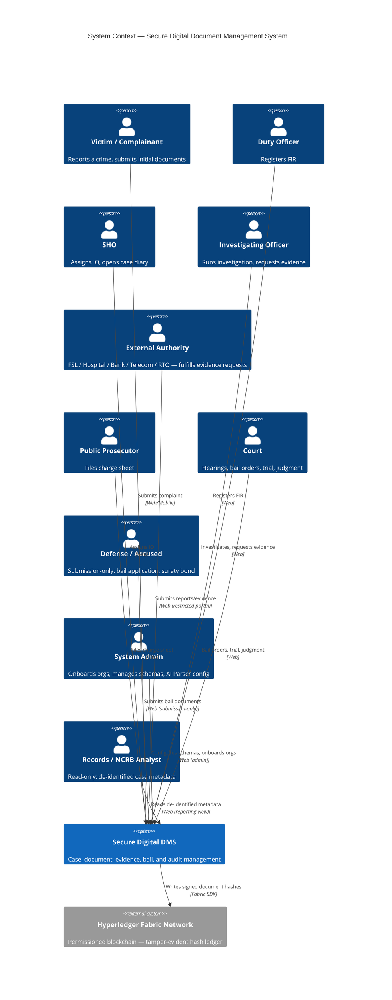

**ASCII fallback:**
```
[Victim] ─┐
[Duty Officer] ─┤
[SHO] ─┤
[IO] ────────────┤
[External Authority] ─┼──▶ [Secure Digital DMS] ──▶ [Hyperledger Fabric — hash ledger]
[Prosecutor] ─┤
[Court] ─┤
[Defense/Accused] ─┤
[Admin] ─┤
[Records/NCRB Analyst] ─┘ (read-only, de-identified)
```

### C4 Container Diagram

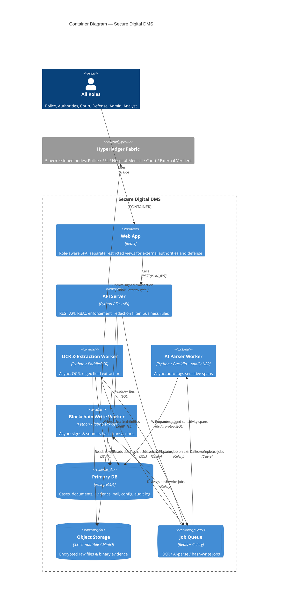

**ASCII fallback:**
```
[All Roles] ─▶ [Web App: React] ─▶ [API: Python/FastAPI] ──▶ [DB: PostgreSQL]
                                          │                       ▲
                                          ├──▶ [Object Storage: S3/MinIO]
                                          └──▶ [Queue: Redis/Celery]
                                                   │
                              ┌────────────────────┼───────────────────────┐
                              ▼                    ▼                       ▼
             [OCR Worker: PaddleOCR] ──▶ [AI Parser: Presidio+spaCy]  [Chain Worker: fabric-sdk-py]
                              │                    │                       │
                              ▼                    ▼                       ▼
                        (writes to DB)      (writes tags to DB)   [Hyperledger Fabric — 5 org nodes]
```

---

## System Connections — Usage Reference

This is the expansion of the Container Diagram's arrows into something a team member can build and
debug from — not just "A talks to B" but why the connection exists, how it fails, and what tool sits
on it. Numbers below match the diagram; the table after it is the thing to actually reference while
building.

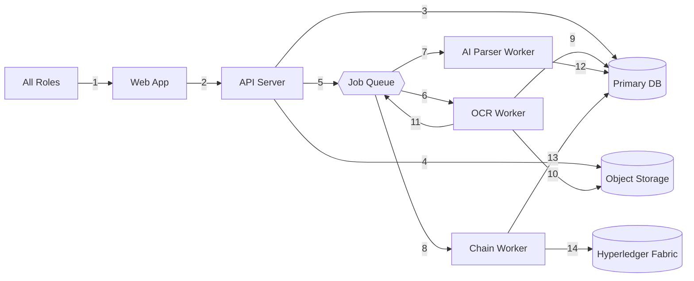

**ASCII fallback:**
```
1: All Roles      -> Web App          (HTTPS)
2: Web App        -> API Server       (REST/JSON, JWT)
3: API Server     -> Primary DB       (SQL)
4: API Server     -> Object Storage   (S3 API, TLS)
5: API Server     -> Job Queue        (Redis protocol)
6: Job Queue      -> OCR Worker       (Celery)
7: Job Queue      -> AI Parser Worker (Celery)
8: Job Queue      -> Chain Worker     (Celery)
9: OCR Worker     -> Primary DB       (SQL, writes extracted fields)
10: OCR Worker    -> Object Storage   (S3 API, reads raw file)
11: OCR Worker    -> Job Queue        (Celery, enqueues AI-parse job)
12: AI Parser     -> Primary DB       (SQL, writes sensitivity tags)
13: Chain Worker  -> Primary DB       (SQL, reads hash / writes chain_status)
14: Chain Worker  -> Hyperledger Fabric (Fabric Gateway gRPC, signed tx)
```

| # | Connection | Use case — why it exists | Drawbacks & failure modes | Tooling |
|---|---|---|---|---|
| 1 | Roles → Web App | Every human interaction with the system starts here — the one entry point for 10 different role types | Client-side only; a compromised browser session is a compromised role until the JWT expires | React SPA, HTTPS |
| 2 | Web App → API | Every read/write goes through one enforcement point (RBAC + redaction), never direct DB access from the browser | If the API is down, the whole system is down — no offline mode, no read-through cache at MVP scale | REST/JSON, JWT (role + org claim) |
| 3 | API → DB | Source of truth for every structured fact in the system (cases, documents metadata, evidence, bail, config, audit) | Single real point of failure in this design (per `LegaDoc_v2.md`'s dependency table) — no read replica at MVP scale | PostgreSQL, SQL over service credential |
| 4 | API → Object Storage | Raw files (scans, CCTV, device dumps) don't belong in relational rows — keeps DB lean and lets large binaries scale independently | Upload/fetch failures are surfaced to the user directly; no server-side retry beyond client-triggered re-upload | MinIO (S3-compatible), TLS, per-org scoped path |
| 5 | API → Job Queue | Decouples slow work (OCR, AI-tagging, blockchain writes) from the request/response cycle — the user gets a 202, not a multi-second wait | Fire-and-forget enqueue: if Redis is down, jobs are never queued (not silently lost, but visibly failed at enqueue time, not hidden) | Redis + Celery, idempotency key in every job payload |
| 6 | Queue → OCR Worker | Text-bearing documents need extraction before anything downstream (tagging, redaction) can happen | Retried with backoff; after N failures, dead-lettered + flagged via `GET /documents?status=needs_review` | Celery, PaddleOCR |
| 7 | Queue → AI Parser Worker | Delivers the AI-parse job the OCR worker enqueues — this is the automatic-redaction step | On repeated failure, **fails closed**: document defaults to fully redacted, not fully exposed, and flags for review — the one failure mode in this system deliberately designed to be safe rather than convenient | Celery, Presidio + spaCy NER |
| 8 | Queue → Chain Worker | Delivers the hash-write job — runs independently of the OCR/AI-parse track since it only needs the raw file bytes, which never change | Fabric transaction submission is this system's single most flaky integration point (community-maintained Python SDK) — retried with backoff, and has a manual `retry-chain-write` admin escape hatch | Celery, fabric-sdk-py |
| 9 | OCR Worker → DB | Persists extracted structured fields so the AI Parser and the redaction filter both have something to read | Re-extraction only happens if the document is re-uploaded as a new version — an OCR mistake on v1 doesn't silently self-correct | SQL |
| 10 | OCR Worker → Object Storage | Needs the actual file bytes to run PaddleOCR against | Read-only; a storage outage here just delays extraction, it can't corrupt the stored original | S3 API |
| 11 | OCR Worker → Job Queue | This is the causal link between extraction finishing and auto-redaction starting — OCR doesn't call the AI Parser directly, it hands off through the same queue | If this enqueue silently failed, a document could sit "extracted but never tagged" indefinitely — worth an explicit test case, not just a hope | Celery |
| 12 | AI Parser → DB | Writes the auto-tagged sensitivity spans (entity type + location + confidence — **never the raw redacted text itself**) | If this write is what fails repeatedly (not just the tagging logic), the fail-closed rule still applies — the document stays "processing," never silently serves an untagged view | SQL |
| 13 | Chain Worker → DB | Reads the document hash to sign, then writes back `chain_status` (pending/confirmed/failed) | The classic split-brain risk: Fabric confirms but the DB write crashes before recording it — this is exactly why `retry-chain-write` reuses the *original* idempotency key instead of minting a new one | SQL |
| 14 | Chain Worker → Fabric | The actual tamper-evidence mechanism — a signed hash transaction per document, submitted under the org's own Fabric MSP identity | On repeated endorsement failure, the document is flagged `chain_status=failed` for manual review; there is no inbound webhook from Fabric — confirmation is read back by polling, deliberately, to avoid standing up event-listening infrastructure at MVP scale | Fabric Gateway gRPC, fabric-sdk-py, org signing key |

Full per-arrow sync/async, retry, and volume detail (the compact version of this same table) already
lives in `LegaDoc_v2.md`'s **Arrow Specifications** section — this table is the "why and how it
breaks" companion to that one, not a replacement.

---

## Key Flows

### Flow 1 — FIR Registration & Case Creation (synchronous)

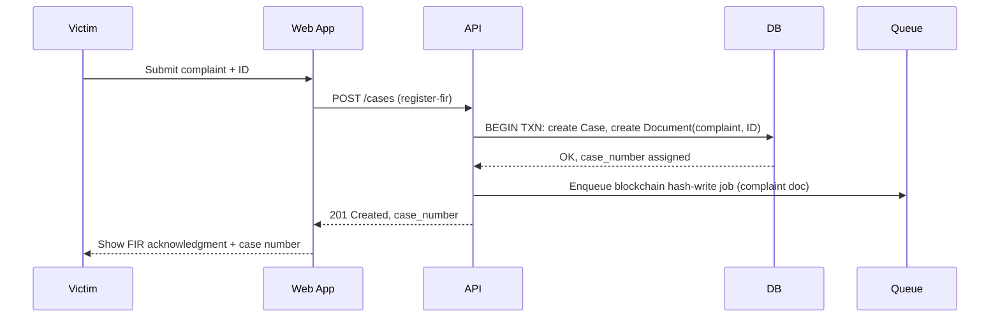

**Use case**: the victim needs a case number to reference immediately — this is the one flow where
waiting on anything async (even a blockchain write) would be a bad user experience for zero benefit.
**Drawback**: because it's fully synchronous end-to-end except the hash-write, a slow DB transaction
here is directly felt by a victim standing at a desk — this is the one endpoint worth watching for
p99 latency even at demo scale.
**Tooling**: FastAPI request handler + a single DB transaction; no queue involvement except the
fire-and-forget hash-write enqueue.

---

### Flow 2 — Document Upload → OCR → AI-Parsed Redaction → Blockchain Hash-Write
*(the core technical differentiator — two independent parallel tracks)*

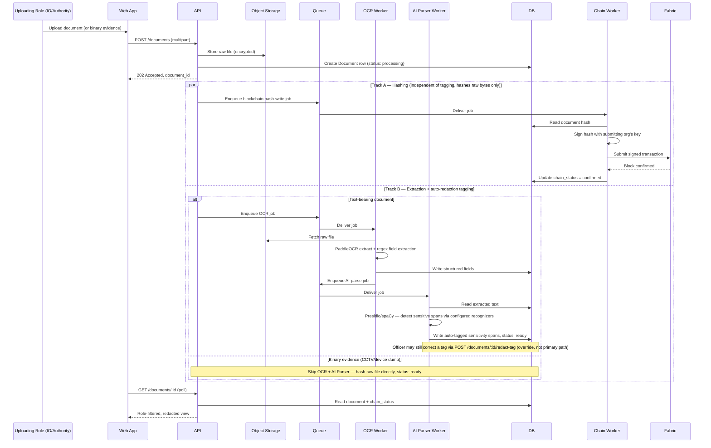

**Use case**: this is the flow that makes the whole "tamper-evident + auto-redacted" pitch real — a
document is simultaneously being made legally provable (hash on Fabric) and safe to share across
organizations (auto-tagged redaction), without either process blocking the other or blocking the
uploader.

**Drawbacks**:
- The AI Parser's out-of-the-box NER model wasn't trained on Indian legal/medical/police-report
  language — expect real misses on domain-specific fields until recognizer patterns are tuned
  per document type. This is precisely why `redact-tag` exists as a correction path, not a
  nice-to-have.
- Two independent async tracks means two independent places a document can get "stuck" —
  `chain_status=pending` forever, or `status=processing` forever. Both have a designed recovery
  path (`retry-chain-write`, and the AI Parser's fail-closed + `needs_review` flag respectively) —
  neither should ever require a manual DB edit to unstick.

**Tooling**: MinIO (storage), Celery (queue), PaddleOCR (extraction), Presidio + spaCy (tagging),
fabric-sdk-py (hashing).

---

### Flow 3 — Parallel Evidence Requests (AND-join) → Charge Sheet Filing

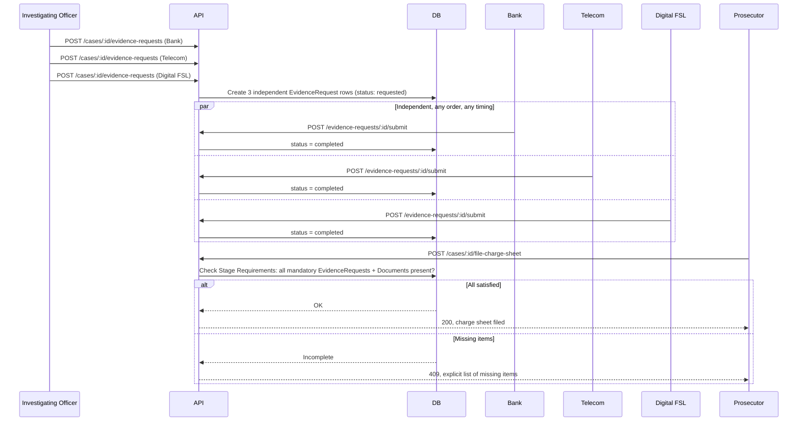

**Use case**: real investigations don't get evidence back in a fixed order — Bank might respond in a
day, Digital FSL in three weeks. Modeling this as N independent rows with an AND-join gate (rather
than a fixed sequence) is what makes the design match how evidence actually arrives.

**Drawbacks**: external authorities are real institutions with real response-time variance outside
this system's control. A single slow authority blocks charge-sheet filing indefinitely — there's no
reminder/escalation job at MVP scale (explicitly deferred to LATER), so a stuck request currently
relies on the IO noticing and following up manually.

**Tooling**: plain synchronous API calls + a DB-side validation query against the
`StageRequirements` config table — no queue involvement, this is fast enough to stay synchronous.

---

### Flow 4 — Bail Track (runs independently of the Investigation Track)

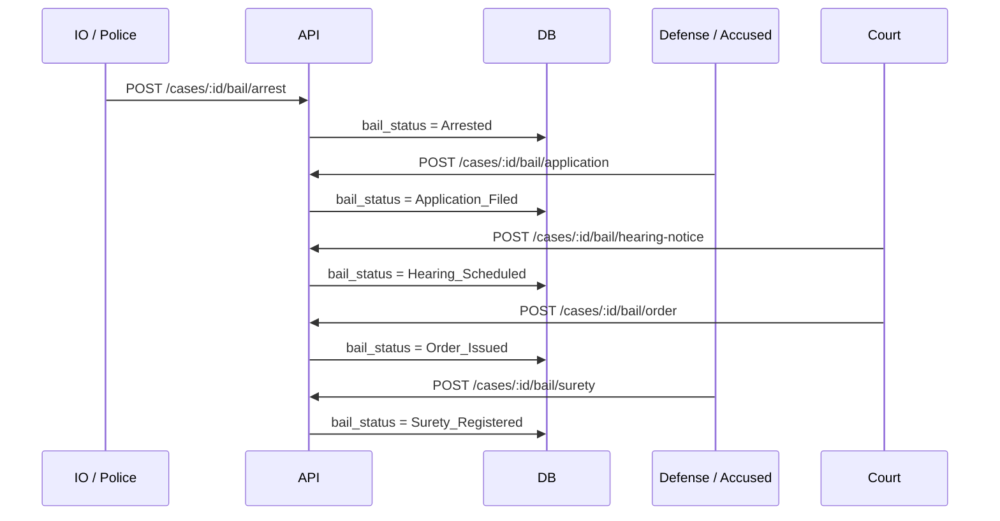

**Use case**: `investigation_status` and `bail_status` are two independent columns on the same case
row — a case can be "Charge Sheet Ready" while bail is still "Hearing Scheduled," and vice versa.
Domestic Violence was chosen as the demo showcase specifically because it's the only women-safety
case in the taxonomy with a *confirmed* bail pathway, so this flow can actually run live in a demo.

**Drawbacks**: 9 of the 15 crime types have "bail pathway not yet confirmed" in the source taxonomy
data (some legally load-bearing — NDPS Section 37, non-bailable sexual-offence classifications).
Doesn't block this flow or the demo, but it's a real legal-accuracy gap if the system is asked to
make a bail-pathway claim for those crime types.

**Tooling**: same as Flow 3 — synchronous API + DB state transition, no queue.

---

### Flow 5 — Trial → Judgment (Court Disposition)

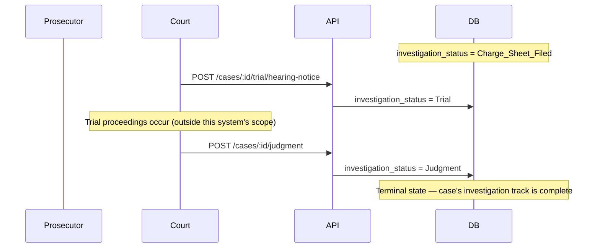

**Use case**: closes the investigation-track state diagram's final transition
(`Trial → Judgment → [*]`), which — before this design pass — had no backing endpoint at all despite
being named in the Scope statement ("...charge sheet filing, and court disposition").

**Drawbacks**: this flow deliberately does *not* model what happens inside a trial (witness
examination, adjournments, multiple hearing dates) — it only records the two endpoints that matter
to this system's state machine. If the team later needs finer-grained trial tracking, this is a
LATER item, not a gap in what's built now.

**Tooling**: identical shape to the bail endpoints — synchronous API + DB state transition.

---

### Flow 6 — AI Parser Audit Trail: Who Can See What the AI Decided

```mermaid
sequenceDiagram
    participant AI as AI Parser Worker
    participant Off as Recording Officer
    participant Adm as System Admin
    participant D as DB (audit_log)

    AI->>D: auto-tag event (entity type, location, confidence — never the raw text)
    Off->>D: correction event (old tag → new tag) via redact-tag
    Note over D: Both hash-chained to Fabric, same as any other state-changing action

    Adm->>D: GET /cases/:id/audit-log/ai-parser
    D-->>Adm: Full entity-level detail for this case
    D->>D: Meta-audit entry written — who read this, when

    Note over D: Every other role reading GET /cases/:id/audit-log sees only an aggregate line
```

**Use case**: proves two separate things — that the AI's redaction decisions are tamper-evident
(same hash-chain as everything else), and that access to the *detail* of those decisions is itself
tracked, not just the decisions.

**Drawbacks**: the meta-audit doubles the write volume on this specific endpoint (every read is now
also a write) — negligible at demo scale, worth knowing if this endpoint is ever exposed to a
high-frequency automated caller later.

**Tooling**: same append-only audit log table as everything else; no separate logging system.

---

## Domain Views — Diagrams & Use Cases

Each of the system's real-world domains gets its own view: what its actors actually do, which
endpoints they touch, and what's non-obvious or risky about building for that domain specifically.
This is the layer between "here's a container diagram" and "here's how a Women Cell officer's day
actually goes."

### Domain 1 — Police & Investigation

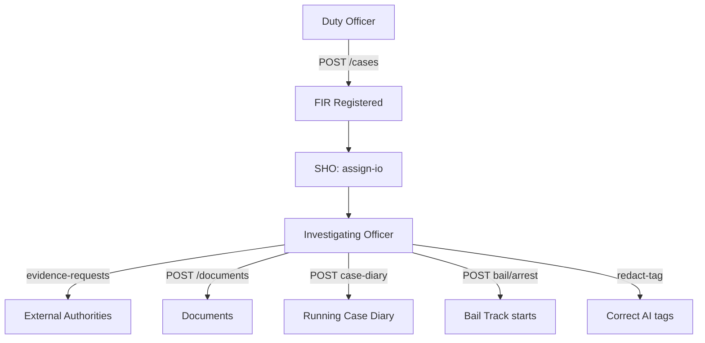

- **Use cases**: register FIR, assign/reassign IO, request evidence from external authorities,
  upload documents, maintain a running case diary, record an arrest (which starts the independent
  Bail Track), correct an AI Parser mis-tag.
- **Endpoints touched**: `/cases`, `/cases/:id/assign-io`, `/reassign-io`, `/evidence-requests`,
  `/documents`, `/cases/:id/case-diary`, `/bail/arrest`, `/documents/:id/redact-tag`.
- **Risks / non-obvious**: specialized units (Women Cell, Cyber Cell, Narcotics Police, Traffic
  Police, Crime Scene Unit, Rescue Team, Counselor) are **roles inside the Police org**, not
  separate tenants — easy to accidentally model as separate orgs, which would break the
  cross-tenant RBAC middleware's simple `org_id` check. Case Diary is an append-only running log,
  distinct from a Document upload — conflating the two loses the "running notebook" semantics real
  investigations need.

### Domain 2 — Forensic (FSL / Digital FSL)

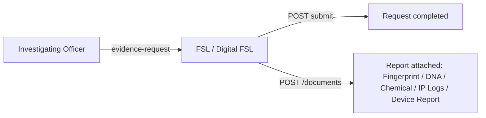

- **Use cases**: fulfill a routed evidence request; attach the resulting forensic report (general
  FSL: Fingerprint/DNA/Chemical/Blood/Biological reports; Digital FSL: IP Logs, Device Report, SIM
  Details for cyber cases).
- **Endpoints touched**: `GET /cases/:id/evidence-requests` (own only), `POST /evidence-requests/:id/submit`, `POST /documents`.
- **Risks / non-obvious**: access must be scoped to **the specific request routed to them**, never
  the rest of the case file — if this is implemented as "any user in the FSL org can see anything
  tagged FSL" instead of "only requests explicitly assigned to this org," it silently becomes a
  much bigger information leak than intended.

### Domain 3 — Medical (Hospital)

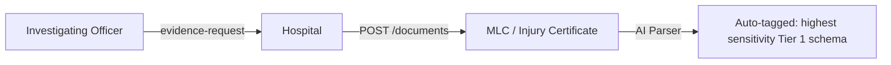

- **Use cases**: submit MLC (Medical Legal Certificate) or Injury Certificate/Report for Robbery,
  Road Accident, Assault, Rape, Domestic Violence, Acid Attack cases.
- **Endpoints touched**: same evidence-request/document pattern as Forensic.
- **Risks / non-obvious**: MLC is one of only three **Tier 1 full-custom DocumentSchema** types
  precisely because of its sensitivity concentration — this is also the document type where the AI
  Parser's out-of-the-box accuracy gap (medical/diagnosis fields, caste/religion-adjacent fields)
  matters most. Recognizer tuning here is not optional polish.

### Domain 4 — Financial & Verification Authorities (Bank, Telecom, RTO)

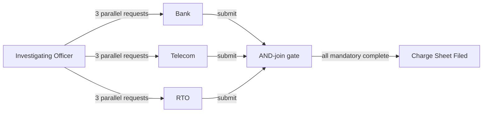

- **Use cases**: Bank/Telecom fulfill Cyber Fraud evidence requests (Bank Statement, UPI records,
  CDR, SIM details); RTO verifies vehicle registration/insurance for Road Accident cases. This
  domain is the clearest real-world demonstration of Flow 3's AND-join.
- **Endpoints touched**: same evidence-request/document pattern.
- **Risks / non-obvious**: these are genuinely separate real-world institutions (unlike the
  internal police specialized units) — the correct place to actually create a new `org_id`. Real
  response-time variance (days to weeks) means a slow authority silently blocks charge-sheet
  filing with no reminder mechanism at MVP scale — a known, accepted LATER gap, not an oversight.

### Domain 5 — Judiciary (Magistrate / Sessions / NDPS Court)

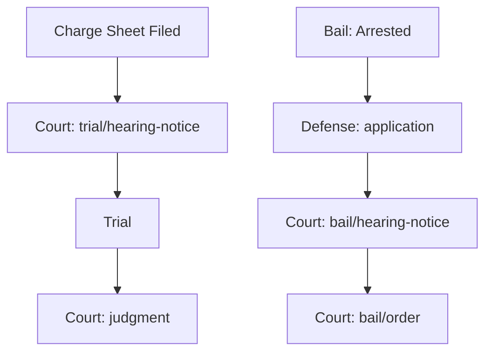

- **Use cases**: schedule and record bail hearings/orders; schedule trial hearings and record final
  judgment. Magistrate/Sessions/NDPS Court each own their org, matched to crime type and severity.
- **Endpoints touched**: `/bail/hearing-notice`, `/bail/order`, `/trial/hearing-notice`, `/judgment`,
  full `GET /cases/:id/audit-log` access (Court gets the unredacted full trail per the Access Model).
- **Risks / non-obvious**: hearing-notice and order actions share the same Court role — they're
  differentiated by audit-log action type, **not** a separate "Judge" role. A team member modeling
  RBAC from scratch might reach for a Judge role that doesn't exist in this design on purpose.
  Court-instance routing (which specific Magistrate Court, not just which level) isn't modeled —
  fine at single-court demo scale, a real limitation past it.

### Domain 6 — Defense / Accused

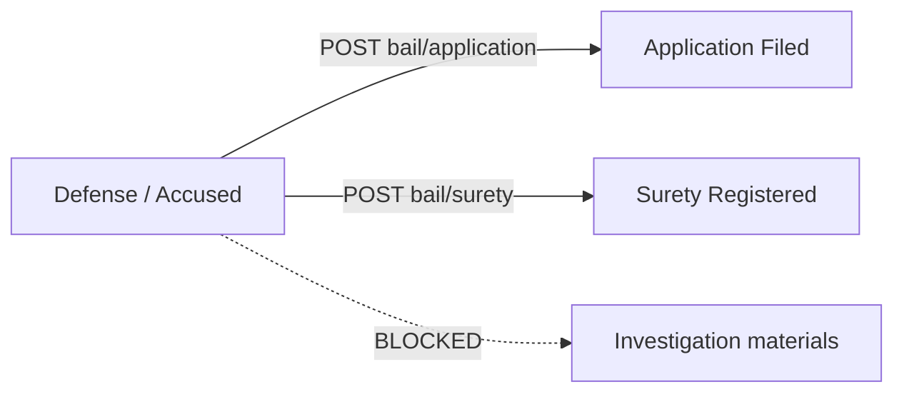

- **Use cases**: file a bail application, register a surety bond — submission-only, nothing else.
- **Endpoints touched**: `/bail/application`, `/bail/surety`, `GET /cases/:id` (own bail submissions
  only).
- **Risks / non-obvious**: this is the domain with the least access and the most consequence if
  RBAC is implemented loosely — Defense/Accused must **never** see investigation materials during
  an active investigation, per the Access Model. This is exactly why Auth/RBAC tests are the
  system's stated #1 testing priority: a broken filter here is not a cosmetic bug.

### Domain 7 — Records / NCRB Reporting

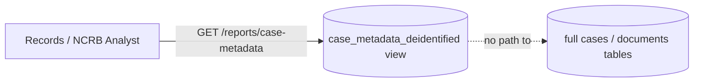

- **Use cases**: read de-identified case metadata (crime type, status, dates, court level) for
  reporting — nothing else.
- **Endpoints touched**: `GET /reports/case-metadata` only.
- **Risks / non-obvious**: this role deliberately gets **its own dedicated Postgres view**, never a
  filtered pass through the normal `/cases` or `/documents/:id` endpoints. That's not extra
  engineering for its own sake — it's the one domain in this system architected to make the
  "someone forgot to apply the redaction filter on this code path" bug class structurally
  impossible rather than just tested against.

### Domain 8 — Platform / Admin (Schema Config, AI Parser, Security)

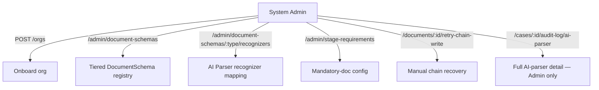

- **Use cases**: onboard organizations, manage the tiered DocumentSchema registry, configure AI
  Parser recognizer mappings per document type, manage Stage Requirements, manually recover a stuck
  chain-write, read the full AI Parser audit trail.
- **Endpoints touched**: everything under `/admin/*`, plus `/documents/:id/retry-chain-write` and
  `/cases/:id/audit-log/ai-parser`.
- **Risks / non-obvious**: this role concentrates nearly every genuinely dangerous capability in
  the system — a schema change affects redaction correctness system-wide, a recognizer
  misconfiguration affects AI Parser accuracy, and the ai-parser audit endpoint is the most
  sensitive read path that exists. A compromised Admin credential is the single highest-impact
  credential here, which is exactly why `retry-chain-write` reuses idempotency keys and the
  ai-parser audit endpoint has no bulk/cross-case export — both are deliberate blast-radius limits
  on this one role, not incidental design choices.

---

## Interface Contracts

Full 36-row endpoint table, arrow specifications, and async pattern decisions already live in
`LegaDoc_v2.md`'s **Interface Contracts** section — reused here by reference rather than duplicated,
since nothing about them changed in this pass. The **System Connections — Usage Reference** table
above is the new material this document adds on top of that endpoint table.

## State Ownership Map

Reused as-is from `LegaDoc_v2.md` — every piece of state (case core data, investigation/bail status,
document bytes, structured fields, sensitivity tags, chain_status, evidence requests, bail records,
case assignment, schema registry, stage requirements, audit log, meta-audit) has exactly one owner.
No changes in this pass.

## Environments

Reused as-is from `LegaDoc_v2.md` — local/dev, demo (judging day), production (stated, not built).
Zero external SaaS dependencies confirmed intact after the AI Parser addition (Presidio + spaCy run
entirely self-hosted).

## Domain Overlays Applied

Reused as-is from `LegaDoc_v2.md` — B2B SaaS multi-tenant overlay partially adapted (org/role model,
tenant context propagation); Fintech/Trading/AI-agent overlays explicitly not applicable, with the
AI-agent non-applicability now stated precisely (classical NLP via Presidio/spaCy, not a generative
model or LLM agent).

## Concepts Checklist

NOW / LATER / WATCHLIST tables reused as-is from `LegaDoc_v2.md`, including every addition from this
design's review sessions (Celery over BullMQ, AI Parser Worker, tiered DocumentSchema coverage,
retry-chain-write idempotency, trial/judgment endpoints, Case Diary, needs-review queue,
Records/NCRB data path, AI Parser audit trail).

## Open Questions

1. **Role-model capacity** — can the team build the full expanded role set (Women Cell, Cyber Cell,
   Records/NCRB Analyst, etc.) in the time remaining, or do some fold back into generic buckets for
   the demo?
2. **Bail-pathway data gaps** — 9 of 15 crime types have "bail pathway not yet confirmed" in the
   source taxonomy (some legally load-bearing). Doesn't block the Domestic Violence demo; a real gap
   if judges ask about other crime types.

Everything else in this document and in `LegaDoc_v2.md` is confirmed and buildable as-is.

## Build Prompt Seed

> Building a multi-organization criminal case management system (Python/FastAPI API, React
> frontend, PostgreSQL, Redis+Celery queue, MinIO object storage, Python/PaddleOCR worker,
> Python/Presidio+spaCy AI Parser worker, Python fabric-sdk-py Chain Worker against a 5-node
> Hyperledger Fabric network). The repository already has a blank baseline scaffold matching this
> container diagram (`api/`, `workers/ocr_worker/`, `workers/ai_parser_worker/`,
> `workers/chain_worker/`, `web/`, `fabric-network/`, `scripts/`, `db/migrations/`) — fill it in
> against `LegaDoc_v2.md`'s Interface Contracts and this document's System Connections table. First
> milestone unchanged from prior guidance: stand up the Fabric test network and confirm the Python
> Chain Worker can submit and confirm one signed hash transaction end-to-end, in isolation, before
> wiring the rest of the pipeline around it — this remains the highest-setup-risk component in the
> system.

---

## Review Gate

This document is additive to `LegaDoc_v2.md`, not a replacement — it adds the System Connections
usage reference, per-flow diagrams for Trial/Judgment and the AI Parser audit trail (neither had a
dedicated diagram before), and the eight domain views. The two open questions above are the only
items still needing your team's explicit call before treating the full design as final.
