# System Design — SIH26190 Secure Digital Document Management System
## Full Reference: Architecture, Connections, Flows & Domain Views

> This is the complete, self-contained system design — architecture, every connection between
> components, every flow end-to-end, every real-world domain's view into the platform, and the
> full interface contract, state ownership, environment, and checklist reference behind it. Nothing
> in this document depends on any other file.

## Scope
A multi-organization case management system for law enforcement, forensic, medical, and judicial
bodies to jointly manage a criminal case's full lifecycle — FIR through investigation, parallel
evidence collection, an independently-running bail track, charge sheet filing, and court disposition
(trial → judgment). Field-level sensitivity redaction is AI-assisted (self-hosted, non-generative)
with a human override path; every state-changing action is hash-chained to a permissioned blockchain
ledger for tamper evidence.

## Scale tier
MVP-that-becomes-a-capstone — 1 week to a demoable build, 5-person team, zero external SaaS
dependencies. A 5-person team with mixed experience (React, CNN/ML background pivoting to backend
logic, Java + conceptual Python, general full-stack, one strong pipeline-experienced generalist)
building toward a judged prototype demo, not live traffic. Every choice below is sized to that
reality; anything heavier is explicitly deferred with a stated trigger, not built because it looks
impressive.

---

## Architecture

### C4 Context Diagram

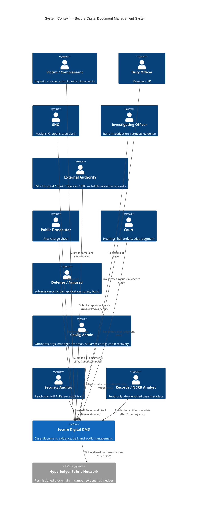

**ASCII fallback:**
```
[Victim] ─┐
[Duty Officer] ─┤
[SHO] ─┤
[IO] ────────────┤
[External Authority] ─┼──▶ [Secure Digital DMS] ──▶ [Hyperledger Fabric — hash ledger]
[Prosecutor] ─┤
[Court] ─┤
[Defense/Accused] ─┤
[Config Admin] ─┤
[Security Auditor] ─┤
[Records/NCRB Analyst] ─┘ (read-only, de-identified)
```

### C4 Container Diagram

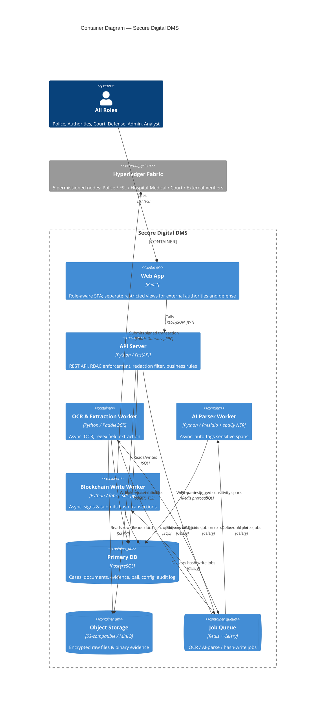

**ASCII fallback:**
```
[All Roles] ─▶ [Web App: React] ─▶ [API: Python/FastAPI] ──▶ [DB: PostgreSQL]
                                          │                       ▲
                                          ├──▶ [Object Storage: S3/MinIO]
                                          └──▶ [Queue: Redis/Celery]
                                                   │
                              ┌────────────────────┼───────────────────────┐
                              ▼                    ▼                       ▼
             [OCR Worker: PaddleOCR] ──▶ [AI Parser: Presidio+spaCy]  [Chain Worker: fabric-sdk-py]
                              │                    │                       │
                              ▼                    ▼                       ▼
                        (writes to DB)      (writes tags to DB)   [Hyperledger Fabric — 5 org nodes]
```

**Tech-choice rationale (one line each):**
- **PostgreSQL over NoSQL** — case/document/evidence-request/bail data is deeply relational (foreign keys, joins for stage-requirement checks); relational integrity matters more here than schema flexibility.
- **Python/FastAPI for the API** — the whole backend is standardized on Python; FastAPI's async support fits the poll-heavy, queue-heavy request patterns in this design and gives request/response validation for free.
- **Python for the OCR worker** — PaddleOCR is Python-native; no polyglot cost since the whole backend is Python.
- **Python (fabric-sdk-py) for the Chain Worker, deliberately** — Fabric's most mature SDKs are Node/Java/Go; the Python SDK is community-maintained and less current. Chosen anyway for stack consistency, with the risk explicitly accepted, not overlooked.
- **Presidio + spaCy NER for the AI Parser, self-hosted** — purpose-built open-source PII/sensitive-span detection (pattern recognizers + a pretrained NER model), not a generative LLM. Needs a one-time human configuration step (map entity types → DocumentSchema fields) instead of training-data collection, which is the realistic path to "fully automatic, self-hosted, no existing trained model" inside a short build window.
- **Redis/Celery over BullMQ** — with the whole backend in Python, Celery is the natural, officially-supported choice. Three job types (OCR, AI-parse, blockchain-write), each single-producer/single-consumer — exactly right-sized, no Kafka-scale event streaming needed.
- **MinIO/S3-compatible object storage over storing files in Postgres** — documents and binary evidence (CCTV, device dumps) don't belong in relational rows; object storage with DB-held references is the standard, correct split.

---

## System Connections — Usage Reference

This is the expansion of the Container Diagram's arrows into something a team member can build and
debug from — not just "A talks to B" but why the connection exists, how it fails, and what tool sits
on it. Numbers below match the diagram; the table after it is the thing to actually reference while
building.

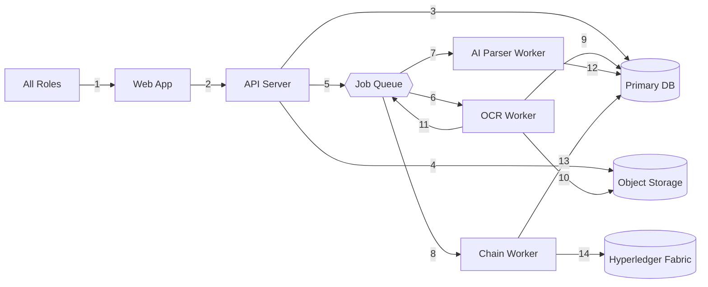

**ASCII fallback:**
```
1: All Roles      -> Web App          (HTTPS)
2: Web App        -> API Server       (REST/JSON, JWT)
3: API Server     -> Primary DB       (SQL)
4: API Server     -> Object Storage   (S3 API, TLS)
5: API Server     -> Job Queue        (Redis protocol)
6: Job Queue      -> OCR Worker       (Celery)
7: Job Queue      -> AI Parser Worker (Celery)
8: Job Queue      -> Chain Worker     (Celery)
9: OCR Worker     -> Primary DB       (SQL, writes extracted fields)
10: OCR Worker    -> Object Storage   (S3 API, reads raw file)
11: OCR Worker    -> Job Queue        (Celery, enqueues AI-parse job)
12: AI Parser     -> Primary DB       (SQL, writes sensitivity tags)
13: Chain Worker  -> Primary DB       (SQL, reads hash / writes chain_status)
14: Chain Worker  -> Hyperledger Fabric (Fabric Gateway gRPC, signed tx)
```

| # | Connection | Use case — why it exists | Drawbacks & failure modes | Tooling |
|---|---|---|---|---|
| 1 | Roles → Web App | Every human interaction with the system starts here — the one entry point for 10 different role types | Client-side only; a compromised browser session is a compromised role until the JWT expires | React SPA, HTTPS |
| 2 | Web App → API | Every read/write goes through one enforcement point (RBAC + redaction), never direct DB access from the browser | If the API is down, the whole system is down — no offline mode, no read-through cache at MVP scale | REST/JSON, JWT (role + org claim) |
| 3 | API → DB | Source of truth for every structured fact in the system (cases, documents metadata, evidence, bail, config, audit) | Single real point of failure in this design — no read replica at MVP scale | PostgreSQL, SQL over service credential |
| 4 | API → Object Storage | Raw files (scans, CCTV, device dumps) don't belong in relational rows — keeps DB lean and lets large binaries scale independently | Upload/fetch failures are surfaced to the user directly; no server-side retry beyond client-triggered re-upload | MinIO (S3-compatible), TLS, per-org scoped path |
| 5 | API → Job Queue | Decouples slow work (OCR, AI-tagging, blockchain writes) from the request/response cycle — the user gets a 202, not a multi-second wait | Fire-and-forget enqueue: if Redis is down, jobs are never queued (not silently lost, but visibly failed at enqueue time, not hidden) | Redis + Celery, idempotency key in every job payload |
| 6 | Queue → OCR Worker | Text-bearing documents need extraction before anything downstream (tagging, redaction) can happen | Retried with backoff; on a PaddleOCR engine failure, falls back to Tesseract before giving up; after N failures on both, dead-lettered + flagged via `GET /documents?status=needs_review` | Celery, PaddleOCR (primary), Tesseract (fallback only) |
| 7 | Queue → AI Parser Worker | Delivers the AI-parse job the OCR worker enqueues — this is the automatic-redaction step | On repeated failure, **fails closed**: document defaults to fully redacted, not fully exposed, and flags for review — the one failure mode in this system deliberately designed to be safe rather than convenient | Celery, Presidio + spaCy NER |
| 8 | Queue → Chain Worker | Delivers the hash-write job — runs independently of the OCR/AI-parse track since it only needs the raw file bytes, which never change | Fabric transaction submission is this system's single most flaky integration point (community-maintained Python SDK) — retried with backoff, and has a manual `retry-chain-write` admin escape hatch | Celery, fabric-sdk-py |
| 9 | OCR Worker → DB | Persists `raw_text` plus extracted structured fields — the AI Parser literally has nothing to tag without this write landing first | Re-extraction only happens if the document is re-uploaded as a new version — an OCR mistake on v1 doesn't silently self-correct | SQL |
| 10 | OCR Worker → Object Storage | Needs the actual file bytes to run PaddleOCR against | Read-only; a storage outage here just delays extraction, it can't corrupt the stored original | S3 API |
| 11 | OCR Worker → Job Queue | This is the causal link between extraction finishing and auto-redaction starting — OCR doesn't call the AI Parser directly, it hands off through the same queue | If this enqueue silently failed, a document could sit "extracted but never tagged" indefinitely with no active worker watching it. **A periodic reconciliation job must flag any document stuck in `status=processing` for more than ~10 minutes** — this is not optional hardening, it's the only thing standing between a silent enqueue failure and a document nobody ever notices is stuck | Celery |
| 12 | AI Parser → DB | Writes the auto-tagged sensitivity spans (entity type + location + confidence — **never the raw redacted text itself**) | If this write is what fails repeatedly (not just the tagging logic), the fail-closed rule still applies — the document stays "processing," never silently serves an untagged view | SQL |
| 13 | Chain Worker → DB | Reads the document hash to sign, then writes back `chain_status` (pending/confirmed/failed) | The classic split-brain risk: Fabric confirms but the DB write crashes before recording it — this is exactly why `retry-chain-write` reuses the *original* idempotency key instead of minting a new one | SQL |
| 14 | Chain Worker → Fabric | The actual tamper-evidence mechanism — a signed hash transaction per document, submitted under the org's own Fabric MSP identity | On repeated endorsement failure, the document is flagged `chain_status=failed` for manual review; there is no inbound webhook from Fabric — confirmation is read back by polling, deliberately, to avoid standing up event-listening infrastructure at MVP scale | Fabric Gateway gRPC, fabric-sdk-py, org signing key |

The compact sync/async/retry/volume version of this same table lives in the **Interface Contracts**
section below, under Arrow Specifications — this table is the "why and how it breaks" companion to
that one.

### The chaincode interface (concrete, not just conceptual)

`fabric-network/chaincode/hashledger` implements exactly three functions — deliberately narrow, not
a generic asset-transfer contract:

- **`RecordHash(docID, docHash, orgID)`** — writes a hash record once, keyed by `docID` (this
  system's `Document.id`, already globally unique per version). Idempotent for a resubmission of the
  *same* hash (supports `retry-chain-write` safely); fails loudly if the *same* `docID` is ever
  submitted with a *different* hash — that would mean either an upstream bug or actual tampering,
  never something to silently accept.
- **`GetHash(docID)`** — reads the stored record back.
- **`VerifyHash(docID, hashToCheck)`** — the direct support for the strongest demo moment this
  architecture can produce: recompute a document's hash locally, ask the ledger if it matches, get a
  live yes/no. Run it once on an untouched document and again after deliberately editing the stored
  file — that live contrast is worth more than any slide describing tamper-evidence in the abstract.

The Chain Worker's own orchestration (idempotency-key handling, retry, `chain_status` transitions,
audit logging) is implemented and unit-tested against a mocked Fabric boundary — see
`workers/chain_worker/worker.py` and `api/tests/test_chain_worker.py`. The chaincode itself and the
`fabric_client.py` module that calls it are **not** verified end-to-end against a real network — see
`fabric-network/README.md` for exactly what's been checked and what hasn't. Standing up the network
and confirming one real signed transaction remains the first build milestone, unchanged from the
Build Prompt Seed below.

---

## Key Flows

### Flow 1 — FIR Registration & Case Creation (synchronous)

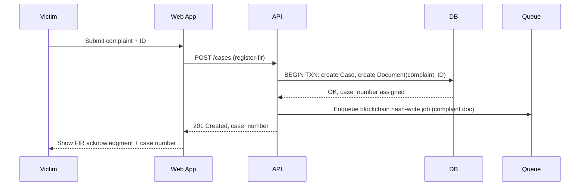

**Use case**: the victim needs a case number to reference immediately — this is the one flow where
waiting on anything async (even a blockchain write) would be a bad user experience for zero benefit.
**Drawback**: because it's fully synchronous end-to-end except the hash-write, a slow DB transaction
here is directly felt by a victim standing at a desk — this is the one endpoint worth watching for
p99 latency even at demo scale.
**Tooling**: FastAPI request handler + a single DB transaction; no queue involvement except the
fire-and-forget hash-write enqueue.

---

### Flow 2 — Document Upload → OCR → AI-Parsed Redaction → Blockchain Hash-Write
*(the core technical differentiator — two independent parallel tracks)*

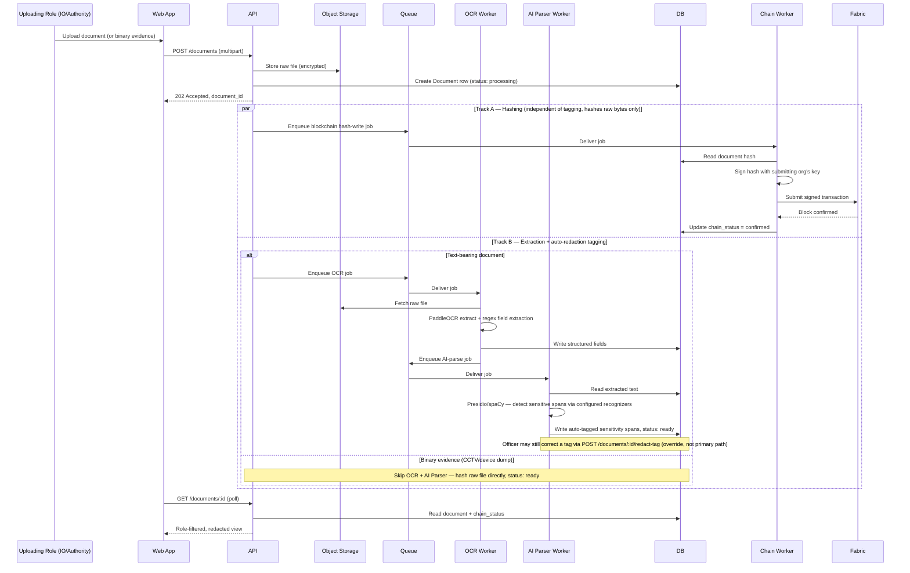

**Use case**: this is the flow that makes the whole "tamper-evident + auto-redacted" pitch real — a
document is simultaneously being made legally provable (hash on Fabric) and safe to share across
organizations (auto-tagged redaction), without either process blocking the other or blocking the
uploader.

**Drawbacks**:
- The AI Parser's out-of-the-box NER model wasn't trained on Indian legal/medical/police-report
  language — expect real misses on domain-specific fields until recognizer patterns are tuned
  per document type. This is precisely why `redact-tag` exists as a correction path, not a
  nice-to-have.
- Two independent async tracks means two independent places a document can get "stuck" —
  `chain_status=pending` forever, or `status=processing` forever. Both have a designed recovery
  path (`retry-chain-write`, a periodic reconciliation job flagging stuck `processing` documents,
  and the AI Parser's fail-closed + `needs_review` flag respectively) — neither should ever require
  a manual DB edit to unstick.
- A tag that "succeeds" at low confidence isn't the same as one worth trusting — any tag below the
  confidence threshold (70/100) routes the whole document to `needs_review`, same as an outright
  failure would.

**Tooling**: MinIO (storage), Celery (queue), PaddleOCR with Tesseract as a fallback engine
(extraction), Presidio + spaCy (tagging), fabric-sdk-py (hashing).

---

### Flow 3 — Parallel Evidence Requests (AND-join) → Charge Sheet Filing

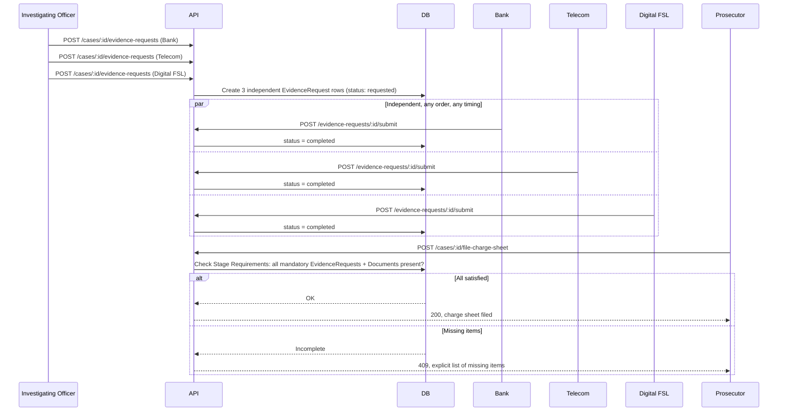

**Use case**: real investigations don't get evidence back in a fixed order — Bank might respond in a
day, Digital FSL in three weeks. Modeling this as N independent rows with an AND-join gate (rather
than a fixed sequence) is what makes the design match how evidence actually arrives.

**Drawbacks**: external authorities are real institutions with real response-time variance outside
this system's control. A single slow authority blocks charge-sheet filing indefinitely — there's no
reminder/escalation job at MVP scale (explicitly deferred to LATER), so a stuck request currently
relies on the IO noticing and following up manually.

**Tooling**: plain synchronous API calls + a DB-side validation query against the
`StageRequirements` config table — no queue involvement, this is fast enough to stay synchronous.

---

### Flow 4 — Bail Track (runs independently of the Investigation Track)

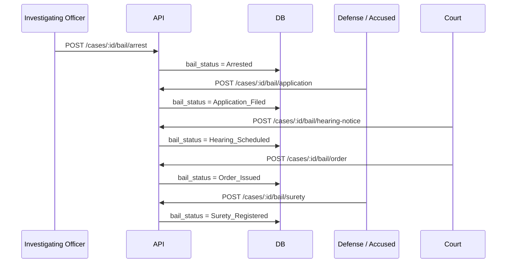

**Use case**: `investigation_status` and `bail_status` are two independent columns on the same case
row — a case can be "Charge Sheet Ready" while bail is still "Hearing Scheduled," and vice versa.
Domestic Violence was chosen as the demo showcase specifically because it's the only women-safety
case in the taxonomy with a *confirmed* bail pathway, so this flow can actually run live in a demo.

**Drawbacks**: 9 of the 15 crime types have "bail pathway not yet confirmed" in the source taxonomy
data (some legally load-bearing — NDPS Section 37, non-bailable sexual-offence classifications).
Doesn't block this flow or the demo, but it's a real legal-accuracy gap if the system is asked to
make a bail-pathway claim for those crime types.

**Tooling**: same as Flow 3 — synchronous API + DB state transition, no queue.

---

### Flow 5 — Trial → Judgment (Court Disposition)

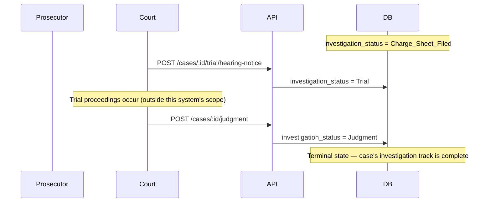

**Use case**: closes the investigation-track state diagram's final transition
(`Trial → Judgment → [*]`), which — before this design pass — had no backing endpoint at all despite
being named in the Scope statement ("...charge sheet filing, and court disposition").

**Drawbacks**: this flow deliberately does *not* model what happens inside a trial (witness
examination, adjournments, multiple hearing dates) — it only records the two endpoints that matter
to this system's state machine. If the team later needs finer-grained trial tracking, this is a
LATER item, not a gap in what's built now.

**Tooling**: identical shape to the bail endpoints — synchronous API + DB state transition.

---

### Flow 6 — AI Parser Audit Trail: Who Can See What the AI Decided

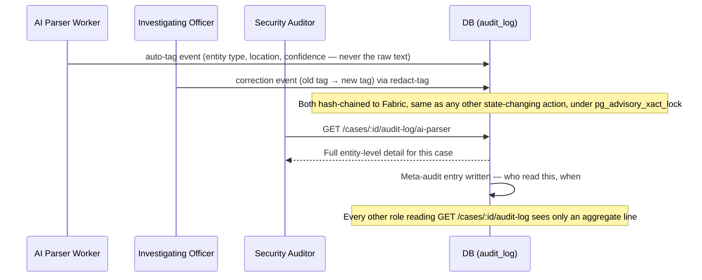

**Use case**: proves two separate things — that the AI's redaction decisions are tamper-evident
(same hash-chain as everything else), and that access to the *detail* of those decisions is itself
tracked, not just the decisions.

**Drawbacks**: the meta-audit doubles the write volume on this specific endpoint (every read is now
also a write) — negligible at demo scale, worth knowing if this endpoint is ever exposed to a
high-frequency automated caller later.

**Tooling**: same append-only audit log table as everything else; no separate logging system.

---

## Domain Views — Diagrams & Use Cases

Each of the system's real-world domains gets its own view: what its actors actually do, which
endpoints they touch, and what's non-obvious or risky about building for that domain specifically.
This is the layer between "here's a container diagram" and "here's how a Women Cell officer's day
actually goes."

### Domain 1 — Police & Investigation

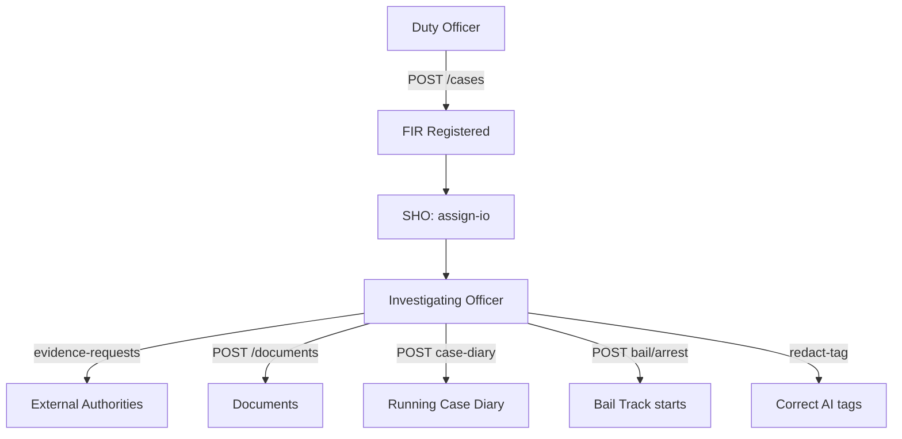

- **Use cases**: register FIR, assign/reassign IO, request evidence from external authorities,
  upload documents, maintain a running case diary, record an arrest (which starts the independent
  Bail Track), correct an AI Parser mis-tag.
- **Endpoints touched**: `/cases`, `/cases/:id/assign-io`, `/reassign-io`, `/evidence-requests`,
  `/documents`, `/cases/:id/case-diary`, `/bail/arrest`, `/documents/:id/redact-tag`.
- **Risks / non-obvious**: specialized units (Women Cell, Cyber Cell, Narcotics Police, Traffic
  Police, Crime Scene Unit, Rescue Team, Counselor) are **roles inside the Police org**, not
  separate tenants — easy to accidentally model as separate orgs, which would break the
  cross-tenant RBAC middleware's simple `org_id` check. Case Diary is an append-only running log,
  distinct from a Document upload — conflating the two loses the "running notebook" semantics real
  investigations need. It now routes through the AI Parser for auto-redaction before being visible
  beyond the assigned IO/SHO, closing what was previously a gap in the flagship redaction feature.

### Domain 2 — Forensic (FSL / Digital FSL)

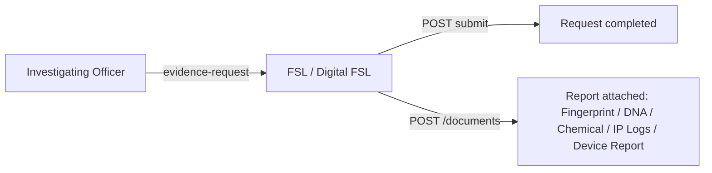

- **Use cases**: fulfill a routed evidence request; attach the resulting forensic report (general
  FSL: Fingerprint/DNA/Chemical/Blood/Biological reports; Digital FSL: IP Logs, Device Report, SIM
  Details for cyber cases).
- **Endpoints touched**: `GET /cases/:id/evidence-requests` (own only), `POST /evidence-requests/:id/submit`, `POST /documents`.
- **Risks / non-obvious**: access must be scoped to **the specific request routed to them**, never
  the rest of the case file — if this is implemented as "any user in the FSL org can see anything
  tagged FSL" instead of "only requests explicitly assigned to this org," it silently becomes a
  much bigger information leak than intended.

### Domain 3 — Medical (Hospital)


- **Use cases**: submit MLC (Medical Legal Certificate) or Injury Certificate/Report for Robbery,
  Road Accident, Assault, Rape, Domestic Violence, Acid Attack cases.
- **Endpoints touched**: same evidence-request/document pattern as Forensic.
- **Risks / non-obvious**: MLC is one of only three **Tier 1 full-custom DocumentSchema** types
  precisely because of its sensitivity concentration — this is also the document type where the AI
  Parser's out-of-the-box accuracy gap (medical/diagnosis fields, caste/religion-adjacent fields)
  matters most. Recognizer tuning here is not optional polish.

### Domain 4 — Financial & Verification Authorities (Bank, Telecom, RTO)

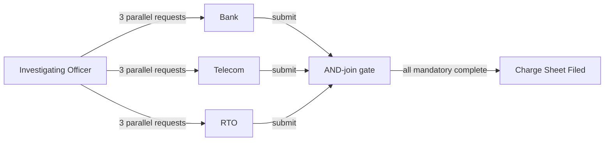

- **Use cases**: Bank/Telecom fulfill Cyber Fraud evidence requests (Bank Statement, UPI records,
  CDR, SIM details); RTO verifies vehicle registration/insurance for Road Accident cases. This
  domain is the clearest real-world demonstration of Flow 3's AND-join.
- **Endpoints touched**: same evidence-request/document pattern.
- **Risks / non-obvious**: these are genuinely separate real-world institutions (unlike the
  internal police specialized units) — the correct place to actually create a new `org_id`. Real
  response-time variance (days to weeks) means a slow authority silently blocks charge-sheet
  filing with no reminder mechanism at MVP scale — a known, accepted LATER gap, not an oversight.

### Domain 5 — Judiciary (Magistrate / Sessions / NDPS Court)

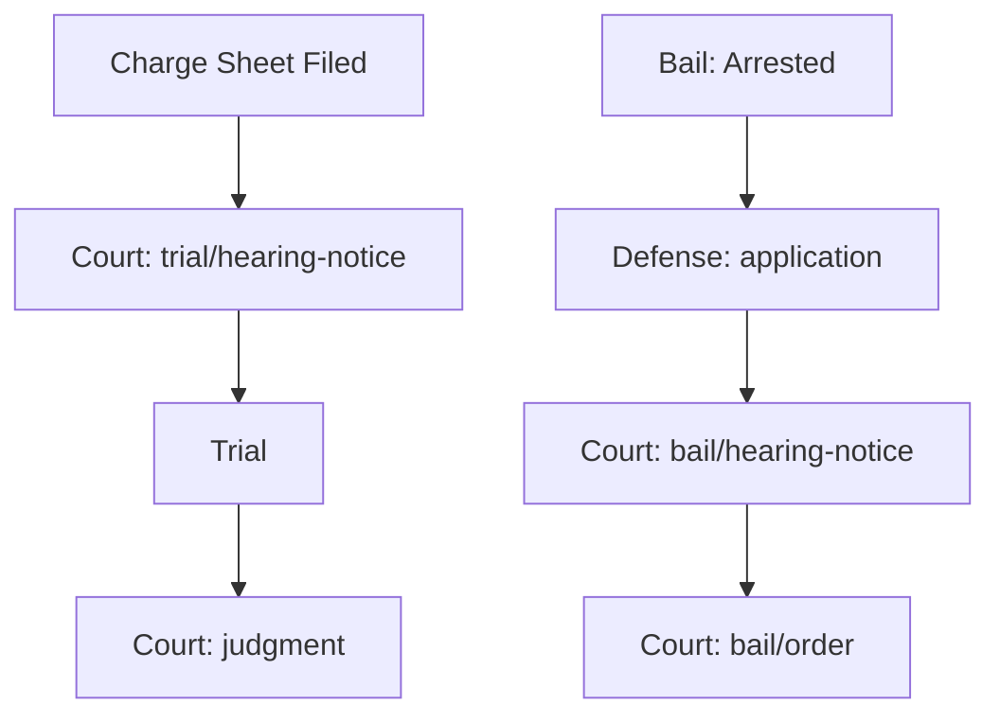

- **Use cases**: schedule and record bail hearings/orders; schedule trial hearings and record final
  judgment. Magistrate/Sessions/NDPS Court each own their org, matched to crime type and severity.
- **Endpoints touched**: `/bail/hearing-notice`, `/bail/order`, `/trial/hearing-notice`, `/judgment`,
  full `GET /cases/:id/audit-log` access (Court gets the unredacted full trail per the Access Model).
- **Risks / non-obvious**: hearing-notice and order actions share the same Court role — they're
  differentiated by audit-log action type, **not** a separate "Judge" role. A team member modeling
  RBAC from scratch might reach for a Judge role that doesn't exist in this design on purpose.
  Court-instance routing (which specific Magistrate Court, not just which level) isn't modeled —
  fine at single-court demo scale, a real limitation past it.

### Domain 6 — Defense / Accused

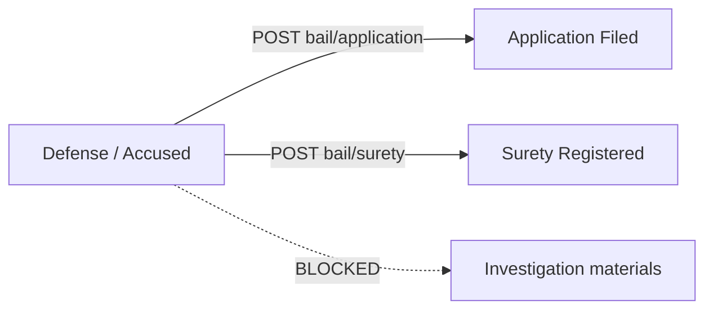

- **Use cases**: file a bail application, register a surety bond — submission-only, nothing else.
- **Endpoints touched**: `/bail/application`, `/bail/surety`, `GET /cases/:id` (own bail submissions
  only).
- **Risks / non-obvious**: this is the domain with the least access and the most consequence if
  RBAC is implemented loosely — Defense/Accused must **never** see investigation materials during
  an active investigation, per the Access Model. This is exactly why Auth/RBAC tests are the
  system's stated #1 testing priority: a broken filter here is not a cosmetic bug.

### Domain 7 — Records / NCRB Reporting

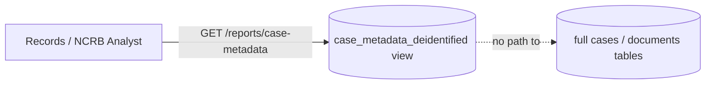

- **Use cases**: read de-identified case metadata (crime type, status, dates, court level) for
  reporting — nothing else.
- **Endpoints touched**: `GET /reports/case-metadata` only.
- **Risks / non-obvious**: this role deliberately gets **its own dedicated Postgres view**, never a
  filtered pass through the normal `/cases` or `/documents/:id` endpoints. That's not extra
  engineering for its own sake — it's the one domain in this system architected to make the
  "someone forgot to apply the redaction filter on this code path" bug class structurally
  impossible rather than just tested against. This role belongs to its own organization — `org = NCRB`,
  a central body, distinct from Police.

### Domain 8 — Platform / Admin (Schema Config, AI Parser, Security)

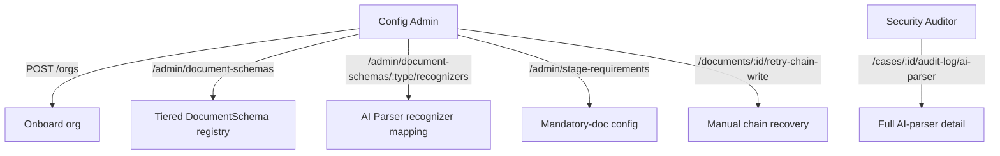

- **Use cases**: **Config Admin** — onboard organizations, manage the tiered DocumentSchema
  registry, configure AI Parser recognizer mappings per document type, manage Stage Requirements,
  manually recover a stuck chain-write. **Security Auditor** — read the full AI Parser audit trail,
  nothing else.
- **Endpoints touched**: Config Admin owns everything under `/admin/*` plus
  `/documents/:id/retry-chain-write`; Security Auditor owns only `/cases/:id/audit-log/ai-parser`.
- **Risks / non-obvious**: this domain concentrates nearly every genuinely dangerous capability in
  the system, which is exactly why it's split into two roles rather than one — a schema change
  affects redaction correctness system-wide, a recognizer misconfiguration affects AI Parser
  accuracy, and the ai-parser audit endpoint is the most sensitive read path that exists. Splitting
  Config Admin from Security Auditor means the account that edits redaction rules is never the same
  account that inspects whether redaction is working — the same person checking their own work is
  exactly the failure mode this split closes. `retry-chain-write` reuses idempotency keys and the
  ai-parser audit endpoint has no bulk/cross-case export — both are deliberate blast-radius limits
  on top of the role split, not incidental design choices. Both roles are MFA-required (see
  Security section) and both are flagged for second-person confirmation on their riskiest actions
  (schema changes, chain-write recovery) once this moves past demo scale.

---

## Interface Contracts

### Endpoint Table

| Verb | Route | Auth (who) | Purpose | Notes |
|---|---|---|---|---|
| POST | /auth/login | Public | Issue access token (15 min) + refresh token (7 days) | Rate-limited 10/min per IP; constant-time check even against an unknown email, to prevent account enumeration via response timing |
| POST | /auth/refresh | Any authenticated (via refresh token) | Exchange a refresh token for a new access token | New — a 15-minute access-token TTL is unusable without this |
| POST | /auth/logout | Any authenticated | Invalidate the current session | New. LATER: write the token's JTI to a Redis revocation set so this works before natural expiry, not just client-side |
| GET | /orgs/:orgId/users | Config Admin | List an org's users | — |
| POST | /orgs | Config Admin | Onboard external authority org | MVP: admin pre-registration, not self-service |
| POST | /cases | Duty Officer | Register FIR, create case | Action-shaped, not raw POST — validates crime-type config |
| GET | /cases | Any authenticated role | List cases, filtered by role/org visibility | Paginated, filterable by crime_type/status |
| GET | /cases/:id | Role-filtered | Fetch case summary + linked resources | — |
| POST | /cases/:id/assign-io | SHO | Assign investigating officer | Creates CaseAssignment row |
| POST | /cases/:id/reassign-io | SHO / Config Admin | Reassign IO mid-case | Logged as its own audit event; EvidenceRequest ownership follows the Case, not the individual IO, so in-flight requests transfer transparently |
| POST | /cases/:id/case-diary | IO | Append a running case-diary entry | Append-only log (author, text, timestamp) — not a Document upload, a running notebook per case; text is routed through the AI Parser for auto-redaction before being visible beyond the assigned IO/SHO |
| GET | /cases/:id/case-diary | Role-filtered | List case-diary entries | Same visibility rule as the rest of the case file |
| POST | /cases/:id/evidence-requests | IO | Create request to external org | One row per request — supports parallel N requests |
| GET | /cases/:id/evidence-requests | IO / relevant Authority | List requests + status | — |
| POST | /evidence-requests/:id/submit | The specific requested Authority | Fulfill request, attach document | Triggers document upload pipeline |
| POST | /documents | Role permitted for that case/doc-type | Upload document or binary evidence | Multipart; routes to OCR→AI-Parser pipeline or binary pipeline by file type |
| GET | /documents/:id | Role-filtered | Fetch document | Returns redacted or full view per auto-tagged sensitivity spans + role |
| GET | /documents/:id/versions | Role-filtered | Version history | Append-only — originals never overwritten |
| GET | /documents/:id/chain-status | Role-filtered | Poll blockchain confirmation | Short-poll target for Flow 2 |
| GET | /documents?status=needs_review | Config Admin / Investigating Officer | List documents where the AI Parser fell back to fully-redacted after repeated failure, **including a low-confidence tag that technically "succeeded"** | Plain filtered query on the documents table; surface age + count in the UI so a growing backlog doesn't go unnoticed |
| POST | /documents/:id/retry-chain-write | Config Admin | Manually re-trigger a stuck chain-write | Reuses the *original* idempotency key, never a fresh one — if Fabric actually confirmed the transaction before the crash, this guarantees the retry can't create a duplicate ledger entry. Flagged for second-person confirmation once past demo scale |
| POST | /documents/:id/redact-tag | Investigating Officer | Correct/override an AI Parser sensitivity tag | Correction path over the AI Parser's auto-tags, not the primary tagging mechanism. "Recording officer" in earlier drafts of this doc meant the IO assigned to the case — resolved to the actual role name for consistency with the Role & Authority Taxonomy |
| POST | /cases/:id/file-charge-sheet | Prosecutor | Attempt charge sheet filing | Validated against Stage Requirements — 409 if incomplete |
| POST | /cases/:id/bail/arrest | Investigating Officer / Duty Officer | Record arrest | Starts independent bail track |
| POST | /cases/:id/bail/application | Defense (submission-only) | File bail application | — |
| POST | /cases/:id/bail/hearing-notice | Court | Schedule hearing | — |
| POST | /cases/:id/bail/order | Court | Issue bail order | Same role as hearing-notice; differentiated by audit-log action, not a separate "Judge" role |
| POST | /cases/:id/bail/surety | Accused (submission-only) | Register surety bond | — |
| POST | /cases/:id/trial/hearing-notice | Court | Schedule a trial hearing | Mirrors bail's hearing-notice; moves `investigation_status` to `Trial` |
| POST | /cases/:id/judgment | Court | Record final judgment | Mirrors bail's order pattern; moves `investigation_status` to `Judgment` — closes the state diagram's `Trial → Judgment` transition |
| GET | /cases/:id/audit-log | Role-filtered | Full or summarized audit trail incl. chain_status | Full for Config Admin/Security Auditor/Court, summarized elsewhere |
| GET | /cases/:id/audit-log/ai-parser | **Security Auditor only** (not Config Admin) | Full detail of every AI Parser auto-tag decision and every human correction on this case's documents | Deliberately narrower than the general audit log; rate-limited separately (20/min per user) from the general API default; every read of this endpoint is itself logged (meta-audit); no bulk/cross-case export |
| GET | /admin/document-schemas | Config Admin | Manage field-sensitivity schema registry | Tiered: full field definitions for the ~13 Tier 1+2 types (FIR, MLC, Witness Statement + Domestic Violence showcase set), one generic default profile inherited by the remaining ~40+ of the 57 canonical types |
| POST | /admin/document-schemas/:type/recognizers | Config Admin | Map entity types (name, phone, medical condition, ID number, ...) to a DocumentSchema's sensitivity fields | One-time-per-type config step that drives the AI Parser; every change writes an old-vs-new diff to the audit log |
| GET | /admin/stage-requirements | Config Admin | Manage mandatory-document/evidence config per crime type | Drives Flow 3's validation check |
| GET | /reports/case-metadata | Records / NCRB Analyst | De-identified case metadata only | Backed by a dedicated Postgres view (e.g. `case_metadata_deidentified`) exposing only non-sensitive columns — no separate redaction logic to build or keep in sync |

*(36 endpoints — every route maps to a resource + verb derived mechanically from the case/document/evidence/bail resource model, not invented ad hoc. `/auth/refresh` and `/auth/logout` are the two additions from this pass — required once the access-token TTL was tightened to 15 minutes.)*

### Arrow Specifications (every connection in the container diagram)

| From → To | Trigger | Sync/async | Payload | Auth | Failure behavior | Retry & idempotency | Volume (demo scale) |
|---|---|---|---|---|---|---|---|
| Web App → API | User action | Sync | REST/JSON per endpoint table | JWT (role + org claim) | Error surfaced to user | N/A (user-initiated) | Low |
| API → DB | Every request | Sync | SQL | Service credential | 500 to caller, logged | N/A within a request; idempotency keys on state-transition actions | Low |
| API → Object Storage | Document upload/fetch | Sync | File bytes, S3 API | Service credential, scoped per-org path | Error surfaced; upload retried by client | Client-side retry on network failure | Low |
| API → Queue | Doc uploaded / doc finalized | Async (fire-and-forget enqueue) | Job payload: doc_id, case_id, org_id, idempotency_key | Internal service credential | Job requeued on worker crash (Celery default, acks-late) | Idempotency key prevents duplicate OCR/AI-parse/hash-write on redelivery | Low |
| Queue → OCR Worker | Job available | Async | doc_id | Internal | Job retried with backoff; after N failures, dead-letter + manual review flag | Idempotency key = doc_id + version | Low |
| OCR Worker → Queue | Extraction complete | Async (fire-and-forget enqueue) | doc_id, extracted text ref | Internal | Requeued on worker crash | Idempotency key = doc_id + version | Low |
| Queue → AI Parser Worker | Job available | Async | doc_id, extracted text ref | Internal | Retried with backoff; after N failures, document falls back to "unreviewed — full redaction" default (fail-safe: hide everything, not expose everything) and flags for manual review | Idempotency key = doc_id + version | Low |
| Queue → Chain Worker | Job available | Async | doc_id, computed hash | Internal | Retried with backoff (Fabric transaction submission is a known flaky point) | Idempotency key prevents double hash-write for same doc version | Low |
| Chain Worker → Fabric | Job processing | Async (from the API's perspective) | Signed transaction (doc hash + metadata) | Org's signing key via Fabric MSP identity | On endorsement failure, retry with backoff; on repeated failure, flag doc as chain_status=failed for manual review via retry-chain-write endpoint | Fabric's own transaction ID + our idempotency key together prevent duplicate ledger entries | Low |
| Web App → API (polling) | Status check after upload | Sync, short-poll | GET request | JWT | Simple retry by client on next poll interval | N/A | Low |

**Third-party arrow — direction of trust**: the only genuinely external system is Hyperledger Fabric,
and *we* call *it* (Chain Worker holds each org's signing credential, submits outbound). There is no
inbound webhook from Fabric — confirmation is read back via polling the ledger, deliberately kept
simple for MVP rather than standing up event-listening infrastructure.

**Fail-safe worth calling out**: if the AI Parser job fails repeatedly, the document defaults to
**fully redacted** pending manual review, not fully exposed. In a legal-evidence system, failing
closed (over-hiding) is the safe direction; failing open (under-hiding) is the one that causes real
harm.

### Async Pattern Decisions (one line per flow)

- **FIR registration**: synchronous — user needs the case number immediately to continue.
- **Document raw upload acknowledgment**: synchronous (202 Accepted) — but the *processing* (OCR, AI-parse tagging, hash-write) is async; no one should wait on any of it before the UI responds.
- **OCR/field extraction**: queue + worker — slow, not needed inline; status surfaced via short-poll on `GET /documents/:id`.
- **AI Parser sensitivity tagging**: queue + worker, chained after OCR completes — runs fully automatically once extraction finishes; document status stays "processing" until tagging completes, since the redaction filter needs tags before any role should read the document.
- **Blockchain hash-write**: queue + worker, always async, and runs **in parallel** with OCR/AI-parse rather than after — it hashes the raw file bytes in Object Storage, which never change regardless of tagging outcome.
- **Evidence request fulfillment**: synchronous submit action, which itself triggers the async upload pipeline above.
- **Charge sheet filing**: synchronous — fast DB-side validation + state transition, no reason to make it async.
- **Bail and trial/judgment stage actions**: synchronous — same reasoning, fast state transitions.

No WebSockets anywhere in this design — nothing here needs live bidirectional push at MVP scale;
short-polling a status endpoint is the simplest thing that works.

---

## State Ownership Map

| State | Owner (writes) | Readers | Copies/caches | Invalidation |
|---|---|---|---|---|
| Case core data (status, crime_type, court_level) | API → `cases` table | All roles (filtered) | None | Direct read, always current |
| Investigation status | API → `cases.investigation_status` | All roles (filtered) | None | Full lifecycle: FIR → Evidence Collection → Charge Sheet Ready → Charge Sheet Filed → Trial → Judgment |
| Bail status | API → `cases.bail_status` | All roles (filtered) | None | Independent of investigation_status — see Flow 4 |
| Document raw bytes | Object Storage | OCR Worker, API (serving to authorized roles) | None — single copy | — |
| Document raw_text (OCR output) | OCR Worker → `documents.raw_text` | AI Parser Worker only — never served directly to any role, redacted views are derived from tags, not this column | None | Re-extracted only if document is re-uploaded as new version |
| Document structured fields | OCR Worker → `documents` table | AI Parser Worker, API (redaction filter reads this) | None | Re-extracted only if document is re-uploaded as new version |
| Document sensitivity tags | AI Parser Worker writes automatically; recording officer can overwrite an individual tag via `redact-tag` | API (redaction filter reads this on every document read) | None | Not retroactive on schema change — new uploads only |
| Document hash + chain_status | Chain Worker writes `chain_status`; **Fabric ledger is the actual source of truth for the hash's validity** | API (displays status) | DB holds a *mirror* of confirmation state | Reconciliation job compares DB chain_status against ledger periodically (LATER — manual reconciliation acceptable at MVP scale); admin can force a retry via retry-chain-write |
| EvidenceRequest status | API, written by IO (create) and Authority (submit) | IO, Prosecutor (for Stage Requirements check) | None | — |
| BailRecord per stage | API, written by respective role per stage | Court, IO, Defense (own case only) | None | — |
| Case Diary entries | IO, via `POST /cases/:id/case-diary` | Role-filtered readers of the case | None | Append-only running log, separate from Document uploads; routed through the AI Parser for auto-redaction before being visible beyond the assigned IO/SHO |
| CaseAssignment (current IO) | API, written by SHO only | All roles needing to know current IO | None | Updated in place on reassignment; history preserved via audit log |
| DocumentSchema registry (incl. recognizer mappings) | Admin, via `/admin/document-schemas` and `/admin/document-schemas/:type/recognizers` | AI Parser Worker (reads recognizer config), redaction filter (reads schema on every document read) | None | Changing a schema or recognizer mapping does not retroactively re-tag already-processed documents |
| Stage Requirements config | Admin, via `/admin/stage-requirements` | Charge-sheet validation logic | None | — |
| Audit log (incl. AI Parser decisions + corrections) | API, append-only write on every state-changing action, including AI Parser auto-tags, human corrections, and recognizer-mapping config changes | Role-filtered readers (aggregate view); full AI-parser entity-level detail is Security Auditor only | None — blockchain holds only the *hash* of each entry, not a full copy | Immutable by design; audit entries never store the redacted content itself, only metadata about the tagging decision. Each row also stores `row_hash = hash(prev_row_hash + content)`, an internal chain independent of Fabric that makes deleting or reordering a row detectable — **every append must hold `pg_advisory_xact_lock` for its duration, or concurrent writers can fork the chain silently** |
| Document retention state (`retention_legal_hold`) | Config Admin (sets/clears a legal hold) | API (blocks any future archival/deletion action while set) | None | LATER: full hot/warm/cold retention tiers and a secure-deletion policy are out of MVP scope by conscious decision (see Open Questions) — this one column exists now so a hold can be recorded even before that policy is built |
| Meta-audit (who read the AI-parser audit trail) | API, append-only write triggered on every `GET /cases/:id/audit-log/ai-parser` | Security Auditor only | None | Same immutability rule as the audit log itself |

**Rule enforced here**: the blockchain is never treated as a second full copy of anything — it holds
hashes only. Postgres is the single owner of all actual content; Fabric is the tamper-evidence layer
riding on top, not a parallel data store.

---

## Environments

| Env | DB | Fabric network | Object storage | Third parties real/mocked | Secrets source | Deliberate differences |
|---|---|---|---|---|---|---|
| local/dev | Dockerized Postgres | Local Fabric test network (fabric-samples-style, 5 peer containers) | MinIO container | N/A — fully self-hosted, no external SaaS dependency | `.env`, gitignored | Seed data (synthetic cases) loaded on startup; AI Parser Worker container bundles its spaCy model at build time (no runtime download) |
| demo (judging day) | Same dockerized Postgres, seeded with the synthetic 15-case dataset | Same local Fabric network, now treated as "the" network for the demo | Same MinIO | Still fully self-hosted | `.env` on demo machine | No seed-reset route exposed once demo data is finalized |
| production (stated, not built) | Managed Postgres | Real multi-org Fabric consortium across actual agency infrastructure | Managed S3-compatible storage, data-localized per government requirements | Real org onboarding process (not admin pre-registration) | Platform secret store / HSM for signing keys | Named as the LATER target throughout this doc — not built now |

**Worth stating plainly in the pitch**: this system has genuinely **zero external SaaS dependencies**
in its architecture — no third-party API calls at all in the core pipeline (no LLM API, no external
maps/payment/identity provider). Everything runs self-hosted, including the AI Parser (Presidio +
spaCy). That's a real, defensible data-sovereignty claim for a government legal-records system: no
victim, medical, or investigative data ever leaves Indian government-controlled infrastructure.

### Third-Party Dependency Inventory

| Dependency | Used for | Credential location | Blast radius if down | Fallback |
|---|---|---|---|---|
| Hyperledger Fabric (self-hosted) | Tamper-evident hash ledger | Org-specific MSP identity, stored per-service | Documents still store/serve normally; only chain-confirmation badge shows "pending" | Retry with backoff, or admin triggers manual retry-chain-write |
| PostgreSQL (self-hosted) | All structured data | DB service credential | Full outage — this is the single real point of failure in the design | Standard DB backup/restore; no external mitigation needed at MVP scale |
| MinIO (self-hosted) | File/evidence storage | Service credential | Document uploads/reads fail | Same tier as DB — self-hosted, backed up |
| Redis/Celery (self-hosted) | Job queue | Internal | OCR, AI-parse, and hash-write jobs pause, resume once restored | Jobs persist in Redis broker, not lost, just delayed |
| Presidio + spaCy (self-hosted) | AI Parser Worker — sensitive-span detection | None — local library/model, no credential at all | Documents fall back to fully-redacted pending manual review (fail-safe, not fail-open) | Manual redact-tag override always available regardless of AI Parser health |

No external SaaS product appears in this table — a strong, simple, and true line for judges.

---

## Security: Encryption, Key Management, Input Validation & Audit Integrity

### Encryption
- **At rest**: MinIO server-side encryption (AES-256) for all object storage; PostgreSQL with disk-level encryption in production, plus **column-level encryption via pgcrypto** for the highest-sensitivity fields specifically — victim/accused legal names, medical diagnosis text, financial account numbers, and any field a Tier 1 DocumentSchema marks as maximum-sensitivity. This is narrower than whole-DB encryption because it protects those fields even against a compromised read replica or backup, not just a stolen disk.
- **In transit**: TLS 1.2+ on every connection — Web App↔API, API↔DB, API↔MinIO, Chain Worker↔Fabric (gRPC over TLS) — no exceptions, including internal service-to-service traffic.

### Key management
- **Dev**: `.env`, gitignored — acceptable only for local development, never the production answer.
- **Production (LATER, stated now)**: a named secrets manager (HashiCorp Vault or the cloud provider's KMS) holds every Fabric org's MSP private key and every DB/service credential — never committed, never sitting in an env file on a running host.
- **Revocation runbook**: if an org's Fabric signing identity is suspected compromised — (1) revoke that identity via the Fabric CA immediately, the consortium's other orgs continue unaffected; (2) force-rotate that org's DB service credential; (3) invalidate all currently-issued JWTs for that org (short token TTL makes this self-resolving within minutes even without a revocation list).

### Input validation
- Every FastAPI endpoint validates its request body against a Pydantic schema before any handler code runs.
- All database access goes through the ORM's parameterized queries — no raw string-interpolated SQL anywhere, including in free-text fields (Case Diary entries, redact-tag corrections).
- Free-text fields are output-encoded on render (standard React JSX escaping) to prevent stored XSS from a diary entry or correction note.
- File uploads are validated by content-sniffed MIME type against the declared type (not filename extension alone), with a per-file size cap enforced before the multipart body is fully accepted.

### Audit log integrity — closing a real gap
Individual audit-log entries are hash-chained to Fabric, which proves a given action happened and wasn't altered after the fact. That alone doesn't prove no entry was ever *removed* from the sequence by someone with direct database access. **Every `audit_log` row now stores `row_hash = hash(prev_row_hash + this row's content)`**, forming an internal hash chain independent of Fabric — deleting or reordering any row breaks every subsequent row's hash, making tampering with the log's own sequence detectable by a simple integrity check, not just tampering with one entry's content.

### Case Diary now routes through the redaction pipeline — closing a real gap
Case Diary entries are officer-written free text and, prior to this pass, bypassed OCR and the AI Parser entirely — a diary entry containing a victim's name or a medical detail was never auto-redacted before other roles could read it, directly undercutting the system's flagship feature. **Resolved**: Case Diary text is now submitted to the AI Parser as a lightweight text-tagging job (same Presidio/spaCy pipeline, skipping OCR since there's no image to extract from) before the entry is marked readable by anyone beyond the assigned IO and SHO. The same fail-closed rule applies as everywhere else: if tagging fails, the entry stays visible only to the assigned IO/SHO until it succeeds or is manually reviewed.

### Low-confidence AI Parser tags are not the same as trustworthy ones
A confidence score has been recorded on every tag since the AI Parser was designed, but nothing previously *used* it — a tag at 12% confidence was treated identically to one at 99%. **Resolved**: any document where a tag falls below a confidence threshold (default 70/100) is routed to `needs_review` even though tagging technically succeeded — the same queue and the same fail-closed posture as an outright AI Parser failure. A missed redaction from an overconfident low-quality match is a real, one-time leak, not a statistic that averages out over a large enough demo.

### Concurrent writes can silently fork the audit log's hash chain
The audit log's `row_hash = hash(prev_row_hash + content)` chain (above) is only a real tamper-evidence guarantee if writes are serialized. The API and multiple Celery workers all append to the same table — if two of them read the same `prev_hash` at the same moment and both insert, the chain forks silently and neither half is individually invalid, defeating the entire mechanism without any error being raised. **Every audit-log append must take a `pg_advisory_xact_lock` for the duration of its read-prev-hash-then-insert transaction**, serializing appends across every process, API and worker alike. This is not an optional hardening step — an unserialized hash chain is a broken guarantee dressed up as a working one.

### Token lifetime, revocation, and login hardening
- **Access tokens are short-lived (15 minutes) with a refresh token (7 days)** — the access-token TTL *is* the revocation mechanism at this scale, rather than an undefined lifetime that gets improvised under deadline pressure later.
- **Constant-time login**: a login attempt against an email that doesn't exist must still run a dummy bcrypt check against a fixed hash, taking the same time as a real password check. Skipping this lets an attacker measure response timing to enumerate which emails belong to real officer accounts, entirely without guessing a password.
- **Rate limiting, with actual numbers stated**: `/auth/login` is capped at 10 attempts/minute per IP; `/cases/:id/audit-log/ai-parser` — the single most sensitive read path in the system — gets its own tighter limit (20/minute per user), separate from the general API default, specifically so it can't be quietly spammed to bloat the tamper-evident log or fish for patterns.
- **Token revocation (LATER, scoped)**: a 15-minute TTL bounds the damage of a stolen token well enough for the demo. A production deployment needs a Redis-backed JTI denylist so logout / suspected compromise can invalidate a session immediately rather than waiting out the TTL.
- **MFA required for Config Admin, Security Auditor, and Court** — the highest-privilege and highest-consequence roles in the system get a second factor; other roles don't need the friction at this scale.

### Admin was a single role holding too much power — now split
A single "admin" role previously held schema-editing power, audit-inspection power, and chain-recovery power all at once — one compromised account meant total control, and it meant the account that configures redaction rules was also the account that checks whether redaction is working, which is the same person checking their own work. **Resolved**: split into **Config Admin** (document schemas, recognizer mappings, stage requirements, org onboarding, chain-write recovery) and **Security Auditor** (the AI-parser audit trail, nothing else). See Domain 8 below and the endpoint table's Auth column.
- Every recognizer-mapping change now writes an `audit_log` entry with the old-vs-new mapping diff — tampering with a recognizer to quietly un-redact a phone number or ID field is exactly the kind of change that must be traceable, not silent.
- **Second-person confirmation (LATER)**: schema changes and manual chain-write recovery are flagged as needing two-person sign-off before they take effect in a real deployment — not built for the baseline, but don't wire single-click execution for these and call the job done.

### Defense-in-depth beyond the application layer (LATER)
- **Postgres Row-Level Security by `org_id`**, as a second enforcement layer independent of the API's RBAC middleware — if the app-layer check ever has a bug, this is what stands between that bug and a raw cross-org leak.
- **Isolate the Chain Worker's signing-key access** in its own locked-down container/network, separate from the other workers — this key is the entire tamper-proof guarantee, and it shouldn't share a blast radius with, say, the OCR worker.
- **External/defense accounts get a stricter security profile** than internal police accounts (shorter session TTL, mandatory MFA candidate, tighter rate limits) — a compromised external account is the most likely real-world attack path into this system, since it's the trust boundary furthest from direct organizational control.
- **Secret scanning in CI** (e.g. gitleaks) and **dependency vulnerability scanning for the frontend** (`npm audit` / Dependabot) — cheap, standard, and currently absent.

### Frontend hard rules — the server decides visibility, never the browser
The frontend is the one entry point for every role, and it's the part of this design that had the least explicit security treatment before this pass:
- **The server must never send content a role isn't allowed to see, even redacted-looking, for the browser to hide with CSS/UI polish** — if the full document ever reaches the browser and is only visually hidden, anyone can read it via dev tools. No exception for a nicer UI. A hidden button or menu is a convenience, never the access control — the real check is always server-side.
- **Store the auth token in an httpOnly cookie, not `localStorage`** — a token in `localStorage` is readable by any XSS bug in any dependency; an httpOnly cookie isn't readable by JavaScript at all. If cookies are used, add standard CSRF protection alongside them.
- **Clear all app state on every login/logout** — on a shared station device, one role's cached data must never flash into the next officer's session.
- **Generic error messages for external/defense users**, with real detail logged server-side only — the least-trusted audience is the most likely to see and misuse a raw stack trace.
- Standard hardening, cheap to add: Content-Security-Policy + anti-clickjacking headers (three trust tiers — internal, external orgs, defense — share one app), source maps off in production builds, backend-side validation of free-text fields (never rely on frontend-only XSS protection).

---

## Field Operations — Offline Architecture (Design Only, Not Built)

**Current state**: if the API server or a station's internet connectivity drops, the system stops
working entirely — there is no offline mode. Fine for a controlled demo; a real risk for a rural
police chowki or a mountain outpost with unreliable connectivity. This section is a designed,
not-yet-built answer, explicitly phased so it doesn't compete with demo-week priorities. Nothing
here changes the container diagram or endpoint table above — it describes what a future field
client does, not a rebuild of the server side.

### What's offline-capable and what isn't

| Action | Offline-capable? | Why |
|---|---|---|
| Register a new FIR | Yes | Pure creation — no dependency on server-side state, assigns a local UUID + timestamp, queues for sync |
| Upload a document/evidence file | Yes (local stage only) | Saved to encrypted local storage with a local SHA-256 fingerprint generated immediately; actually uploads once back online |
| Add a Case Diary entry | Yes | Append-only, no dependency on other data |
| View a document | Read-only, cached copies only | The redaction filter must never execute on untrusted, unauthenticated local state — a device can cache a view it already legitimately received, never compute a new one offline |
| Submit an evidence-request response | No | Needs live routing to external Bank/Hospital/FSL systems |
| File a charge sheet | No | Needs a live Stage Requirements completeness check |
| Bail / trial / judgment actions | No | Needs live cross-role state (a court action while offline would race the actual server state) |

The pattern: only **pure "create new" actions** go offline. Nothing that reads or depends on
server-side state, and nothing that edits an existing record, does — which is also why conflict
resolution barely needs to exist (see below).

### Sync architecture

| Phase | What happens |
|---|---|
| 1. Offline intake | Officer's device writes the action to a local **SQLCipher (AES-256 encrypted SQLite)** store, in order, with an immediate local SHA-256 fingerprint |
| 2. Connectivity restored | Device/station gateway detects a real connectivity heartbeat and opens a mutual-TLS session to the central API |
| 3. Atomic resync | Queued actions replay sequentially, exactly like normal live requests — no separate "offline" code path on the server. Files upload to MinIO → metadata inserts to PostgreSQL → hash dispatches to Fabric, same order as the online flow |
| 4. Conflict & tamper check | Server verifies the local SHA-256 matches the uploaded file; the resulting audit-log entry records `source="offline_sync"` plus both the original device timestamp and the server receipt timestamp |

Because only creates go offline, "conflict resolution" is mostly a non-problem by construction — if
one queued action does fail on replay, it's flagged for the officer to review, using the same
error-handling path as any other failure, not a bespoke offline conflict system.

### Field-specific security notes

| Threat | Countermeasure |
|---|---|
| Stolen station device | Local SQLCipher database encrypted (AES-256); device-bound PIN/biometric key derivation |
| Clock tampering on the offline device | Audit log records both device timestamp and server receipt timestamp; flagged if the delta exceeds 1 hour |
| Shared terminal, multiple officers | Offline workspace isolated per logged-in officer profile, not per device; auto-lock after 5 minutes idle |
| Login token expiring while offline | A separate, more limited offline permission scope that expires immediately on reconnect, rather than trying to keep a normal access token "alive" with no server to validate it against |
| A large batch of actions syncing at once after a long offline stretch | Tag these clearly in the audit log (`source="offline_sync"`) so a legitimate backlog isn't mistaken for suspicious bulk activity |

### Rollout — explicitly not needed for the demo

| Phase | What | When |
|---|---|---|
| 0 | This design only, no code | Now |
| 1 | A simple "is the server actually down?" status check + a cache of recently-viewed cases | First real pilot with more than one station |
| 2 | Full offline FIR + Case Diary + document intake, per the table above | A confirmed low-connectivity station is actually in use |
| 3 | Expand further | Only if Phase 2 proves it's actually needed |

---

## Domain Overlays Applied

None of the standard domain overlays (B2B SaaS, Fintech, Trading/quant, AI-agent) is a precise match
for a multi-agency government legal-records system — worth being honest about that rather than
forcing a fit.

**Partially adapted: B2B SaaS multi-tenant overlay**, because Police/FSL/Hospital/Bank/Telecom/RTO/Court
function analogously to separate tenant organizations, each with their own users and a role model.

| Adapted item | Application here | Rationale |
|---|---|---|
| Tenant context propagation | Every request carries `org_id` + `role` as JWT claims, checked via one consistent middleware — not reinvented per endpoint | Prevents the classic cross-tenant leak failure mode this overlay warns about; directly relevant since an FSL user must never see a Bank's evidence requests, etc. |
| Org/user model | Users belong to exactly one Organization; role model (Duty Officer, SHO, IO, specialized police units, Authority-staff, Prosecutor, Court, Defense, Admin, Records/NCRB Analyst) designed as first-class tables now | Bolting multi-org support on later would be a real migration cost — designed in from day one |

**Explicitly not applicable:**
- **Fintech overlay** — there is no money-movement ledger in this system's core scope. The "ledger-shaped storage" instinct is satisfied instead by the *audit log's* append-only design.
- **Trading/quant overlay** — no signal generation, no execution, not applicable.
- **AI-agent overlay** — not applicable, precisely stated: the AI Parser is classical NLP (pattern recognizers + a pretrained NER model via Presidio/spaCy), not a generative model or an LLM agent. There is no prompt-assembly step, no LLM API call, no token-budget concern, no autonomous decision-making beyond "does this span match a configured entity pattern." This is closer to a smart regex than an agent — worth being precise about this distinction with judges.

---

## Concepts Checklist

### NOW

| Category | Choice | Rationale |
|---|---|---|
| Containerization (Docker) | Yes, every service | Fabric's own setup assumes containerized peers |
| Docker Compose | Yes | Multiple local dependencies (Postgres, Redis, MinIO, Fabric peers, AI Parser's model files) |
| Primary DB | PostgreSQL | Deeply relational data (case↔document↔evidence-request↔bail relationships, stage-requirement joins) |
| Indexes | On `case_number`, `crime_type`, `status`, `org_id` | Real queries exist from day one (case search, role-filtered listing) |
| Object storage | MinIO (S3-compatible) | Any document/binary-evidence upload needs this |
| Queue | Redis + Celery | Whole backend is Python; Celery is the mature, officially-supported choice |
| AI Parser Worker | Self-hosted Presidio + spaCy NER, config-driven per DocumentSchema | Fully-automatic sensitive-span detection, no external API |
| DocumentSchema coverage | Tiered: 3 full-custom (FIR, MLC, Witness Statement) + ~10 full-custom (Domestic Violence showcase set + Bail Lifecycle) + 1 generic default profile inherited by the remaining ~40+ of the 57 canonical types | Fits a short build window while still giving every one of the 57 types a schema |
| AI Parser recognizer-mapping owner | ML-background teammate | Domain-knowledge-heavy config work; needs direct access to whoever understands the legal/medical field semantics |
| Retry-chain-write admin action | Yes, dedicated endpoint | Demo-safety net for a Chain Worker crash mid-write; reuses the original idempotency key |
| Trial/Judgment endpoints | Yes | Closes the state diagram's `Trial → Judgment` transition |
| Case Diary | Yes | Named in the Context diagram and present in every one of the 15 workflows' document lists |
| Needs-review queue | Yes, `GET /documents?status=needs_review` | Gives the AI Parser's and OCR's "manual review" fail-safes somewhere to actually surface |
| Records/NCRB Analyst data path | Dedicated de-identified Postgres view, not new redaction logic | Keeps this role's access mechanically separate from the main redaction filter |
| AI Parser audit trail | Every auto-tag + correction logged, hash-chained under `pg_advisory_xact_lock`; full entity-level detail is Security Auditor only (not Config Admin); reads of that detail are themselves logged (meta-audit) | Answers "can we prove what the AI did and who looked at it" |
| Admin role split | Config Admin (schemas, recognizers, org onboarding, chain recovery) vs. Security Auditor (AI-parser audit trail only) — no single role holds both | Closes "one compromised admin = total control, including checking their own redaction work" |
| Auth hardening | 15-min access token + 7-day refresh token, constant-time login check, login rate-limited 10/min per IP, MFA required for Config Admin/Security Auditor/Court | Bounds stolen-token damage, prevents account enumeration, matches the two highest-privilege roles to the strongest auth requirement |
| OCR resilience | Tesseract as a fallback engine when PaddleOCR itself errors (not just low-confidence output) | One less silent dead-letter path for valid evidence |
| Reconciliation cron | Periodic check flags any document stuck in `status=processing` beyond ~10 minutes | Closes the "OCR→AI-parse handoff enqueue silently failed" blind spot |
| Redis persistence | AOF enabled | A queued job must not vanish on a container restart after the API already returned 202 to the uploader |
| MinIO path convention | `{org_id}/{case_id}/{doc_id}/v{version}`, one bucket, server-side encryption | Prevents cross-tenant object traversal in a single unpartitioned bucket |
| Firewall / default-deny | Yes, even for demo | No exceptions |
| HTTPS/TLS | Yes, no exceptions | Same |
| CI/CD pipeline | Lightweight (GitHub Actions: run tests on push) | 5-person team committing in parallel benefits from catching breakage early |
| Git branching strategy | Trunk-based, short-lived feature branches | Decided now so it isn't improvised mid-build |
| Code review | Lightweight peer check before merge | Real value even at hackathon pace |
| Rate limiting | Basic, at API middleware | External orgs are calling in |
| Error logging | Structured logs to stdout/console | Sufficient for demo; real sink is a LATER concern |
| Retry/circuit-breaker on Chain Worker | Yes, exponential backoff on Fabric transaction submission, plus manual retry endpoint | Known real failure point, has both automatic and manual recovery |
| Fail-safe on AI Parser failure | Document defaults to fully-redacted, not fully-exposed, on repeated tagging failure | Legal-evidence system: failing closed is the safe direction |
| Encryption at rest | Yes, on Object Storage and DB | Non-negotiable given victim PII content |
| Availability target (informal) | "Must stay up through the judging window; brief downtime outside it acceptable" | Cheap to state, focuses effort correctly |
| Observability (basic) | Structured logs + simple request/error counters | Enough for a demo; full APM is unjustified overhead |
| Scheduled jobs | None required at MVP | See LATER — evidence-request reminders deferred |
| Third-party dependency inventory | Table above | Doubles as the "no external SaaS" pitch point |
| Cost estimate | Near-zero — everything self-hosted/open-source; only real cost is compute during the build/demo window | Worth stating plainly, it's a strength |
| Testing priority | Auth/RBAC tests first, then AI Parser tagging accuracy + redaction-filter tests, then charge-sheet Stage Requirements validation logic | Exactly what judges will probe hardest |
| RTO/RPO (informal) | "Acceptable to lose in-progress demo state; not acceptable to lose a blockchain-confirmed record" | Good pitch line — confirmed records have a fundamentally different resilience story than working state |
| DB restart runbook | Write it down, test it once before judging day | Postgres is the confirmed single point of failure in this design — a written-but-never-tried runbook is not meaningfully better than no runbook during an actual outage |
| Accessibility baseline | Semantic HTML, alt text | Costs nothing to start right |

### LATER (path kept open, not built)

| Category | Why deferred | Trigger to build it |
|---|---|---|
| Evidence-request reminder/escalation jobs | Legal-process nuance beyond pure MVP technical scope | Real deployment beyond demo, or if judges specifically probe for it |
| Caching layer (Redis for reads, not just queue) | No expensive/repeated read pattern exists yet at demo scale | If dashboard/search load grows meaningfully |
| Chain-status reconciliation job (automated) | Manual reconciliation + manual retry endpoint are acceptable at MVP scale | Before any real multi-org production pilot |
| Automated recognizer-accuracy tuning / active learning for the AI Parser | Out of scope for a short build window; manual recognizer config + human override is the right-sized MVP answer | Real deployment stage, once there's volume of officer corrections to learn from |
| API versioning scheme | No external consumer beyond the frontend exists yet | First external consumer (e.g., an e-Courts/CCTNS integration) |
| Self-service org onboarding | Admin pre-registration is sufficient and safer for a demo | Real deployment needing many orgs to onboard without direct involvement |
| Distributed tracing / full APM | Structured logs are enough at this scale and team size | More than 2-3 services genuinely need cross-service trace correlation |
| Load testing | No real traffic expected | Before any pilot deployment with actual usage |
| Formal DR runbook | Backup strategy (Postgres point-in-time recovery) is enough for now | Real deployment stage |
| Cross-case evidence linking | A Document belongs to one Case; real serial-crime evidence sometimes spans two | If organized/serial-crime cases become a demonstrated priority |
| Search / full-text indexing across cases | No expensive query pattern exists yet at demo scale | If case volume grows past direct case-number lookup being sufficient |
| Offline-capable client | Demo runs on a controlled connection | Real deployment in low-connectivity police stations — full design in "Field Operations — Offline Architecture" below, phased rollout, none of it built yet |
| Multi-language OCR/NER (PaddleOCR and Presidio both support it) | English is sufficient for the demo showcase | Real deployment across non-English-primary states |
| Victim-facing case-status lookup | Not part of the officer-facing demo path | If citizen-transparency becomes a stated priority |
| Postgres Row-Level Security by `org_id`, as a second layer under the API's RBAC middleware | App-layer middleware is the single enforcement point today; a good one, but a single one | Before any real multi-org production pilot — a defense-in-depth layer, not a replacement for the app-layer check |
| Second-person confirmation on schema changes and manual chain-write recovery | Adds real workflow friction not worth it at demo scale with a 2-person admin team | Real deployment, once these actions have consequences beyond a demo reset |
| Retention layer — hot/warm/cold storage tiers, secure deletion, formal legal-hold workflow | Evidence disposal/retention rules were a conscious MVP exclusion from the outset (see Open Questions); `retention_legal_hold` exists as a placeholder column, the policy engine around it doesn't | Real deployment — this needs actual legal input on retention periods, not an engineering guess |
| `schema_version` tagging + a batch re-tagging admin endpoint | New-uploads-only retroactivity is the right MVP default (already decided); this adds an opt-in way to intentionally re-run old documents under new rules later | If an admin ever needs to deliberately refresh historical documents against an updated schema |
| Multi-court access scoping (Court sees only their own court's cases, not every court) | Only one court instance exists at demo scale | More than one court onboarded |
| Document-similarity matching (Sentence Transformers) for duplicate/related-case detection | A genuinely new capability, not a gap fix — real scope, not a quick add | If duplicate-FIR or related-case detection becomes a stated product priority |
| Named observability upgrade path: Prometheus + Grafana + Loki | Structured stdout logs are enough at this scale; naming the actual tools now avoids an "improvise it later" scramble | More than 2-3 services genuinely need cross-service metrics/log correlation |
| Secret scanning (gitleaks) + frontend dependency scanning (`npm audit`/Dependabot) in CI | Cheap but not yet wired into the lightweight CI pipeline | Before the first real (non-demo) deployment — costs nothing to add, no reason to wait, but not demo-blocking |

### WATCHLIST (explicit non-decision)

| Category | Why skipped | Revisit trigger |
|---|---|---|
| Kubernetes | Team of 5, no ops capacity, short build window — this would actively slow the team down | Never at this project's current scope; revisit only if this became a genuinely funded multi-year deployment |
| Kafka | Three simple job types with single producer/consumer each — Celery is correctly sized | Only if genuine multi-consumer event streaming becomes necessary |
| WebSockets | No real-time bidirectional need identified anywhere in the 15-case workflow data | If a live "war room" collaborative case view became a real requirement |
| CDN | No public read-heavy content — this is an internal, authenticated system | Never expected to apply to this system's nature |
| Load balancer | Single instance sufficient for demo | Multi-instance deploy, a production-stage concern |
| Sharding/partitioning | Nowhere near the data volume that would justify this | 10x+ current design assumptions, genuinely production scale |
| Full WCAG accessibility audit | Baseline only is right-sized for MVP | Production deployment stage |
| Larger/fine-tuned NER model for the AI Parser | Off-the-shelf spaCy pretrained model is enough to demo the mechanism | If this becomes a real pilot deployment where false-negative redaction has actual legal consequences |
| Mobile native app | Web-first is sufficient to demo the mechanism | If field-use by officers away from a desk becomes a demonstrated priority |

---

## Open Questions

1. **Role-model capacity** — can the team build the full expanded role set (Women Cell, Cyber Cell,
   Records/NCRB Analyst, etc.) in the time remaining, or do some fold back into generic buckets for
   the demo?
2. **Bail-pathway data gaps** — 9 of 15 crime types have "bail pathway not yet confirmed" in the
   source taxonomy (some legally load-bearing). Doesn't block the Domestic Violence demo; a real gap
   if judges ask about other crime types.
3. **Conscious exclusions, carried forward from the project's original scoping** — POCSO/juvenile
   pathways, appeals, multi-jurisdiction FIR transfer, victim compensation tracking, and full
   evidence disposal/retention rules (the `retention_legal_hold` column is a placeholder for the
   last of these, not the policy itself) remain out of scope by deliberate choice, not oversight.
   Flagged once here so it stays a conscious, on-record decision rather than something that quietly
   never got revisited — no action needed unless the team wants to reopen one.

Everything else in this document is confirmed and buildable as-is.

## Build Prompt Seed

> Building a multi-organization criminal case management system (Python/FastAPI API, React
> frontend, PostgreSQL, Redis+Celery queue, MinIO object storage, Python/PaddleOCR worker,
> Python/Presidio+spaCy AI Parser worker, Python fabric-sdk-py Chain Worker against a 5-node
> Hyperledger Fabric network). Core resources: Organization, User, Case, Document (versioned, never
> overwritten), EvidenceRequest (N parallel requests per case with an AND-join gate before
> charge-sheet filing), BailRecord (tracks independently of investigation status), CaseDiaryEntry
> (append-only running log), DocumentSchema (tiered field-level sensitivity registry + AI Parser
> recognizer mappings), StageRequirements (config-driven mandatory-document rules per crime type),
> and an append-only AuditLog (hash-chained to Fabric, including AI Parser decisions and a
> meta-audit of who reads them). Build the folder structure to match the Container Diagram above
> (`api/`, `workers/ocr_worker/`, `workers/ai_parser_worker/`, `workers/chain_worker/`, `web/`,
> `fabric-network/`, `scripts/`, `db/migrations/`) and implement against the Interface Contracts and
> System Connections tables above. First milestone: stand up the Fabric test network and confirm
> the Python Chain Worker can submit and confirm one signed hash transaction end-to-end, in
> isolation, before wiring the rest of the pipeline around it — this is the highest-setup-risk
> component in the system.

---

## Review Gate

This document is self-contained and complete: architecture, every connection between components,
every flow end-to-end, every domain's view into the platform, the full interface contract, state
ownership, environment, and checklist reference all live here. The two open questions above are the
only items still needing the team's explicit call before treating the full design as final.
