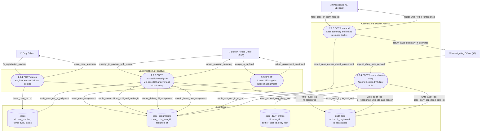
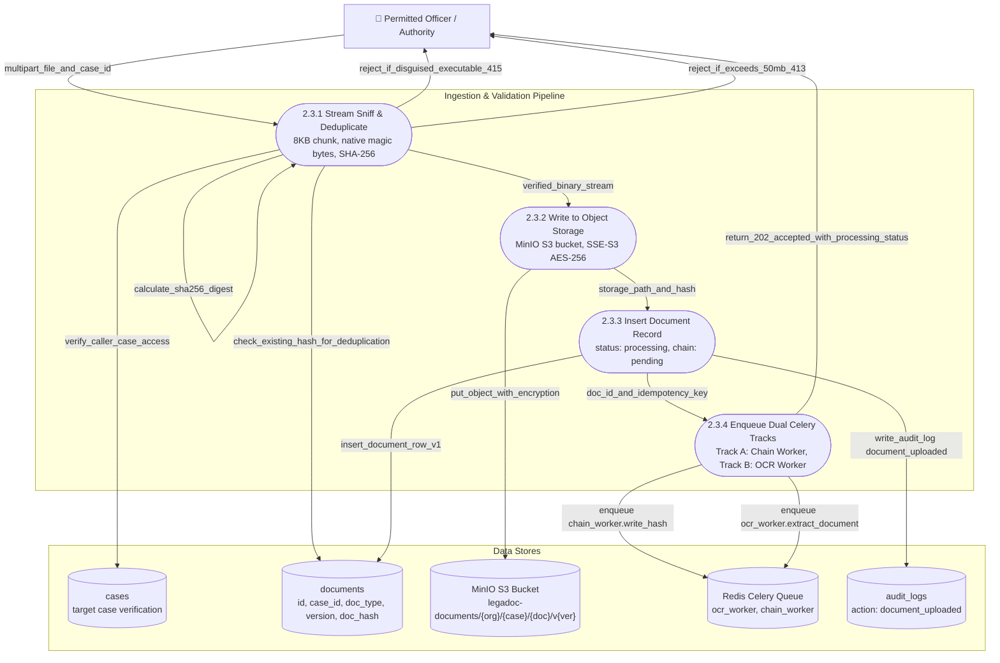
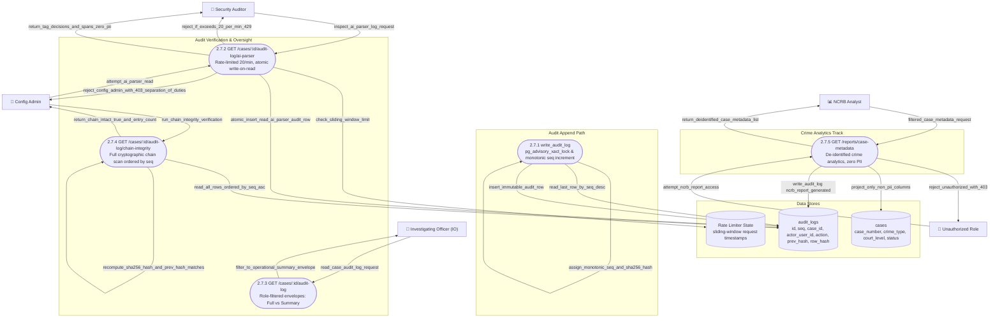

# LegaDoc — Exhaustive Repository Data Flow Diagrams (DFD / DRD)

> **Repository:** [LegaDoc](file:///Users/kamalnasir/Desktop/SIH2026/LegaDoc)  
> **Standard:** Complete Data Flow Diagram set spanning Level 0 (Context), Level 1 (Macro Subsystems), and Level 2 (Micro Decompositions for all 7 submodules).  
> **Layout Architecture:** Optimized for vertical clarity and high readability across IDE preview panes, GitHub, and PDF exports. Prevents horizontal squishing and eliminates microscopic text.  
> **Validation:** Standard Mermaid flowchart syntax without bidirectional link errors, unquoted delimiters, stateDiagram-v2 parse bugs, or recursive loops.

---

## 1. DFD Level 0 — System Context (The Macro Boundary)

```mermaid
flowchart TB
    %% ==========================================
    %% TOP TIER: STAKEHOLDERS (VERTICAL STACK)
    %% ==========================================
    subgraph STAKEHOLDERS ["👥 Justice System Stakeholders"]
        direction TB
        subgraph G_POLICE ["Law Enforcement & Public Authorities"]
            direction LR
            POLICE["👤 Police Personnel<br/>(Duty Officer / SHO / IO)"]
            AUTH["🏛️ External Authorities<br/>(FSL / Hospitals / Banks)"]
        end
        subgraph G_COURT ["Judiciary & Legal Defense"]
            direction LR
            COURT["⚖️ Judiciary & Prosecution<br/>(Judge / Public Prosecutor)"]
            DEFENSE["🛡️ Defense & Accused<br/>(Defense Counsel / Accused)"]
        end
        subgraph G_GOV ["Independent Oversight & Analytics"]
            direction LR
            AUDITOR["🔍 Security Auditor<br/>(Redaction & Decision Oversight)"]
            ANALYST["📊 NCRB / Crime Analyst<br/>(National Crime Records Bureau)"]
        end
        G_POLICE ~~~ G_COURT ~~~ G_GOV
    end

    %% ==========================================
    %% CORE SYSTEM
    %% ==========================================
    LEGADOC(["0.0 LEGADOC CRIMINAL JUSTICE OS<br/>(FastAPI Monolith, Security Gateways & Celery Workers)"])

    %% ==========================================
    %% BOTTOM TIER: STORAGE & RAILS (VERTICAL STACK)
    %% ==========================================
    subgraph INFRA ["💾 Storage, Blockchain & Messaging Substrate"]
        direction TB
        subgraph G_PERSIST ["Relational Core & Encrypted Blobs"]
            direction LR
            DB[("💾 PostgreSQL 16 Multi-Tenant Core<br/>(Cases, Documents, Tags, Monotonic AuditLog)")]
            STORAGE[("💾 MinIO S3 Object Storage<br/>(AES-256 Server-Side Encrypted Blobs)")]
        end
        subgraph G_ASYNC ["Distributed Ledger & Task Queue"]
            direction LR
            REDIS[("💾 Redis 7 Persistent Broker<br/>(Celery Queues & Sliding Rate Limiter)")]
            FABRIC[("⛓️ Hyperledger Fabric<br/>(Immutable SHA-256 Proof of Existence)")]
        end
        G_PERSIST ~~~ G_ASYNC
    end

    %% Stakeholder Inbound / Outbound
    POLICE -->|fir dockets, evidence, case diary| LEGADOC
    AUTH -->|section 91 certified reports| LEGADOC
    COURT -->|hearing notices, bail orders, judgments| LEGADOC
    DEFENSE -->|bail applications, surety bonds| LEGADOC
    AUDITOR -->|ai parser audit inspection| LEGADOC
    ANALYST -->|crime metadata queries| LEGADOC

    LEGADOC -->|case docket and review queues| POLICE
    LEGADOC -->|routed evidence requisitions| AUTH
    LEGADOC -->|unredacted judicial evidence| COURT
    LEGADOC -->|bail status and hearing schedules| DEFENSE
    LEGADOC -->|confidence scores, zero pii| AUDITOR
    LEGADOC -->|deidentified crime metadata| ANALYST

    %% Infrastructure Links
    LEGADOC -->|write encrypted blobs and presigned urls| STORAGE
    STORAGE -->|read binary streams| LEGADOC
    LEGADOC -->|sql rls and seq hash chaining| DB
    DB -->|relational records and row verification| LEGADOC
    LEGADOC -->|enqueue async jobs and check rate limits| REDIS
    REDIS -->|dequeue jobs to celery workers| LEGADOC
    LEGADOC -->|signed sha256 hash transactions| FABRIC
    FABRIC -->|block confirmation and transaction id| LEGADOC
```

---

## 2. DFD Level 1 — Macro Repository Data Flow

```mermaid
flowchart TB
    %% ==========================================
    %% TOP ACTORS
    %% ==========================================
    subgraph USERS ["👥 Primary Stakeholders"]
        direction LR
        PoliceStaff["👤 Police (Duty Officer / SHO / IO)"]
        JudicialStaff["⚖️ Court & Prosecution"]
        AuditorStaff["🔍 Security Auditor & NCRB"]
    end

    %% ==========================================
    %% STAGE 1: IDENTITY & CASE INTAKE
    %% ==========================================
    subgraph STAGE1 ["Stage 1: Identity, Tenancy & Case Registration"]
        direction TB
        subgraph S1_PROCS ["Processes"]
            direction TB
            P_AUTH(["1.0 /auth & /admin/roles<br/>Constant-Time Dummy Bcrypt & 18 Canonical Roles"])
            P_CASES(["2.0 /cases & Handover<br/>FIR Registration, Section 172 Diary & IO Reassignment"])
        end
        subgraph S1_DATA ["Data Stores"]
            direction TB
            D_USERS[("💾 D1: users & roles<br/>users, orgs, permissions")]
            D_CASES[("💾 D2: cases & assignments<br/>cases, assignments, diary")]
        end
    end

    %% ==========================================
    %% STAGE 2: INGESTION & PROCESSING
    %% ==========================================
    subgraph STAGE2 ["Stage 2: Document Ingestion, OCR & Redaction Spine"]
        direction TB
        subgraph S2_PROCS ["Processes"]
            direction TB
            P_INGEST(["3.0 /documents (Upload)<br/>Streaming Sniffer, MinIO AES-256 & Celery Dispatch"])
            P_WORKER(["4.0 Workers & Review Queue<br/>PaddleOCR, Presidio Tags & Dynamic Role Redaction"])
        end
        subgraph S2_DATA ["Data Stores"]
            direction TB
            D_S3[("💾 D6: MinIO S3<br/>AES-256 Encrypted Blobs")]
            D_DOCS[("💾 D3: documents<br/>status, chain, raw_text")]
            D_TAGS[("💾 D4: sensitivity_tags<br/>zero PII span coordinates")]
            D_REDIS[("💾 D7: Redis Queues<br/>Celery broker & limiter")]
        end
    end

    %% ==========================================
    %% STAGE 3: EVIDENCE REQUISITION & COURT
    %% ==========================================
    subgraph STAGE3 ["Stage 3: Evidence Requisitions & Court Lifecycle"]
        direction TB
        subgraph S3_PROCS ["Processes"]
            direction TB
            P_EVID(["5.0 /evidence-requests & Gate<br/>Sec 91 Multi-Tenant Requisitions & Sec 173 Gate"])
            P_BAIL_TRIAL(["6.0 /bail & /trial<br/>Independent 5-State Bail FSM & Judicial Trial"])
        end
        subgraph S3_DATA ["Data Stores"]
            direction TB
            D_EVID[("💾 D5: evidence_requests<br/>requests, checklist requirements")]
        end
    end

    %% ==========================================
    %% STAGE 4: AUDIT & CRIME REPORTING
    %% ==========================================
    subgraph STAGE4 ["Stage 4: Tamper-Evident Audit & Analytics"]
        direction TB
        subgraph S4_PROCS ["Processes"]
            direction TB
            P_AUDIT_NCRB(["7.0 /audit-log & /reports<br/>Monotonic Seq Hash Chaining & NCRB De-Identified Analytics"])
        end
        subgraph S4_DATA ["Data Stores"]
            direction TB
            D_AUDIT[("💾 D8: audit_logs<br/>pg_advisory_lock, seq, row_hash")]
            FabricLedger[("⛓️ Hyperledger Fabric<br/>Immutable SHA-256 Anchor")]
        end
    end

    %% ==========================================
    %% STAGE-BY-STAGE PIPELINE FLOW
    %% ==========================================
    USERS --> P_AUTH
    P_AUTH -->|verify_credentials| D_USERS
    D_USERS -->|active_role_and_jwt| P_AUTH
    P_AUTH --> P_CASES

    PoliceStaff -->|fir_payload_and_reassign| P_CASES
    P_CASES -->|create_case_and_swap_assignment| D_CASES
    P_CASES --> P_INGEST

    PoliceStaff -->|multipart_file_upload| P_INGEST
    P_INGEST -->|stream_encrypted_blob| D_S3
    P_INGEST -->|insert_doc_record| D_DOCS
    P_INGEST -->|enqueue_track_a_and_b| D_REDIS
    D_REDIS -->|dequeue_job| P_WORKER

    P_WORKER -->|read_blob| D_S3
    P_WORKER -->|update_ocr_text| D_DOCS
    P_WORKER -->|store_detected_spans| D_TAGS
    P_WORKER -->|needs_review_queue| PoliceStaff
    P_WORKER -->|role_filtered_document| JudicialStaff
    P_WORKER --> P_EVID

    PoliceStaff -->|create_sec_91_request| P_EVID
    P_EVID -->|insert_requisition| D_EVID
    P_EVID -->|evaluate_sec_173_and_join_gate| D_CASES
    P_EVID --> P_BAIL_TRIAL

    PoliceStaff -->|record_arrest| P_BAIL_TRIAL
    JudicialStaff -->|bail_order_and_trial_hearing| P_BAIL_TRIAL
    JudicialStaff -->|verdict_judgment_terminal| P_BAIL_TRIAL
    P_BAIL_TRIAL -->|update_fsm_and_disposition| D_CASES
    P_BAIL_TRIAL --> P_AUDIT_NCRB

    AuditorStaff -->|inspect_ai_decisions_20_per_min| P_AUDIT_NCRB
    AuditorStaff -->|ncrb_deidentified_crime_metadata| P_AUDIT_NCRB
    P_AUDIT_NCRB -->|read_non_pii_columns| D_CASES
    P_AUDIT_NCRB -->|verify_seq_ordered_hash_chain| D_AUDIT
    P_WORKER -->|anchor_doc_hash| FabricLedger
    FabricLedger -->|block_receipt_tx_id| P_WORKER
```

---

## 3. Level 2 Detailed Decompositions (Subsystem-by-Subsystem)

---

### 3.1 DFD 2.1 — Authentication, Multi-Tenant RBAC & Role Management (`/auth`, `/admin/roles`)
* **Key Files:** [`api/app/routers/auth.py`](file:///Users/kamalnasir/Desktop/SIH2026/LegaDoc/api/app/routers/auth.py), [`api/app/security.py`](file:///Users/kamalnasir/Desktop/SIH2026/LegaDoc/api/app/security.py), [`api/app/routers/admin.py`](file:///Users/kamalnasir/Desktop/SIH2026/LegaDoc/api/app/routers/admin.py), [`api/app/models.py`](file:///Users/kamalnasir/Desktop/SIH2026/LegaDoc/api/app/models.py)

```mermaid
flowchart TB
    ClientUser["👤 User (Any Role)"]
    AdminUser["👤 Config Admin"]

    subgraph AUTH_PIPELINE ["Authentication & Session Lifecycle"]
        direction TB
        P_LOGIN(["2.1.1 POST /auth/login<br/>Constant-time dummy bcrypt check"])
        P_REFRESH(["2.1.2 POST /auth/refresh<br/>Exchange refresh token for access token"])
        P_ME(["2.1.3 GET /auth/me<br/>Authoritative identity and permission profile"])
    end

    subgraph ROLE_GOV ["Role Governance & Provisioning"]
        direction TB
        P_ROLE_MANAGE(["2.1.4 GET/POST /admin/roles<br/>Role definitions and custom role provisioning"])
        P_ROLE_ASSIGN(["2.1.5 POST /admin/users/:id/role<br/>Assign role to government officer"])
    end

    subgraph AUTH_STORES ["Data Stores"]
        direction TB
        T_USERS[("users<br/>email, hashed_password, role, org_id")]
        T_ROLES[("roles & role_permissions<br/>code, name, is_system, permissions")]
        T_AUDIT[("audit_logs<br/>seq, action, actor_user_id, row_hash")]
    end

    ClientUser -->|login_credentials| P_LOGIN
    P_LOGIN -->|query_user_by_email| T_USERS
    P_LOGIN -->|run_constant_time_dummy_if_not_found| P_LOGIN
    P_LOGIN -->|return_15m_access_and_7d_refresh_jwt| ClientUser

    ClientUser -->|refresh_token_jwt| P_REFRESH
    P_REFRESH -->|verify_expected_type_refresh| P_REFRESH
    P_REFRESH -->|issue_new_access_token| ClientUser

    ClientUser -->|bearer_access_jwt| P_ME
    P_ME -->|fetch_user_and_permissions| T_USERS
    T_USERS -->|joined_profile_and_permissions| P_ME
    P_ME -->|return_authoritative_user_summary| ClientUser

    AdminUser -->|create_custom_role_payload| P_ROLE_MANAGE
    P_ROLE_MANAGE -->|verify_config_admin_role| P_ROLE_MANAGE
    P_ROLE_MANAGE -->|insert_custom_role_record| T_ROLES
    P_ROLE_MANAGE -->|write_audit_log role_created| T_AUDIT

    AdminUser -->|assign_user_role_payload| P_ROLE_ASSIGN
    P_ROLE_ASSIGN -->|verify_config_admin_role| P_ROLE_ASSIGN
    P_ROLE_ASSIGN -->|update_user_role| T_USERS
    P_ROLE_ASSIGN -->|write_audit_log role_assigned| T_AUDIT
```

---

### 3.2 DFD 2.2 — Case Intake, Assignment & Mid-Case IO Handover (`/cases`)
* **Key Files:** [`api/app/routers/cases.py`](file:///Users/kamalnasir/Desktop/SIH2026/LegaDoc/api/app/routers/cases.py), [`api/app/models.py`](file:///Users/kamalnasir/Desktop/SIH2026/LegaDoc/api/app/models.py), [`api/app/security.py`](file:///Users/kamalnasir/Desktop/SIH2026/LegaDoc/api/app/security.py), [`api/app/audit.py`](file:///Users/kamalnasir/Desktop/SIH2026/LegaDoc/api/app/audit.py)

---

### 3.3 DFD 2.3 — Document Ingestion, Native MIME Sniffing & Storage (`/documents` Upload)
* **Key Files:** [`api/app/routers/documents.py`](file:///Users/kamalnasir/Desktop/SIH2026/LegaDoc/api/app/routers/documents.py), [`api/app/upload_validator.py`](file:///Users/kamalnasir/Desktop/SIH2026/LegaDoc/api/app/upload_validator.py), [`api/app/storage.py`](file:///Users/kamalnasir/Desktop/SIH2026/LegaDoc/api/app/storage.py), [`api/app/queue.py`](file:///Users/kamalnasir/Desktop/SIH2026/LegaDoc/api/app/queue.py)

---

### 3.4 DFD 2.4 — Dual-Track Processing, Review Queue & Redaction Engine (`workers/*`, `/documents`)
* **Key Files:** [`workers/ocr_worker/worker.py`](file:///Users/kamalnasir/Desktop/SIH2026/LegaDoc/workers/ocr_worker/worker.py), [`workers/ai_parser_worker/worker.py`](file:///Users/kamalnasir/Desktop/SIH2026/LegaDoc/workers/ai_parser_worker/worker.py), [`workers/chain_worker/worker.py`](file:///Users/kamalnasir/Desktop/SIH2026/LegaDoc/workers/chain_worker/worker.py), [`api/app/redaction.py`](file:///Users/kamalnasir/Desktop/SIH2026/LegaDoc/api/app/redaction.py), [`api/app/routers/documents.py`](file:///Users/kamalnasir/Desktop/SIH2026/LegaDoc/api/app/routers/documents.py)

```mermaid
flowchart TB
    RedisQueue["⚡ Redis / Celery Task Broker"]
    FabricNetwork["⛓️ Hyperledger Fabric Network"]
    IOUser["👤 Investigating Officer (IO)"]
    AdminUser["👤 Config Admin"]
    ReaderUser["👤 Reading Role (Specialist / Court)"]

    subgraph WORKER_TRACK ["Worker Execution Track"]
        direction TB
        P_OCR_EXEC(["2.4.1 OCR Worker: extract_document<br/>Fetch S3 blob, run PaddleOCR, store raw_text"])
        P_AI_EXEC(["2.4.2 AI Parser: tag_document<br/>Presidio NER, tag spans, check 70% threshold"])
        P_CHAIN_EXEC(["2.4.3 Chain Worker: process_hash_write<br/>Idempotent Fabric anchor & status update"])
    end

    subgraph REVIEW_TRACK ["Review & Redaction Track"]
        direction TB
        P_REVIEW_QUEUE(["2.4.4 GET /documents?status=needs_review<br/>Scoped queue, structural PII exclusion"])
        P_HUMAN_CORRECT(["2.4.5 POST /documents/:id/redact-tag<br/>Officer manual override, extend hash chain"])
        P_READ_VIEW(["2.4.6 GET /documents/:id<br/>app/redaction.py dynamic span masking"])
    end

    subgraph WORKER_STORES ["Data Stores"]
        direction TB
        D_MINIO[("MinIO S3 Storage<br/>raw document file")]
        T_DOCS[("documents<br/>status, chain_status, raw_text")]
        T_TAGS[("document_sensitivity_tags<br/>entity_type, span_start, span_end, confidence")]
        T_AUDIT[("audit_logs<br/>auto_tag_completed, redact_tag_correction")]
    end

    RedisQueue -->|dequeue ocr_worker task| P_OCR_EXEC
    P_OCR_EXEC -->|read_raw_bytes| D_MINIO
    P_OCR_EXEC -->|execute_ocr_and_store_text| T_DOCS
    P_OCR_EXEC -->|enqueue ai_parser_worker task| RedisQueue

    RedisQueue -->|dequeue ai_parser_worker task| P_AI_EXEC
    T_DOCS -->|read_raw_text| P_AI_EXEC
    P_AI_EXEC -->|write_detected_entity_tags| T_TAGS
    P_AI_EXEC -->|write_audit_log auto_tag_completed| T_AUDIT
    P_AI_EXEC -->|if_confidence_below_70_set_status_needs_review| T_DOCS
    P_AI_EXEC -->|if_confident_set_status_ready| T_DOCS

    RedisQueue -->|dequeue chain_worker task| P_CHAIN_EXEC
    P_CHAIN_EXEC -->|submit_sha256_hash_transaction| FabricNetwork
    FabricNetwork -->|transaction_confirmed_id| P_CHAIN_EXEC
    P_CHAIN_EXEC -->|update_chain_status_confirmed| T_DOCS
    P_CHAIN_EXEC -->|write_audit_log chain_write_confirmed| T_AUDIT

    IOUser -->|request_review_queue| P_REVIEW_QUEUE
    AdminUser -->|request_global_review_queue| P_REVIEW_QUEUE
    P_REVIEW_QUEUE -->|query_documents_status_needs_review| T_DOCS
    P_REVIEW_QUEUE -->|exclude_raw_text_and_storage_keys| P_REVIEW_QUEUE
    P_REVIEW_QUEUE -->|return_document_review_item_list| IOUser

    IOUser -->|submit_human_correction_tag| P_HUMAN_CORRECT
    P_HUMAN_CORRECT -->|insert_tag_source_human_correction| T_TAGS
    P_HUMAN_CORRECT -->|update_document_status_ready| T_DOCS
    P_HUMAN_CORRECT -->|write_audit_log redact_tag_correction| T_AUDIT

    ReaderUser -->|fetch_document_content| P_READ_VIEW
    P_READ_VIEW -->|verify_case_access| T_DOCS
    P_READ_VIEW -->|fetch_sensitivity_tags| T_TAGS
    P_READ_VIEW -->|if_full_access_role_return_unredacted| ReaderUser
    P_READ_VIEW -->|if_restricted_role_return_masked_spans| ReaderUser
```

---

### 3.5 DFD 2.5 — Section 91 Requisitions & Charge Sheet AND-Join Gate (`/evidence-requests`, `/cases`)
* **Key Files:** [`api/app/routers/evidence_requests.py`](file:///Users/kamalnasir/Desktop/SIH2026/LegaDoc/api/app/routers/evidence_requests.py), [`api/app/security.py`](file:///Users/kamalnasir/Desktop/SIH2026/LegaDoc/api/app/security.py), [`api/app/audit.py`](file:///Users/kamalnasir/Desktop/SIH2026/LegaDoc/api/app/audit.py), [`api/app/models.py`](file:///Users/kamalnasir/Desktop/SIH2026/LegaDoc/api/app/models.py)

```mermaid
flowchart TB
    IOUser["👤 Investigating Officer (IO)"]
    AuthorityStaff["🏛️ External Authority Staff"]
    Intruder["👤 Unauthorized Role (Defense / Civilian)"]
    Prosecutor["⚖️ Public Prosecutor"]

    subgraph REQ_WORKFLOW ["Evidence Requisition & Fulfillment"]
        direction TB
        P_REQ_CREATE(["2.5.1 POST /cases/:id/evidence-requests<br/>Dispatch requisition to FSL, Hospital, Bank"])
        P_REQ_LIST(["2.5.2 GET /cases/:id/evidence-requests<br/>Multi-tenant scoped listing"])
        P_REQ_SUBMIT(["2.5.3 POST /evidence-requests/:id/submit<br/>Default-deny gate & single-fulfillment upload"])
    end

    subgraph GATE_WORKFLOW ["Charge Sheet AND-Join Gate"]
        direction TB
        P_CHARGE_SHEET(["2.5.4 POST /cases/:id/file-charge-sheet<br/>Section 173 AND-Join checklist evaluation"])
    end

    subgraph EVID_STORES ["Data Stores"]
        direction TB
        T_CASES[("cases<br/>investigation_status, crime_type")]
        T_REQ[("evidence_requests<br/>case_id, requested_org_id, status")]
        T_STAGE_REQ[("stage_requirements<br/>crime_type, stage, required_type")]
        T_DOCS[("documents<br/>verified evidence uploads")]
        T_AUDIT[("audit_logs<br/>evidence_requested, charge_sheet_filed")]
    end

    IOUser -->|create_requisition_payload| P_REQ_CREATE
    P_REQ_CREATE -->|verify_assigned_io| P_REQ_CREATE
    P_REQ_CREATE -->|insert_evidence_request_status_pending| T_REQ
    P_REQ_CREATE -->|write_audit_log evidence_requested| T_AUDIT
    P_REQ_CREATE -->|return_201_created_requisition| IOUser

    AuthorityStaff -->|list_requests_query| P_REQ_LIST
    P_REQ_LIST -->|filter_by_requested_org_id| T_REQ
    P_REQ_LIST -->|return_org_scoped_requests| AuthorityStaff

    Intruder -->|attempt_evidence_submission| P_REQ_SUBMIT
    P_REQ_SUBMIT -->|verify_evidence_request_org_access| P_REQ_SUBMIT
    P_REQ_SUBMIT -->|reject_with_403_forbidden_default_deny| Intruder

    AuthorityStaff -->|submit_certified_evidence_multipart| P_REQ_SUBMIT
    P_REQ_SUBMIT -->|verify_request_is_not_already_completed| T_REQ
    P_REQ_SUBMIT -->|insert_evidence_document| T_DOCS
    P_REQ_SUBMIT -->|update_request_status_completed| T_REQ
    P_REQ_SUBMIT -->|write_audit_log evidence_request_fulfilled| T_AUDIT
    P_REQ_SUBMIT -->|return_200_ok_completed| AuthorityStaff

    Prosecutor -->|file_charge_sheet_attempt| P_CHARGE_SHEET
    P_CHARGE_SHEET -->|fetch_mandatory_checklist_for_crime| T_STAGE_REQ
    P_CHARGE_SHEET -->|verify_all_required_docs_uploaded| T_DOCS
    P_CHARGE_SHEET -->|verify_all_required_evidence_completed| T_REQ
    P_CHARGE_SHEET -->|reject_with_409_if_any_item_missing| Prosecutor
    P_CHARGE_SHEET -->|update_status_charge_sheet_filed| T_CASES
    P_CHARGE_SHEET -->|write_audit_log charge_sheet_filed| T_AUDIT
    P_CHARGE_SHEET -->|return_200_ok_transition_successful| Prosecutor
```

---

### 3.6 DFD 2.6 — Decoupled Bail FSM & Judicial Trial Disposition (`/bail`, `/trial`)
* **Key Files:** [`api/app/routers/bail.py`](file:///Users/kamalnasir/Desktop/SIH2026/LegaDoc/api/app/routers/bail.py), [`api/app/routers/trial.py`](file:///Users/kamalnasir/Desktop/SIH2026/LegaDoc/api/app/routers/trial.py), [`api/app/models.py`](file:///Users/kamalnasir/Desktop/SIH2026/LegaDoc/api/app/models.py), [`api/app/audit.py`](file:///Users/kamalnasir/Desktop/SIH2026/LegaDoc/api/app/audit.py)

```mermaid
flowchart TB
    IOUser["👤 Investigating Officer (IO)"]
    DefenseUser["🛡️ Defense Counsel (Submission-Only)"]
    CourtUser["⚖️ Judiciary / Judge"]
    AccusedUser["👤 Accused / Surety"]

    subgraph BAIL_FSM ["Independent Bail Lifecycle Track"]
        direction TB
        P_ARREST(["2.6.1 POST /cases/:id/bail/arrest<br/>Record suspect arrest and start bail FSM"])
        P_BAIL_APP(["2.6.2 POST /cases/:id/bail/application<br/>File Section 437/439 CrPC bail petition"])
        P_BAIL_HEARING(["2.6.3 POST /cases/:id/bail/hearing-notice<br/>Court schedule bail hearing"])
        P_BAIL_ORDER(["2.6.4 POST /cases/:id/bail/order<br/>Pronounce bail grant or final denial"])
        P_BAIL_SURETY(["2.6.5 POST /cases/:id/bail/surety<br/>Register monetary/property surety bond"])
    end

    subgraph TRIAL_TRACK ["Judicial Trial Progression Track"]
        direction TB
        P_TRIAL_NOTICE(["2.6.6 POST /cases/:id/trial/hearing-notice<br/>Transition to Trial (Charge Sheet prerequisite)"])
        P_JUDGMENT(["2.6.7 POST /cases/:id/judgment<br/>Record final verdict: convicted or acquitted"])
    end

    subgraph BAIL_STORES ["Data Stores"]
        direction TB
        T_CASES[("cases<br/>investigation_status, bail_status")]
        T_AUDIT[("audit_logs<br/>action: bail_*, trial_*, judgment_pronounced")]
    end

    IOUser -->|arrest_record_payload| P_ARREST
    P_ARREST -->|transition_bail_status_arrested| T_CASES
    P_ARREST -->|write_audit_log bail_arrest_recorded| T_AUDIT

    DefenseUser -->|bail_petition_payload| P_BAIL_APP
    P_BAIL_APP -->|verify_status_is_arrested_400_if_not| T_CASES
    P_BAIL_APP -->|transition_bail_status_application_filed| T_CASES
    P_BAIL_APP -->|write_audit_log bail_application_filed| T_AUDIT

    CourtUser -->|hearing_schedule_payload| P_BAIL_HEARING
    P_BAIL_HEARING -->|transition_bail_status_hearing_scheduled| T_CASES
    P_BAIL_HEARING -->|write_audit_log bail_hearing_scheduled| T_AUDIT

    CourtUser -->|bail_decision_payload| P_BAIL_ORDER
    P_BAIL_ORDER -->|if_granted_transition_order_issued| T_CASES
    P_BAIL_ORDER -->|if_denied_transition_denied_final| T_CASES
    P_BAIL_ORDER -->|write_audit_log bail_order_issued| T_AUDIT

    AccusedUser -->|surety_bond_payload| P_BAIL_SURETY
    P_BAIL_SURETY -->|verify_status_is_order_issued| T_CASES
    P_BAIL_SURETY -->|transition_bail_status_surety_registered| T_CASES
    P_BAIL_SURETY -->|write_audit_log bail_surety_registered| T_AUDIT

    CourtUser -->|trial_hearing_payload| P_TRIAL_NOTICE
    P_TRIAL_NOTICE -->|verify_case_status_is_charge_sheet_filed| T_CASES
    P_TRIAL_NOTICE -->|transition_investigation_status_trial| T_CASES
    P_TRIAL_NOTICE -->|write_audit_log trial_hearing_scheduled| T_AUDIT

    CourtUser -->|verdict_payload_acquitted_or_convicted| P_JUDGMENT
    P_JUDGMENT -->|transition_investigation_status_judgment| T_CASES
    P_JUDGMENT -->|transition_bail_status_disposed| T_CASES
    P_JUDGMENT -->|write_audit_log judgment_pronounced| T_AUDIT
```

---

### 3.7 DFD 2.7 — Tamper-Evident Audit Trail & NCRB Crime Reporting (`/audit-log`, `/reports`)
* **Key Files:** [`api/app/audit.py`](file:///Users/kamalnasir/Desktop/SIH2026/LegaDoc/api/app/audit.py), [`api/app/routers/audit.py`](file:///Users/kamalnasir/Desktop/SIH2026/LegaDoc/api/app/routers/audit.py), [`api/app/routers/reports.py`](file:///Users/kamalnasir/Desktop/SIH2026/LegaDoc/api/app/routers/reports.py), [`api/app/rate_limit.py`](file:///Users/kamalnasir/Desktop/SIH2026/LegaDoc/api/app/rate_limit.py)

---

## 4. State Ownership & Invariant Matrix

| Domain / Resource | Master Table | Authorization Model | Immutability Invariant | Tamper-Evident Proof |
|:---|:---|:---|:---|:---|
| **Identity & Sessions** | `users`, `organizations` | `require_role()`, constant-time bcrypt | Password updates mutate hash; email immutable | Session JWT signatures (HMAC-SHA256) |
| **Case Dockets** | `cases` | `assert_case_access()` | Mutable status (`investigation_status`, `bail_status`) | Tracked in `AuditLog.case_id` |
| **Case Assignment** | `case_assignments` | Only `sho` and `config_admin` | Exactly one active IO per case. Atomic deletion & insertion | `AuditLog(action='io_reassigned')` |
| **Investigation Diary**| `case_diary_entries` | Strictly assigned IO and SHO | **Append-Only** (no updates, no deletions) | Embedded in sequential audit hash chain |
| **Evidence Requisition**| `evidence_requests` | IO (create), Requested Org (fulfill) | Single-fulfillment guard (`completed` $\\to$ 409) | `AuditLog(action='evidence_request_fulfilled')` |
| **Evidence Files** | `documents` | Role-filtered via `app/redaction.py` | **Append-Only** versions (`v1, v2, ...`). Storage immutable | SHA-256 in MinIO + Fabric Blockchain (`chain_tx_id`) |
| **Sensitivity Tags** | `document_sensitivity_tags` | Internal AI Parser + IO Corrections | Append-only. Raw text NEVER stored in tags | `AuditLog(action='auto_tag_completed')` |
| **Bail Lifecycle** | `cases.bail_status` | Role-gated state transitions | Strict 5-state sequential Finite State Machine | `AuditLog(action='bail_*')` |
| **Trial Progression** | `cases.investigation_status` | Gated by `Charge_Sheet_Filed` (Court only) | Sequential forward progression (`Trial` $\\to$ `Judgment`) | `AuditLog(action='trial_*' \| 'judgment_pronounced')` |
| **Audit Trail** | `audit_logs` | Auditor/Admin (Full), Operational (Summary) | **Strictly Immutable & Append-Only** | Linked SHA-256 hash chain ordered by monotonic `seq` |

---

## 5. Interface & Verification Contract (110 Tests Green)

| Subsystem | Primary Endpoints | Roles Authorized | Test File | Test Count |
|:---|:---|:---|:---|:---:|
| **Auth & RBAC** | `POST /auth/login` `POST /auth/refresh` `GET /auth/me` | Public (Rate Limited) Any Authenticated | [`test_auth.py`](file:///Users/kamalnasir/Desktop/SIH2026/LegaDoc/api/tests/test_auth.py) [`test_rbac_admin.py`](file:///Users/kamalnasir/Desktop/SIH2026/LegaDoc/api/tests/test_rbac_admin.py) | 19 |
| **Case & Assignment** | `POST /cases` `POST /cases/:id/assign-io` `POST /cases/:id/reassign-io` `POST /cases/:id/case-diary` | `duty_officer` `sho` `sho`, `config_admin` Assigned `io` | [`test_cases.py`](file:///Users/kamalnasir/Desktop/SIH2026/LegaDoc/api/tests/test_cases.py) | 23 |
| **Ingestion & Storage** | `POST /documents` `GET /documents/:id` `GET /documents/:id/versions` `POST /documents/:id/retry-chain-write` | Case-Permitted Roles Role-Scoped Redaction `config_admin` | [`test_documents.py`](file:///Users/kamalnasir/Desktop/SIH2026/LegaDoc/api/tests/test_documents.py) [`test_chain_worker.py`](file:///Users/kamalnasir/Desktop/SIH2026/LegaDoc/api/tests/test_chain_worker.py) | 29 |
| **Review & Redaction** | `GET /documents?status=needs_review` `POST /documents/:id/redact-tag` | `config_admin`, Assigned `io` Assigned `io` | [`test_documents.py`](file:///Users/kamalnasir/Desktop/SIH2026/LegaDoc/api/tests/test_documents.py) | (Included above) |
| **Evidence & Gate** | `POST /cases/:id/evidence-requests` `POST /evidence-requests/:id/submit` `POST /cases/:id/file-charge-sheet` | Assigned `io` Matching `authority_staff` `prosecutor` | [`test_evidence_requests.py`](file:///Users/kamalnasir/Desktop/SIH2026/LegaDoc/api/tests/test_evidence_requests.py) | 6 |
| **Bail FSM & Trial** | `POST /cases/:id/bail/*` (5 states) `POST /cases/:id/trial/hearing-notice` `POST /cases/:id/judgment` | `io`, `defense`, `court`, `accused` `court` `court` | [`test_bail.py`](file:///Users/kamalnasir/Desktop/SIH2026/LegaDoc/api/tests/test_bail.py) [`test_trial.py`](file:///Users/kamalnasir/Desktop/SIH2026/LegaDoc/api/tests/test_trial.py) | 6 |
| **Audit & Integrity** | `GET /cases/:id/audit-log` `GET /cases/:id/audit-log/ai-parser` `GET /cases/:id/audit-log/chain-integrity` | Role-Filtered `security_auditor` ONLY `config_admin` | [`test_audit.py`](file:///Users/kamalnasir/Desktop/SIH2026/LegaDoc/api/tests/test_audit.py) [`test_audit_chain_ordering.py`](file:///Users/kamalnasir/Desktop/SIH2026/LegaDoc/api/tests/test_audit_chain_ordering.py) | 20 |
| **Domain 7 (NCRB)** | `GET /reports/case-metadata` | `records_ncrb_analyst` | [`test_reports.py`](file:///Users/kamalnasir/Desktop/SIH2026/LegaDoc/api/tests/test_reports.py) | 7 |
| **TOTAL** | **All 33 Active Endpoints Verified** | **All Roles & Default-Deny Covered** | **Entire Test Suite in Docker** | **110 PASSED (100%)** |
