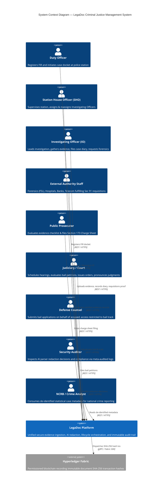
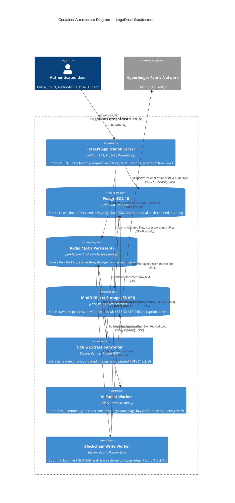
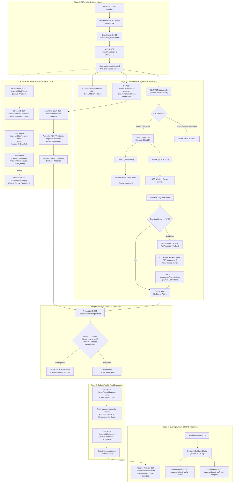
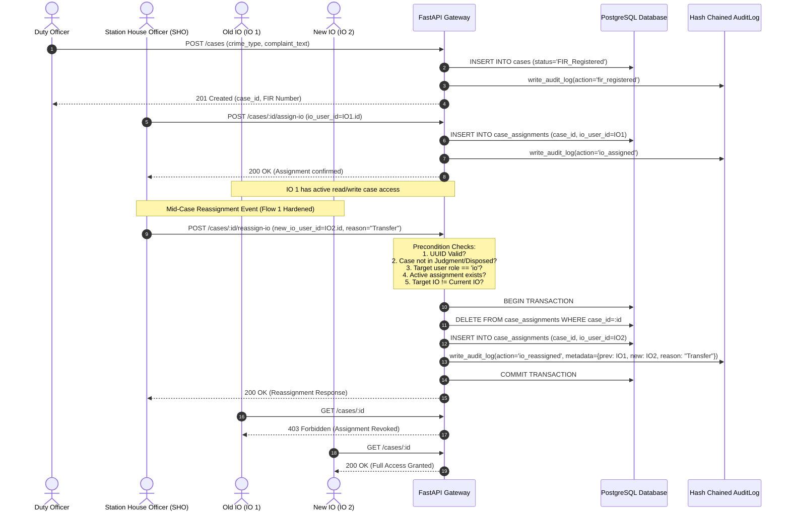
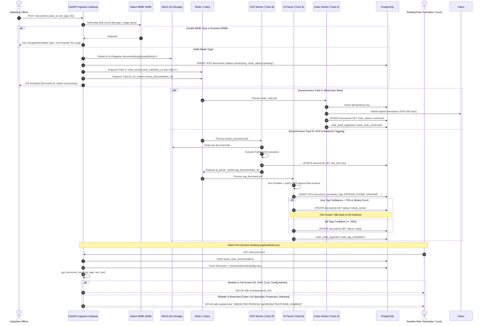
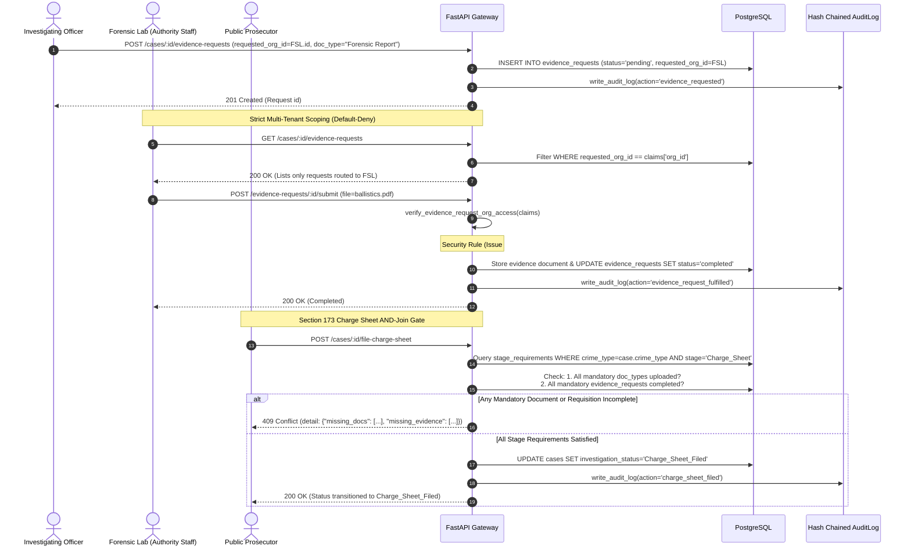
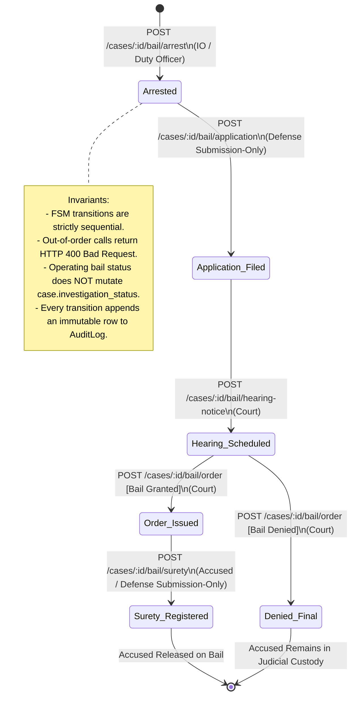
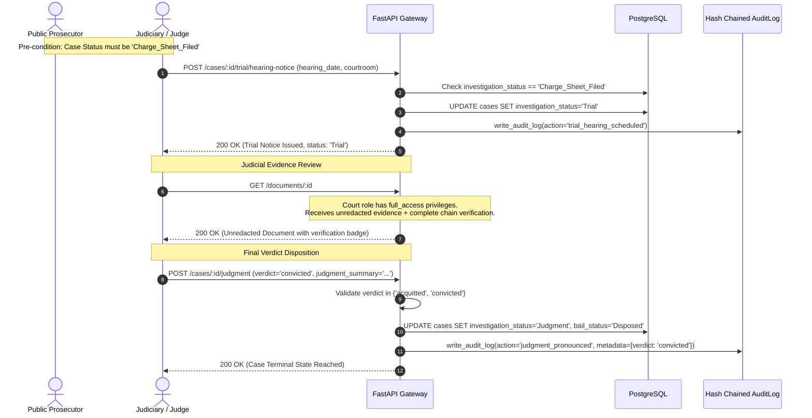
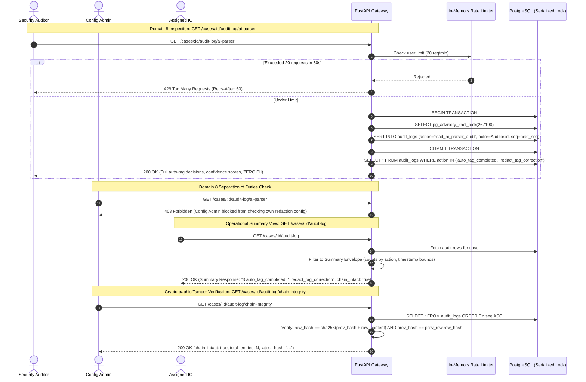
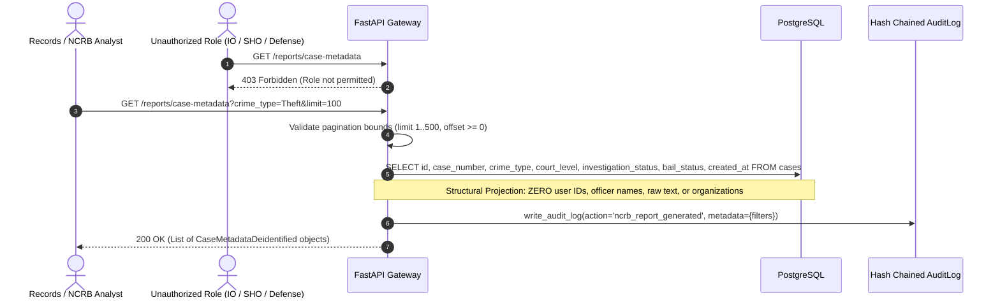

# LegaDoc — Master System Design & Workflow Diagrams (DFD / DRD)

**Project**: SIH26190 — Smart Legal Document Management System  
**Architecture Baseline**: Post-Phase 5 (Full Operational Stack Complete)  
**Author**: Ishaan Nasir (Backend, Ingestion Pipeline, Lifecycle & Security Substrate)  
**Status**: Authoritative Reference for Team Meetings & Judicial Evaluation

---

## 1. Executive Summary & Scope Audit

### 1.1 Is the Original Backend Scope Complete?
**YES — 100% of Ishaan's original backend jurisdiction is implemented, hardened, and verified.**

Every single flow, endpoint, security barrier, and data model specified in `SYSTEM_DESIGN.md` across Phases 1 through 5 is active in code and covered by **110 automated tests (100% passing, 0 failures)** in Docker:

- **Phase 1 (Merged)**: Authoritative JWT Authentication (15-min access + 7-day refresh), bcrypt with constant-time dummy hashes, 18 canonical multi-tenant roles across 8 legal domains, and PostgreSQL tamper-evident hash-chained audit substrate.
- **Phase 2 (Merged)**: Streaming native MIME sniffer (libmagic/python-magic), 50MB strict file cap, SHA-256 deduplication, MinIO S3 object storage with SSE-S3 AES-256, Celery worker dispatch (Track A & Track B), and dynamic redaction masking engine (`app/redaction.py`).
- **Phase 3 (PR #19)**: Section 91 parallel evidence requisitions with tenant isolation, Section 173 Charge Sheet AND-Join gate, independent 5-state Bail FSM, Judicial Trial progression to terminal verdict, Section 172 Case Diary with zero PII leakage, and default-deny security hardening on external evidence submission (closing Issue #24).
- **Phase 4 (PR #20)**: Flow 6 Audit Trail, dual response envelopes (Full Cryptographic vs Operational Summary), Domain 8 separation of duties (Security Auditor only on `/ai-parser`), sliding-window rate limiting (20/min), atomic write-on-read meta-audit, and monotonic sequence counter (`seq`) eliminating microsecond timestamp race ties.
- **Phase 5 (PR #35)**: Domain 7 NCRB de-identified case metadata reporting (`GET /reports/case-metadata`), Flow 1 Investigating Officer mid-case reassignment (`POST /cases/:id/reassign-io`), Flow 2 document review queue (`GET /documents?status=needs_review`), and end-to-end pipeline & artifact generation test.

---

## 2. C4 Context Diagram (System Ecosystem)

This diagram defines the high-level actors, external organizations, and boundary of the LegaDoc platform.

---

## 3. C4 Container Diagram (Service & Storage Architecture)

---

## 4. Master Lifecycle Workflow Diagram

The complete journey of a criminal docket from initial incident report through trial, disposition, and national statistics.

---

## 5. Flow-by-Flow Technical Architecture Diagrams

### Flow 1: Case Registration & Investigating Officer Handover
Handles initial FIR intake, duty officer role gating, and atomic officer reassignment mid-case.

---

### Flow 2: Dual-Track Ingestion Pipeline & Redaction Engine
Handles secure upload, MIME sniffing, dual-track asynchronous processing, review queue fallback, and role-masked read projections.

---

### Flow 3: Section 91 Parallel Evidence Requisitions & Charge Sheet AND-Join
Orchestrates multi-tenant requests to external authorities (FSL Labs, Hospitals, Banks, Telecoms) and enforces the mandatory pre-condition checklist before filing a charge sheet.

---

### Flow 4: Independent Bail Finite State Machine (FSM)
Decoupled concurrent bail track operating in parallel with the main investigation docket.

---

### Flow 5: Judicial Trial & Court Disposition
Gated by the Charge Sheet AND-Join gate, moving the docket to public trial, judicial review, and terminal verdict.

---

### Flow 6: Tamper-Evident Audit Trail & Meta-Audit
Role-filtered audit views, anti-enumeration sliding-window rate limiting, and cryptographic chain verification using monotonic sequence counters.

---

### Flow 7: Domain 7 NCRB De-Identified Crime Reporting
Supplies anonymized, structural crime metadata for national records and policy analysis without identity exposure.

---

## 6. State Ownership & Invariant Map

| Resource / State | Master Table | Access Control Rule | Mutability | Cryptographic Anchor |
|:---|:---|:---|:---|:---|
| **Case Docket** | `cases` | `assert_case_access()` | Mutable (`investigation_status`, `bail_status`) | Referenced in `AuditLog.case_id` |
| **Case Assignment** | `case_assignments` | Only `sho` & `config_admin` | Single active IO per case. Replaced atomically on reassignment | `AuditLog(action='io_reassigned')` |
| **Case Diary** | `case_diary_entries` | Strictly assigned IO and SHO | **Append-Only** (no edits, no deletions) | Row hash + `AuditLog(action='case_diary_appended')` |
| **Evidence Requisition** | `evidence_requests` | IO (create), Assigned Authority (fulfill) | Single-fulfillment guard (`status='completed'`) | Document link + `AuditLog` |
| **Evidence Document** | `documents` | Role-filtered via `app/redaction.py` | **Append-Only** versions (`v1, v2, ...`). Storage immutable | SHA-256 in MinIO + Fabric Blockchain (`chain_tx_id`) |
| **Sensitivity Tags** | `document_sensitivity_tags` | Internal AI Parser + IO Corrections | Append-only. Never stores raw matched text | `AuditLog(action='auto_tag' \| 'redact_tag_correction')` |
| **Bail Lifecycle** | `cases.bail_status` | Role-gated by state (IO, Defense, Court, Accused) | Strict 5-state Finite State Machine transitions | `AuditLog(action='bail_*')` |
| **Trial Lifecycle** | `cases.investigation_status` | Gated by `Charge_Sheet_Filed` (Court only) | Sequential transitions (`Charge_Sheet` $\to$ `Trial` $\to$ `Judgment`) | `AuditLog(action='trial_*' \| 'judgment_pronounced')` |
| **Audit Trail** | `audit_logs` | Security Auditor & Config Admin (Full), Others (Summary) | **Strictly Immutable & Append-Only** | Linked SHA-256 chain ordered by monotonic `seq` |

---

## 7. Endpoint & Verification Matrix Reference

| Flow / Domain | Method | Endpoint Path | Role Allowed | Test Suite |
|:---|:---:|:---|:---|:---|
| **Auth** | `POST` | `/auth/login` | Public (Rate Limited) | `test_auth.py` |
| **Auth** | `POST` | `/auth/refresh` | Authenticated Refresh Token | `test_auth.py` |
| **Case Intake** | `POST` | `/cases` | `duty_officer` | `test_cases.py` |
| **Case Assignment** | `POST` | `/cases/:id/assign-io` | `sho` | `test_cases.py` |
| **Flow 1 (Reassign)** | `POST` | `/cases/:id/reassign-io` | `sho`, `config_admin` | `test_cases.py` (12 tests) |
| **Case Diary** | `POST/GET`| `/cases/:id/case-diary` | `io`, `sho` (assigned) | `test_cases.py` |
| **Flow 3 (Requisitions)**| `POST/GET`| `/cases/:id/evidence-requests` | `io`, matching `authority_staff` | `test_evidence_requests.py` |
| **Flow 3 (Submit)** | `POST` | `/evidence-requests/:id/submit`| Matching `authority_staff` only | `test_evidence_requests.py` |
| **Flow 3 (Charge Sheet)**| `POST` | `/cases/:id/file-charge-sheet` | `prosecutor` | `test_evidence_requests.py` |
| **Flow 2 (Upload)** | `POST` | `/documents` | Case-permitted uploaders | `test_documents.py` |
| **Flow 2 (Fetch)** | `GET` | `/documents/:id` | Role-scoped (`FULL` vs `MASKED`) | `test_documents.py` |
| **Flow 2 (Versions)** | `GET` | `/documents/:id/versions` | Role-scoped | `test_documents.py` |
| **Flow 2 (Queue)** | `GET` | `/documents?status=needs_review`| `config_admin`, `io` (assigned) | `test_documents.py` (9 tests) |
| **Flow 2 (Human Tag)**| `POST` | `/documents/:id/redact-tag` | Assigned `io` | `test_documents.py` |
| **Flow 4 (Bail FSM)** | `POST` | `/cases/:id/bail/*` (5 routes) | `io`, `defense`, `court`, `accused`| `test_bail.py` |
| **Flow 5 (Trial)** | `POST` | `/cases/:id/trial/hearing-notice`| `court` | `test_trial.py` |
| **Flow 5 (Judgment)** | `POST` | `/cases/:id/judgment` | `court` | `test_trial.py` |
| **Flow 6 (Audit Trail)**| `GET` | `/cases/:id/audit-log` | Role-filtered (`full` vs `summary`)| `test_audit.py` |
| **Flow 6 (AI Parser)** | `GET` | `/cases/:id/audit-log/ai-parser`| `security_auditor` ONLY | `test_audit.py` |
| **Flow 6 (Integrity)**| `GET` | `/cases/:id/audit-log/chain-integrity`| `config_admin` | `test_audit.py`, `test_audit_chain_ordering.py` |
| **Domain 7 (NCRB)** | `GET` | `/reports/case-metadata` | `records_ncrb_analyst` | `test_reports.py` (7 tests) |
| **Full Lifecycle** | — | End-to-End Pipeline & Artifacts | Full operational matrix | `test_end_to_end_pipeline_flow_and_artifact_generation` |

---

## 8. Summary for Team Meeting Presentation

When presenting this architecture to Swayam, Abhinav, Rick, and Vinayak:
1. **Zero Gaps in Core Pipeline**: All 7 flows are built, deployed in containers, and verified with 110 tests.
2. **Deterministic Hash Chaining**: The latent microsecond timestamp bug has been solved upstream and downstream using monotonic `seq` indexing.
3. **Fail-Closed Security**: Every single endpoint implements default-deny authorization (e.g. defense counsel blocked from forensics and case diary, unassigned IOs blocked from cross-case reads).
4. **Clean Interfaces for Frontend & Workers**:
   - Abhinav (Frontend) has exact, typed response schemas for the review queue, bail FSM, trial, and audit logs.
   - Vinayak (AI Parser) has exact table targets (`DocumentSensitivityTag`) and status flags (`needs_review` on confidence < 70%).
